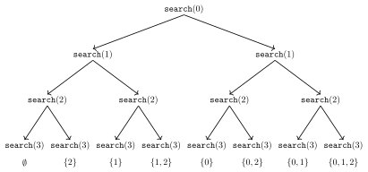
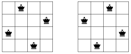
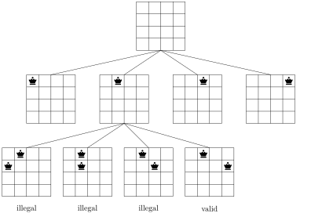
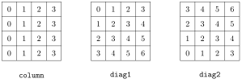
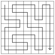
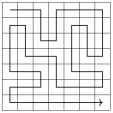
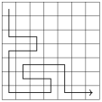
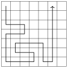
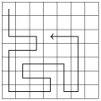

# 完全搜索

**完全搜索**是一种通用的方法，几乎可以用来求解任何算法问题。其思路是用暴力枚举生成问题的所有可能解，然后根据具体问题选出最优解或统计解的个数。

如果有足够的时间遍历所有解，完全搜索就是一种很好的技巧，因为这种搜索通常易于实现，而且总能给出正确答案。如果完全搜索太慢，则可能需要贪心算法或动态规划等其他技巧。

## 生成子集

我们首先考虑生成一个含 $n$ 个元素的集合的所有子集的问题。例如，$\{0,1,2\}$ 的子集为 $\emptyset$、$\{0\}$、$\{1\}$、$\{2\}$、$\{0,1\}$、$\{0,2\}$、$\{1,2\}$ 和 $\{0,1,2\}$。生成子集有两种常见方法：既可以执行递归搜索，也可以利用整数的二进制表示。

#### 方法 1

遍历一个集合的所有子集的一种优雅方式是使用递归。下面的函数 `search` 生成集合 $\{0,1,\ldots,n-1\}$ 的子集。该函数维护一个向量 `subset`，其中包含每个子集的元素。当以参数 0 调用该函数时，搜索开始。

```cpp
void search(int k) {
    if (k == n) {
        // process subset
    } else {
        search(k+1);
        subset.push_back(k);
        search(k+1);
        subset.pop_back();
    }
}
```

当以参数 $k$ 调用函数 `search` 时，它决定是否将元素 $k$ 包含在子集中，并在两种情况下都以参数 $k+1$ 调用自身。不过，如果 $k=n$，函数便注意到所有元素都已处理完毕，一个子集已经生成。

下面的树展示了 $n=3$ 时的函数调用情况。我们总是既可以选择左分支（$k$ 不包含在子集中），也可以选择右分支（$k$ 包含在子集中）。



#### 方法 2

生成子集的另一种方法基于整数的二进制表示。含 $n$ 个元素的集合的每个子集都可以表示为一个 $n$ 位的比特序列，它对应 $0 \ldots 2^n-1$ 之间的一个整数。比特序列中为 1 的位表示哪些元素包含在子集中。

通常的约定是最后一位对应元素 0，倒数第二位对应元素 1，依此类推。例如，25 的二进制表示是 11001，它对应子集 $\{0,3,4\}$。

以下代码遍历含 $n$ 个元素的集合的所有子集

```cpp
for (int b = 0; b < (1<<n); b++) {
    // process subset
}
```

以下代码展示了如何求出一个比特序列所对应的子集的元素。在处理每个子集时，代码构建一个包含该子集中元素的向量。

```cpp
for (int b = 0; b < (1<<n); b++) {
    vector<int> subset;
    for (int i = 0; i < n; i++) {
        if (b&(1<<i)) subset.push_back(i);
    }
}
```

## 生成排列

接下来我们考虑生成一个含 $n$ 个元素的集合的所有排列的问题。例如，$\{0,1,2\}$ 的排列为 $(0,1,2)$、$(0,2,1)$、$(1,0,2)$、$(1,2,0)$、$(2,0,1)$ 和 $(2,1,0)$。同样有两种方法：既可以使用递归，也可以迭代地遍历排列。

#### 方法 1

与子集类似，排列也可以用递归生成。下面的函数 `search` 遍历集合 $\{0,1,\ldots,n-1\}$ 的所有排列。该函数构建一个包含排列的向量 `permutation`，当不带参数调用该函数时，搜索开始。

```cpp
void search() {
    if (permutation.size() == n) {
        // process permutation
    } else {
        for (int i = 0; i < n; i++) {
            if (chosen[i]) continue;
            chosen[i] = true;
            permutation.push_back(i);
            search();
            chosen[i] = false;
            permutation.pop_back();
        }
    }
}
```

每次函数调用都会向 `permutation` 添加一个新元素。数组 `chosen` 表示哪些元素已经包含在排列中。如果 `permutation` 的大小等于集合的大小，就生成了一个排列。

#### 方法 2

生成排列的另一种方法是：从排列 $\{0,1,\ldots,n-1\}$ 开始，反复使用一个按递增顺序构造下一个排列的函数。C++ 标准库包含函数 `next_permutation`，可用于此目的：

```cpp
vector<int> permutation;
for (int i = 0; i < n; i++) {
    permutation.push_back(i);
}
do {
    // process permutation
} while (next_permutation(permutation.begin(),permutation.end()));
```

## 回溯

**回溯**算法从一个空解开始，逐步扩展该解。搜索会递归地遍历构造一个解的所有不同方式。

举个例子，考虑计算在 $n \times n$ 的棋盘上放置 $n$ 个皇后、使得任意两个皇后都不互相攻击的方法数的问题。例如，当 $n=4$ 时，有两种可能的解：



该问题可以用回溯法求解，逐行地在棋盘上放置皇后。更准确地说，每一行恰好放置一个皇后，使得该皇后不攻击任何之前放置的皇后。当 $n$ 个皇后都放到棋盘上时，就找到了一个解。

例如，当 $n=4$ 时，回溯算法生成的一些部分解如下：



在最底层，前三种布局是非法的，因为皇后之间互相攻击。而第四种布局是合法的，可以通过再往棋盘上放置两个皇后将其扩展为一个完整解。放置剩余两个皇后只有一种方式。

该算法可以实现如下：

```cpp
void search(int y) {
    if (y == n) {
        count++;
        return;
    }
    for (int x = 0; x < n; x++) {
        if (column[x] || diag1[x+y] || diag2[x-y+n-1]) continue;
        column[x] = diag1[x+y] = diag2[x-y+n-1] = 1;
        search(y+1);
        column[x] = diag1[x+y] = diag2[x-y+n-1] = 0;
    }
}
```

搜索通过调用 `search(0)` 开始。棋盘的大小为 $n \times n$，代码将解的个数计算到 `count` 中。

代码假设棋盘的行和列都从 0 到 $n-1$ 编号。当以参数 $y$ 调用函数 `search` 时，它在第 $y$ 行放置一个皇后，然后以参数 $y+1$ 调用自身。接着，如果 $y=n$，就找到了一个解，变量 `count` 增加一。

数组 `column` 记录哪些列含有皇后，数组 `diag1` 和 `diag2` 记录对角线。不允许向已经含有皇后的列或对角线再添加皇后。例如，$4 \times 4$ 棋盘的列和对角线编号如下：



设 $q(n)$ 表示在 $n \times n$ 棋盘上放置 $n$ 个皇后的方法数。上述回溯算法告诉我们，例如 $q(8)=92$。当 $n$ 增大时，搜索很快变慢，因为解的个数呈指数增长。例如，用上述算法计算 $q(16)=14772512$ 在一台现代计算机上已经需要约一分钟[^1]。

## 剪枝

我们常常可以通过对搜索树剪枝来优化回溯。其思路是给算法添加“智能”，让它一旦发现某个部分解无法扩展为完整解就尽快察觉。这类优化对搜索的效率可能产生巨大影响。

让我们考虑这样一个问题：计算 $n \times n$ 网格中从左上角到右下角、且恰好访问每个方格一次的路径数。例如，在 $7 \times 7$ 的网格中有 111712 条这样的路径。其中一条路径如下：



我们关注 $7 \times 7$ 的情形，因为它的难度正合适。我们从一个朴素回溯算法出发，然后根据对搜索如何剪枝的观察逐步优化它。每次优化后，我们测量算法的运行时间和递归调用次数，以便清楚地看到每次优化对搜索效率的影响。

#### 基础算法

算法的第一个版本不含任何优化。我们只是用回溯生成从左上角到右下角的所有可能路径，并统计这样的路径数。

- 运行时间：483 秒

- 递归调用次数：760 亿

#### 优化 1

在任何解中，我们第一步要么向下要么向右。第一步之后，总存在两条关于网格对角线对称的路径。例如，下面的路径是对称的：

|  |  |  |
|:--:|:--:|:--:|
|  |  |  |

因此，我们可以规定总是先向下（或向右）走一步，最后把解的个数乘以二。

- 运行时间：244 秒

- 递归调用次数：380 亿

#### 优化 2

如果路径在访问完网格中所有其他方格之前就到达了右下角方格，那么显然无法再完成整个解。下面这条路径就是一个例子：



利用这一观察，如果过早到达右下角方格，我们可以立即终止搜索。

- 运行时间：119 秒

- 递归调用次数：200 亿

#### 优化 3

如果路径碰到墙壁且可以向左或向右转弯，网格就会分裂成两个含有未访问方格的部分。例如，在下面的情形中，路径既可以向左转也可以向右转：



这种情况下，我们无法再访问所有方格，因此可以终止搜索。这一优化非常有用：

- 运行时间：1.8 秒

- 递归调用次数：2.21 亿

#### 优化 4

优化 3 的思路可以推广：如果路径无法继续向前，但可以向左或向右转弯，网格就会分裂成两个都含有未访问方格的部分。例如，考虑下面这条路径：



显然我们无法再访问所有方格，因此可以终止搜索。经过这一优化后，搜索非常高效：

- 运行时间：0.6 秒

- 递归调用次数：6900 万

  
现在是停止优化算法、看看我们取得了什么成果的好时机。原始算法的运行时间是 483 秒，而经过优化后，运行时间只有 0.6 秒。因此，优化后算法快了近 1000 倍。

这是回溯中常见的现象，因为搜索树通常很大，即使是一些简单的观察也能有效地剪枝。尤其是在算法最初几步（即搜索树顶部）发生的优化特别有用。

## 折半搜索

**折半搜索（Meet in the middle）**是一种把搜索空间分成大小大致相等的两部分的技巧。对两部分分别进行搜索，最后把两次搜索的结果合并起来。

如果存在一种高效合并搜索结果的方式，就可以使用这一技巧。在这种情况下，两次搜索所需的时间可能比一次大规模搜索更少。通常，我们可以用折半搜索技巧把 $2^n$ 这一因子变成 $2^{n/2}$。

举个例子，考虑这样一个问题：给定一个含 $n$ 个数字的列表和一个数字 $x$，我们想知道能否从列表中选出若干数字，使它们的和为 $x$。例如，给定列表 $[2,4,5,9]$ 和 $x=15$，我们可以选择数字 $[2,4,9]$ 得到 $2+4+9=15$。然而，对于同一个列表，如果 $x=10$，则无法凑出这个和。

该问题的一个简单算法是遍历元素的所有子集，检查是否有某个子集的和为 $x$。这样算法的时间复杂度是 $O(2^n)$，因为有 $2^n$ 个子集。然而，使用折半搜索技巧，我们可以得到一个更高效的 $O(2^{n/2})$ 时间算法[^2]。注意 $O(2^n)$ 和 $O(2^{n/2})$ 是不同的复杂度，因为 $2^{n/2}$ 等于 $\sqrt{2^n}$。

其思路是把列表分成两个列表 $A$ 和 $B$，使两个列表各含大约一半的数字。第一次搜索生成 $A$ 的所有子集，并把它们的和存入列表 $S_A$。相应地，第二次搜索从 $B$ 生成列表 $S_B$。在此之后，只需检查能否从 $S_A$ 中选一个元素、从 $S_B$ 中选另一个元素，使它们的和为 $x$。这恰好等价于存在一种用原列表中的数字凑出和 $x$ 的方式。

例如，假设列表为 $[2,4,5,9]$，$x=15$。首先，我们把列表分成 $A=[2,4]$ 和 $B=[5,9]$。然后，我们创建列表 $S_A=[0,2,4,6]$ 和 $S_B=[0,5,9,14]$。本例中，和 $x=15$ 可以凑出，因为 $S_A$ 含有和 $6$，$S_B$ 含有和 $9$，而 $6+9=15$。这对应解 $[2,4,9]$。

我们可以这样实现该算法，使其时间复杂度为 $O(2^{n/2})$。首先，我们生成*有序*列表 $S_A$ 和 $S_B$，这可以用类似归并的技巧在 $O(2^{n/2})$ 时间内完成。此后，由于列表是有序的，我们可以在 $O(2^{n/2})$ 时间内检查能否由 $S_A$ 和 $S_B$ 凑出和 $x$。

[^1]: 目前没有已知方法能够高效地计算更大的 $q(n)$ 值。当前的记录是 $q(27)=234907967154122528$，于 2016 年计算得出 [55]。

[^2]: 这一思想由 E. Horowitz 和 S. Sahni 于 1974 年提出 [39]。
