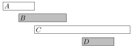
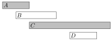
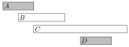
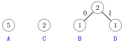
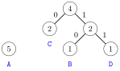
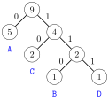

# Greedy algorithms

A **greedy algorithm** constructs a solution to the problem by always making a choice that looks the best at the moment. A greedy algorithm never takes back its choices, but directly constructs the final solution. For this reason, greedy algorithms are usually very efficient.

The difficulty in designing greedy algorithms is to find a greedy strategy that always produces an optimal solution to the problem. The locally optimal choices in a greedy algorithm should also be globally optimal. It is often difficult to argue that a greedy algorithm works.

## Coin problem

As a first example, we consider a problem where we are given a set of coins and our task is to form a sum of money $n$ using the coins. The values of the coins are $\texttt{coins}=\{c_1,c_2,\ldots,c_k\}$, and each coin can be used as many times we want. What is the minimum number of coins needed?

For example, if the coins are the euro coins (in cents) $$\{1,2,5,10,20,50,100,200\}$$ and $n=520$, we need at least four coins. The optimal solution is to select coins $200+200+100+20$ whose sum is 520.

#### Greedy algorithm

A simple greedy algorithm to the problem always selects the largest possible coin, until the required sum of money has been constructed. This algorithm works in the example case, because we first select two 200 cent coins, then one 100 cent coin and finally one 20 cent coin. But does this algorithm always work?

It turns out that if the coins are the euro coins, the greedy algorithm *always* works, i.e., it always produces a solution with the fewest possible number of coins. The correctness of the algorithm can be shown as follows:

First, each coin 1, 5, 10, 50 and 100 appears at most once in an optimal solution, because if the solution would contain two such coins, we could replace them by one coin and obtain a better solution. For example, if the solution would contain coins $5+5$, we could replace them by coin $10$.

In the same way, coins 2 and 20 appear at most twice in an optimal solution, because we could replace coins $2+2+2$ by coins $5+1$ and coins $20+20+20$ by coins $50+10$. Moreover, an optimal solution cannot contain coins $2+2+1$ or $20+20+10$, because we could replace them by coins $5$ and $50$.

Using these observations, we can show for each coin $x$ that it is not possible to optimally construct a sum $x$ or any larger sum by only using coins that are smaller than $x$. For example, if $x=100$, the largest optimal sum using the smaller coins is $50+20+20+5+2+2=99$. Thus, the greedy algorithm that always selects the largest coin produces the optimal solution.

This example shows that it can be difficult to argue that a greedy algorithm works, even if the algorithm itself is simple.

#### General case

In the general case, the coin set can contain any coins and the greedy algorithm *does not* necessarily produce an optimal solution.

We can prove that a greedy algorithm does not work by showing a counterexample where the algorithm gives a wrong answer. In this problem we can easily find a counterexample: if the coins are $\{1,3,4\}$ and the target sum is 6, the greedy algorithm produces the solution $4+1+1$ while the optimal solution is $3+3$.

It is not known if the general coin problem can be solved using any greedy algorithm[^1]. However, as we will see in Chapter 7, in some cases, the general problem can be efficiently solved using a dynamic programming algorithm that always gives the correct answer.

## Scheduling

Many scheduling problems can be solved using greedy algorithms. A classic problem is as follows: Given $n$ events with their starting and ending times, find a schedule that includes as many events as possible. It is not possible to select an event partially. For example, consider the following events:

| event | starting time | ending time |
|:------|:--------------|:------------|
| $A$   | 1             | 3           |
| $B$   | 2             | 5           |
| $C$   | 3             | 9           |
| $D$   | 6             | 8           |

In this case the maximum number of events is two. For example, we can select events $B$ and $D$ as follows:

It is possible to invent several greedy algorithms for the problem, but which of them works in every case?

#### Algorithm 1

The first idea is to select as *short* events as possible. In the example case this algorithm selects the following events:

However, selecting short events is not always a correct strategy. For example, the algorithm fails in the following case:

If we select the short event, we can only select one event. However, it would be possible to select both long events.

#### Algorithm 2

Another idea is to always select the next possible event that *begins* as *early* as possible. This algorithm selects the following events:

However, we can find a counterexample also for this algorithm. For example, in the following case, the algorithm only selects one event:

If we select the first event, it is not possible to select any other events. However, it would be possible to select the other two events.

#### Algorithm 3

The third idea is to always select the next possible event that *ends* as *early* as possible. This algorithm selects the following events:

It turns out that this algorithm *always* produces an optimal solution. The reason for this is that it is always an optimal choice to first select an event that ends as early as possible. After this, it is an optimal choice to select the next event using the same strategy, etc., until we cannot select any more events.

One way to argue that the algorithm works is to consider what happens if we first select an event that ends later than the event that ends as early as possible. Now, we will have at most an equal number of choices how we can select the next event. Hence, selecting an event that ends later can never yield a better solution, and the greedy algorithm is correct.

## Tasks and deadlines

Let us now consider a problem where we are given $n$ tasks with durations and deadlines and our task is to choose an order to perform the tasks. For each task, we earn $d-x$ points where $d$ is the task's deadline and $x$ is the moment when we finish the task. What is the largest possible total score we can obtain?

For example, suppose that the tasks are as follows:

| task | duration | deadline |
|:-----|:---------|:---------|
| $A$  | 4        | 2        |
| $B$  | 3        | 5        |
| $C$  | 2        | 7        |
| $D$  | 4        | 5        |

In this case, an optimal schedule for the tasks is as follows:

In this solution, $C$ yields 5 points, $B$ yields 0 points, $A$ yields $-7$ points and $D$ yields $-8$ points, so the total score is $-10$.

Surprisingly, the optimal solution to the problem does not depend on the deadlines at all, but a correct greedy strategy is to simply perform the tasks *sorted by their durations* in increasing order. The reason for this is that if we ever perform two tasks one after another such that the first task takes longer than the second task, we can obtain a better solution if we swap the tasks. For example, consider the following schedule:

Here $a>b$, so we should swap the tasks:

Now $X$ gives $b$ points less and $Y$ gives $a$ points more, so the total score increases by $a-b > 0$. In an optimal solution, for any two consecutive tasks, it must hold that the shorter task comes before the longer task. Thus, the tasks must be performed sorted by their durations.

## Minimizing sums

We next consider a problem where we are given $n$ numbers $a_1,a_2,\ldots,a_n$ and our task is to find a value $x$ that minimizes the sum $$|a_1-x|^c+|a_2-x|^c+\cdots+|a_n-x|^c.$$ We focus on the cases $c=1$ and $c=2$.

#### Case $c=1$

In this case, we should minimize the sum $$|a_1-x|+|a_2-x|+\cdots+|a_n-x|.$$ For example, if the numbers are $[1,2,9,2,6]$, the best solution is to select $x=2$ which produces the sum $$|1-2|+|2-2|+|9-2|+|2-2|+|6-2|=12.$$ In the general case, the best choice for $x$ is the *median* of the numbers, i.e., the middle number after sorting. For example, the list $[1,2,9,2,6]$ becomes $[1,2,2,6,9]$ after sorting, so the median is 2.

The median is an optimal choice, because if $x$ is smaller than the median, the sum becomes smaller by increasing $x$, and if $x$ is larger then the median, the sum becomes smaller by decreasing $x$. Hence, the optimal solution is that $x$ is the median. If $n$ is even and there are two medians, both medians and all values between them are optimal choices.

#### Case $c=2$

In this case, we should minimize the sum $$(a_1-x)^2+(a_2-x)^2+\cdots+(a_n-x)^2.$$ For example, if the numbers are $[1,2,9,2,6]$, the best solution is to select $x=4$ which produces the sum $$(1-4)^2+(2-4)^2+(9-4)^2+(2-4)^2+(6-4)^2=46.$$ In the general case, the best choice for $x$ is the *average* of the numbers. In the example the average is $(1+2+9+2+6)/5=4$. This result can be derived by presenting the sum as follows: $$nx^2 - 2x(a_1+a_2+\cdots+a_n) + (a_1^2+a_2^2+\cdots+a_n^2)$$ The last part does not depend on $x$, so we can ignore it. The remaining parts form a function $nx^2-2xs$ where $s=a_1+a_2+\cdots+a_n$. This is a parabola opening upwards with roots $x=0$ and $x=2s/n$, and the minimum value is the average of the roots $x=s/n$, i.e., the average of the numbers $a_1,a_2,\ldots,a_n$.

## Data compression

A **binary code** assigns for each character of a string a **codeword** that consists of bits. We can *compress* the string using the binary code by replacing each character by the corresponding codeword. For example, the following binary code assigns codewords for characters `A`--`D`:

| character | codeword |
|----------:|---------:|
|       `A` |       00 |
|       `B` |       01 |
|       `C` |       10 |
|       `D` |       11 |

This is a **constant-length** code which means that the length of each codeword is the same. For example, we can compress the string `AABACDACA` as follows: $$00\,00\,01\,00\,10\,11\,00\,10\,00$$ Using this code, the length of the compressed string is 18 bits. However, we can compress the string better if we use a **variable-length** code where codewords may have different lengths. Then we can give short codewords for characters that appear often and long codewords for characters that appear rarely. It turns out that an **optimal** code for the above string is as follows:

| character | codeword |
|----------:|---------:|
|       `A` |        0 |
|       `B` |      110 |
|       `C` |       10 |
|       `D` |      111 |

An optimal code produces a compressed string that is as short as possible. In this case, the compressed string using the optimal code is $$0\,0\,110\,0\,10\,111\,0\,10\,0,$$ so only 15 bits are needed instead of 18 bits. Thus, thanks to a better code it was possible to save 3 bits in the compressed string.

We require that no codeword is a prefix of another codeword. For example, it is not allowed that a code would contain both codewords 10 and 1011. The reason for this is that we want to be able to generate the original string from the compressed string. If a codeword could be a prefix of another codeword, this would not always be possible. For example, the following code is *not* valid:

| character | codeword |
|----------:|---------:|
|       `A` |       10 |
|       `B` |       11 |
|       `C` |     1011 |
|       `D` |      111 |

Using this code, it would not be possible to know if the compressed string 1011 corresponds to the string `AB` or the string `C`.

#### Huffman coding

**Huffman coding**[^2] is a greedy algorithm that constructs an optimal code for compressing a given string. The algorithm builds a binary tree based on the frequencies of the characters in the string, and each character's codeword can be read by following a path from the root to the corresponding node. A move to the left corresponds to bit 0, and a move to the right corresponds to bit 1.

Initially, each character of the string is represented by a node whose weight is the number of times the character occurs in the string. Then at each step two nodes with minimum weights are combined by creating a new node whose weight is the sum of the weights of the original nodes. The process continues until all nodes have been combined.

Next we will see how Huffman coding creates the optimal code for the string `AABACDACA`. Initially, there are four nodes that correspond to the characters of the string:

The node that represents character `A` has weight 5 because character `A` appears 5 times in the string. The other weights have been calculated in the same way.

The first step is to combine the nodes that correspond to characters `B` and `D`, both with weight 1. The result is:

After this, the nodes with weight 2 are combined:

Finally, the two remaining nodes are combined:

Now all nodes are in the tree, so the code is ready. The following codewords can be read from the tree:

| character | codeword |
|----------:|---------:|
|       `A` |        0 |
|       `B` |      110 |
|       `C` |       10 |
|       `D` |      111 |

[^1]: However, it is possible to *check* in polynomial time if the greedy algorithm presented in this chapter works for a given set of coins [60].

[^2]: D. A. Huffman discovered this method when solving a university course assignment and published the algorithm in 1952 [44].
