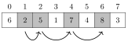
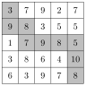
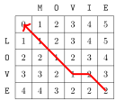

# 动态规划

**动态规划**是一种技术，它结合了完全搜索的正确性与贪心算法的效率。如果一个问题可以被划分为可以独立求解的重叠子问题，那么就可以应用动态规划。

动态规划有两种用途：

- **寻找最优解**：我们希望找到一个尽可能大或尽可能小的解。

- **计数解的个数**：我们希望计算所有可能解的个数。

我们将首先看看如何使用动态规划来寻找最优解，然后我们将用同样的思想来计数解的个数。

理解动态规划是每一位算法竞赛选手职业生涯中的一个里程碑。虽然基本思想很简单，但挑战在于如何将动态规划应用到不同的问题上。本章介绍一组经典问题，它们是一个很好的起点。

## 硬币问题

我们首先关注一个在第 6 章已经见过的问题：给定一组硬币面值 $\texttt{coins} = \{c_1,c_2,\ldots,c_k\}$ 和目标金额 $n$，我们的任务是使用尽可能少的硬币凑出金额 $n$。

在第 6 章中，我们用一个总是选择最大可能硬币的贪心算法解决了这个问题。当硬币是欧元硬币时，贪心算法是有效的，但在一般情况下，贪心算法不一定产生最优解。

现在是时候用动态规划高效地解决这个问题了，使得算法对任意硬币集合都有效。动态规划算法基于一个递归函数，它像暴力枚举算法一样遍历凑出金额的所有可能方式。然而，动态规划算法之所以高效，是因为它使用了*记忆化*，并且每个子问题的答案只计算一次。

#### 递归形式

动态规划的思想是将问题递归地形式化，使得问题的解可以从更小子问题的解计算出来。在硬币问题中，一个自然的递归问题如下：凑出金额 $x$ 所需的最少硬币数是多少？

设 $\texttt{solve}(x)$ 表示凑出金额 $x$ 所需的最少硬币数。函数的值取决于硬币的面值。例如，如果 $\texttt{coins} = \{1,3,4\}$，函数的开头几个值如下：

$$\begin{array}{lcl}
\texttt{solve}(0) & = & 0 \\
\texttt{solve}(1) & = & 1 \\
\texttt{solve}(2) & = & 2 \\
\texttt{solve}(3) & = & 1 \\
\texttt{solve}(4) & = & 1 \\
\texttt{solve}(5) & = & 2 \\
\texttt{solve}(6) & = & 2 \\
\texttt{solve}(7) & = & 2 \\
\texttt{solve}(8) & = & 2 \\
\texttt{solve}(9) & = & 3 \\
\texttt{solve}(10) & = & 3 \\
\end{array}$$

例如，$\texttt{solve}(10)=3$，因为至少需要 3 枚硬币才能凑出金额 10。最优解是 $3+3+4=10$。

$\texttt{solve}$ 的本质性质是它的值可以从更小的值递归地计算出来。其思路是关注我们为金额选择的*第一枚*硬币。例如，在上面的情形中，第一枚硬币可以是 1、3 或 4。如果我们先选择硬币 1，那么剩下的任务是用最少的硬币凑出金额 9，这是原问题的一个子问题。当然，硬币 3 和 4 也是如此。因此，我们可以用下面的递归公式来计算最少硬币数： $$\begin{equation*}
\begin{split}
\texttt{solve}(x) = \min( & \texttt{solve}(x-1)+1, \\
                           & \texttt{solve}(x-3)+1, \\
                           & \texttt{solve}(x-4)+1).
\end{split}
\end{equation*}$$ 递归的基准情况是 $\texttt{solve}(0)=0$，因为凑出空金额不需要任何硬币。例如， $$\texttt{solve}(10) = \texttt{solve}(7)+1 = \texttt{solve}(4)+2 = \texttt{solve}(0)+3 = 3.$$

现在我们可以给出一个通用的递归函数，用来计算凑出金额 $x$ 所需的最少硬币数： $$\begin{equation*}
    \texttt{solve}(x) = \begin{cases}
               \infty               & x < 0\\
               0               & x = 0\\
               \min_{c \in \texttt{coins}} \texttt{solve}(x-c)+1 & x > 0 \\
           \end{cases}
\end{equation*}$$

首先，如果 $x<0$，值为 $\infty$，因为无法凑出负的金额。然后，如果 $x=0$，值为 $0$，因为凑出空金额不需要任何硬币。最后，如果 $x>0$，变量 $c$ 遍历选择金额第一枚硬币的所有可能方式。

一旦找到了解决问题的递归函数，我们就可以直接用 C++ 实现一个解法（常量 `INF` 表示无穷大）：

```cpp
int solve(int x) {
    if (x < 0) return INF;
    if (x == 0) return 0;
    int best = INF;
    for (auto c : coins) {
        best = min(best, solve(x-c)+1);
    }
    return best;
}
```

然而，这个函数并不高效，因为构造金额的方式可能有指数级之多。不过，接下来我们将看到如何用一种称为记忆化的技术使函数变得高效。

#### 使用记忆化

动态规划的思想是使用**记忆化**来高效地计算递归函数的值。这意味着函数的值在被计算出来之后会被存储到一个数组中。对于每个参数，函数的值只递归地计算一次，之后该值就可以直接从数组中取出。

在这个问题中，我们使用数组

```cpp
bool ready[N];
int value[N];
```

其中 $\texttt{ready}[x]$ 表示 $\texttt{solve}(x)$ 的值是否已经计算过，如果计算过，$\texttt{value}[x]$ 就包含这个值。常量 $N$ 的选取使得所有需要的值都能放进数组。

现在这个函数可以高效地实现如下：

```cpp
int solve(int x) {
    if (x < 0) return INF;
    if (x == 0) return 0;
    if (ready[x]) return value[x];
    int best = INF;
    for (auto c : coins) {
        best = min(best, solve(x-c)+1);
    }
    value[x] = best;
    ready[x] = true;
    return best;
}
```

该函数像之前一样处理基准情况 $x<0$ 和 $x=0$。然后函数从 $\texttt{ready}[x]$ 检查 $\texttt{solve}(x)$ 是否已经存储在 $\texttt{value}[x]$ 中，如果是，函数就直接返回它。否则，函数递归地计算 $\texttt{solve}(x)$ 的值并将其存储在 $\texttt{value}[x]$ 中。

这个函数之所以高效，是因为每个参数 $x$ 的答案只递归地计算一次。在 $\texttt{solve}(x)$ 的值被存储在 $\texttt{value}[x]$ 中之后，每当函数再次以参数 $x$ 被调用时，都可以高效地取出它。该算法的时间复杂度是 $O(nk)$，其中 $n$ 是目标金额，$k$ 是硬币数。

注意，我们也可以*迭代地*构造数组 `value`，用一个循环简单地计算 $\texttt{solve}$ 在参数 $0 \ldots n$ 上的所有值：

```cpp
value[0] = 0;
for (int x = 1; x <= n; x++) {
    value[x] = INF;
    for (auto c : coins) {
        if (x-c >= 0) {
            value[x] = min(value[x], value[x-c]+1);
        }
    }
}
```

事实上，大多数算法竞赛选手更喜欢这种实现，因为它更短，且常数因子更小。从现在开始，我们的示例中也将使用迭代实现。不过，从递归函数的角度来思考动态规划解法往往更容易。

#### 构造一个解

有时我们被要求既求出最优解的值，又给出一个如何构造这种解的示例。例如在硬币问题中，我们可以再声明一个数组，它表示每个金额在最优解中的第一枚硬币：

```cpp
int first[N];
```

然后，我们可以如下修改算法：

```cpp
value[0] = 0;
for (int x = 1; x <= n; x++) {
    value[x] = INF;
    for (auto c : coins) {
        if (x-c >= 0 && value[x-c]+1 < value[x]) {
            value[x] = value[x-c]+1;
            first[x] = c;
        }
    }
}
```

之后，可以用下面的代码打印出金额 $n$ 的最优解中出现的硬币：

```cpp
while (n > 0) {
    cout << first[n] << "\n";
    n -= first[n];
}
```

#### 计数解的个数

现在让我们考虑硬币问题的另一个版本，我们的任务是计算用这些硬币凑出金额 $x$ 的总方案数。例如，如果 $\texttt{coins}=\{1,3,4\}$ 且 $x=5$，总共有 6 种方案：

2

- $1+1+1+1+1$

- $1+1+3$

- $1+3+1$

- $3+1+1$

- $1+4$

- $4+1$

我们仍然可以递归地解决这个问题。设 $\texttt{solve}(x)$ 表示凑出金额 $x$ 的方案数。例如，如果 $\texttt{coins}=\{1,3,4\}$，那么 $\texttt{solve}(5)=6$，递归公式为 $$\begin{equation*}
\begin{split}
\texttt{solve}(x) = & \texttt{solve}(x-1) + \\
                    & \texttt{solve}(x-3) + \\
                    & \texttt{solve}(x-4)  .
\end{split}
\end{equation*}$$

于是，通用的递归函数如下： $$\begin{equation*}
    \texttt{solve}(x) = \begin{cases}
               0               & x < 0\\
               1               & x = 0\\
               \sum_{c \in \texttt{coins}} \texttt{solve}(x-c) & x > 0 \\
           \end{cases}
\end{equation*}$$

如果 $x<0$，值为 0，因为没有方案。如果 $x=0$，值为 1，因为凑出空金额只有一种方式。否则我们计算所有形如 $\texttt{solve}(x-c)$ 的值之和，其中 $c$ 在 `coins` 中。

下面的代码构造一个数组 $\texttt{count}$，使得 $\texttt{count}[x]$ 等于 $\texttt{solve}(x)$ 在 $0 \le x \le n$ 上的值：

```cpp
count[0] = 1;
for (int x = 1; x <= n; x++) {
    for (auto c : coins) {
        if (x-c >= 0) {
            count[x] += count[x-c];
        }
    }
}
```

通常解的个数非常大，以至于不需要计算确切的数目，只需给出答案对 $m$ 取模的结果即可，例如 $m=10^9+7$。这可以通过修改代码，使所有计算都在模 $m$ 下进行来实现。在上面的代码中，只需添加下面这一行

```cpp
        count[x] %= m;
```

在下面这一行之后

```cpp
        count[x] += count[x-c];
```

现在我们已经讨论了动态规划的所有基本思想。由于动态规划可以在许多不同的情境中使用，接下来我们将浏览一组问题，它们展示了关于动态规划可能性的更多例子。

## 最长递增子序列

我们的第一个问题是在一个含 $n$ 个元素的数组中找出**最长递增子序列**。它是一个长度最大的、从数组左边到右边的元素序列，且序列中每个元素都比前一个元素大。例如，在数组


中最长递增子序列包含 4 个元素：



设 $\texttt{length}(k)$ 表示以位置 $k$ 结尾的最长递增子序列的长度。因此，如果我们计算出 $\texttt{length}(k)$ 在 $0 \le k \le n-1$ 上的所有值，就能求出最长递增子序列的长度。例如，对于上面的数组，函数的值如下： $$\begin{array}{lcl}
\texttt{length}(0) & = & 1 \\
\texttt{length}(1) & = & 1 \\
\texttt{length}(2) & = & 2 \\
\texttt{length}(3) & = & 1 \\
\texttt{length}(4) & = & 3 \\
\texttt{length}(5) & = & 2 \\
\texttt{length}(6) & = & 4 \\
\texttt{length}(7) & = & 2 \\
\end{array}$$

例如，$\texttt{length}(6)=4$，因为以位置 6 结尾的最长递增子序列由 4 个元素组成。

为了计算 $\texttt{length}(k)$ 的一个值，我们应当找到一个位置 $i<k$，使得 $\texttt{array}[i]<\texttt{array}[k]$ 且 $\texttt{length}(i)$ 尽可能大。于是我们知道 $\texttt{length}(k)=\texttt{length}(i)+1$，因为这是把 $\texttt{array}[k]$ 追加到子序列上的最优方式。然而，如果不存在这样的位置 $i$，那么 $\texttt{length}(k)=1$，这意味着该子序列只包含 $\texttt{array}[k]$。

由于函数的所有值都可以从更小的值计算出来，我们可以使用动态规划。在下面的代码中，函数的值将存储在一个数组 $\texttt{length}$ 中。

```cpp
for (int k = 0; k < n; k++) {
    length[k] = 1;
    for (int i = 0; i < k; i++) {
        if (array[i] < array[k]) {
            length[k] = max(length[k],length[i]+1);
        }
    }
}
```

这段代码在 $O(n^2)$ 时间内运行，因为它由两个嵌套循环组成。不过，也可以用 $O(n \log n)$ 的时间更高效地实现这个动态规划计算。你能找到一种方法吗？

## 网格中的路径

我们的下一个问题是：在一个 $n \times n$ 的网格中，从左上角到右下角找一条路径，使得我们只能向下和向右移动。每个方格包含一个正整数，路径的选取应使得沿路径的数值之和尽可能大。

下图展示了一个网格中的最优路径：



路径上的数值之和为 67，这是从左上角到右下角路径上可能的最大和。

假设网格的行和列都从 1 编号到 $n$，且 $\texttt{value}[y][x]$ 等于方格 $(y,x)$ 中的值。设 $\texttt{sum}(y,x)$ 表示从左上角到方格 $(y,x)$ 的路径上的最大和。于是 $\texttt{sum}(n,n)$ 就给出了从左上角到右下角的最大和。例如在上面的网格中，$\texttt{sum}(5,5)=67$。

我们可以如下递归地计算这些和： $$\texttt{sum}(y,x) = \max(\texttt{sum}(y,x-1),\texttt{sum}(y-1,x))+\texttt{value}[y][x]$$

这个递归公式基于这样一个观察：终点为方格 $(y,x)$ 的路径要么来自方格 $(y,x-1)$，要么来自方格 $(y-1,x)$：


因此，我们选择使和最大的那个方向。我们假设当 $y=0$ 或 $x=0$ 时 $\texttt{sum}(y,x)=0$（因为不存在这样的路径），所以递归公式在 $y=1$ 或 $x=1$ 时也成立。

由于函数 `sum` 有两个参数，动态规划数组也有两维。例如，我们可以使用数组

```cpp
int sum[N][N];
```

并如下计算这些和：

```cpp
for (int y = 1; y <= n; y++) {
    for (int x = 1; x <= n; x++) {
        sum[y][x] = max(sum[y][x-1],sum[y-1][x])+value[y][x];
    }
}
```

该算法的时间复杂度是 $O(n^2)$。

## 背包问题

**背包**一词指的是这样一类问题：给定一组物品，需要找出具有某些性质的子集。背包问题常常可以用动态规划来解决。

在本节中，我们关注下面这个问题：给定一个权重列表 $[w_1,w_2,\ldots,w_n]$，确定用这些权重能够构造出的所有和。例如，如果权重是 $[1,3,3,5]$，则可能得到以下这些和：

|   0 |   1 |   2 |   3 |   4 |   5 |   6 |   7 |   8 |   9 |  10 |  11 |  12 |
|----:|----:|----:|----:|----:|----:|----:|----:|----:|----:|----:|----:|----:|
|   X |   X |     |   X |   X |   X |   X |   X |   X |   X |     |   X |   X |

在这个例子中，$0 \ldots 12$ 之间除 2 和 10 外的所有和都是可能的。例如，和 7 是可能的，因为我们可以选择权重 $[1,3,3]$。

为了解决这个问题，我们关注这样的子问题：只使用前 $k$ 个权重来构造和。设 $\texttt{possible}(x,k)=\textrm{true}$ 表示我们能用前 $k$ 个权重构造出和 $x$，否则 $\texttt{possible}(x,k)=\textrm{false}$。函数的值可以如下递归地计算： $$\texttt{possible}(x,k) = \texttt{possible}(x-w_k,k-1) \lor \texttt{possible}(x,k-1)$$ 这个公式基于这样一个事实：我们要么在和里使用权重 $w_k$，要么不使用它。如果我们使用 $w_k$，剩下的任务就是用前 $k-1$ 个权重凑出和 $x-w_k$；如果我们不使用 $w_k$，剩下的任务就是用前 $k-1$ 个权重凑出和 $x$。作为基准情况， $$\begin{equation*}
    \texttt{possible}(x,0) = \begin{cases}
               \textrm{true}    & x = 0\\
               \textrm{false}   & x \neq 0 \\
           \end{cases}
\end{equation*}$$ 因为如果不使用任何权重，我们只能凑出和 0。

下面的表格展示了权重为 $[1,3,3,5]$ 时函数的所有值（符号 “X” 表示值为 true）：

| $k \backslash x$ |   0 |   1 |   2 |   3 |   4 |   5 |   6 |   7 |   8 |   9 |  10 |  11 |  12 |
|-----------------:|----:|----:|----:|----:|----:|----:|----:|----:|----:|----:|----:|----:|----:|
|                0 |   X |     |     |     |     |     |     |     |     |     |     |     |     |
|                1 |   X |   X |     |     |     |     |     |     |     |     |     |     |     |
|                2 |   X |   X |     |   X |   X |     |     |     |     |     |     |     |     |
|                3 |   X |   X |     |   X |   X |     |   X |   X |     |     |     |     |     |
|                4 |   X |   X |     |   X |   X |   X |   X |   X |   X |   X |     |   X |   X |

计算完这些值之后，$\texttt{possible}(x,n)$ 告诉我们能否使用*全部*权重构造出和 $x$。

设 $W$ 表示权重的总和。下面这个 $O(nW)$ 时间的动态规划解法对应于该递归函数：

```cpp
possible[0][0] = true;
for (int k = 1; k <= n; k++) {
    for (int x = 0; x <= W; x++) {
        if (x-w[k] >= 0) possible[x][k] |= possible[x-w[k]][k-1];
        possible[x][k] |= possible[x][k-1];
    }
}
```

不过，这里有一个更好的实现，它只使用一个一维数组 $\texttt{possible}[x]$，表示我们能否构造出和为 $x$ 的子集。技巧在于对每个新权重从右到左更新数组：

```cpp
possible[0] = true;
for (int k = 1; k <= n; k++) {
    for (int x = W; x >= 0; x--) {
        if (possible[x]) possible[x+w[k]] = true;
    }
}
```

注意，这里给出的一般思想可以用在许多背包问题中。例如，如果给定带有权重和价值的物品，我们可以对每个权重和确定一个子集的最大价值之和。

## 编辑距离

**编辑距离**或 **Levenshtein 距离**[^1]是将一个字符串转换为另一个字符串所需的最少编辑操作次数。允许的编辑操作如下：

- 插入一个字符（例如 `ABC` $\rightarrow$ `ABCA`）

- 删除一个字符（例如 `ABC` $\rightarrow$ `AC`）

- 修改一个字符（例如 `ABC` $\rightarrow$ `ADC`）

例如，`LOVE` 和 `MOVIE` 之间的编辑距离是 2，因为我们可以先执行操作 `LOVE` $\rightarrow$ `MOVE`（修改），再执行操作 `MOVE` $\rightarrow$ `MOVIE`（插入）。这是可能的最少操作次数，因为显然只做一次操作是不够的。

假设给定一个长度为 $n$ 的字符串 `x` 和一个长度为 $m$ 的字符串 `y`，我们要计算 `x` 和 `y` 之间的编辑距离。为了解决这个问题，我们定义一个函数 $\texttt{distance}(a,b)$，它给出前缀 $\texttt{x}[0 \ldots a]$ 和 $\texttt{y}[0 \ldots b]$ 之间的编辑距离。因此，使用这个函数，`x` 和 `y` 之间的编辑距离等于 $\texttt{distance}(n-1,m-1)$。

我们可以如下计算 `distance` 的值： $$\begin{equation*}
\begin{split}
\texttt{distance}(a,b) = \min(& \texttt{distance}(a,b-1)+1, \\
                           & \texttt{distance}(a-1,b)+1, \\
                           & \texttt{distance}(a-1,b-1)+\texttt{cost}(a,b)).
\end{split}
\end{equation*}$$ 这里，如果 $\texttt{x}[a]=\texttt{y}[b]$，则 $\texttt{cost}(a,b)=0$，否则 $\texttt{cost}(a,b)=1$。该公式考虑了以下几种编辑字符串 `x` 的方式：

- $\texttt{distance}(a,b-1)$：在 `x` 末尾插入一个字符

- $\texttt{distance}(a-1,b)$：从 `x` 中删除最后一个字符

- $\texttt{distance}(a-1,b-1)$：匹配或修改 `x` 的最后一个字符

在前两种情况下，需要一次编辑操作（插入或删除）。在最后一种情况下，如果 $\texttt{x}[a]=\texttt{y}[b]$，我们无需编辑即可匹配最后一个字符，否则需要一次编辑操作（修改）。

下面的表格展示了示例中 `distance` 的值：


表格的右下角告诉我们 `LOVE` 和 `MOVIE` 之间的编辑距离是 2。表格还展示了如何构造最短的编辑操作序列。在这个例子中，路径如下：



`LOVE` 和 `MOVIE` 的最后一个字符相等，所以它们之间的编辑距离等于 `LOV` 和 `MOVI` 之间的编辑距离。我们可以用一次编辑操作从 `MOVI` 中删除字符 `I`。因此，编辑距离比 `LOV` 和 `MOV` 之间的编辑距离大 1，依此类推。

## 计数铺砖方案

有时，动态规划解法的状态比数字的固定组合更复杂。作为一个例子，考虑这样一个问题：计算用 $1 \times 2$ 和 $2 \times 1$ 大小的瓷砖铺满一个 $n \times m$ 网格的不同方案数。例如，$4 \times 7$ 网格的一个有效方案是


总方案数为 781。

这个问题可以用动态规划逐行遍历网格来解决。一个方案中的每一行可以表示为一个字符串，它包含 $m$ 个来自集合 $\{\sqcap, \sqcup, \sqsubset, \sqsupset \}$ 的字符。例如，上面的方案由四行组成，它们对应于以下字符串：

- $\sqcap \sqsubset \sqsupset \sqcap \sqsubset \sqsupset \sqcap$

- $\sqcup \sqsubset \sqsupset \sqcup \sqcap \sqcap \sqcup$

- $\sqsubset \sqsupset \sqsubset \sqsupset \sqcup \sqcup \sqcap$

- $\sqsubset \sqsupset \sqsubset \sqsupset \sqsubset \sqsupset \sqcup$

设 $\texttt{count}(k,x)$ 表示这样构造网格第 $1 \ldots k$ 行方案的方法数：字符串 $x$ 对应于第 $k$ 行。这里可以使用动态规划，因为一行的状态只受前一行状态的约束。

一个方案是有效的，如果第 $1$ 行不包含字符 $\sqcup$，第 $n$ 行不包含字符 $\sqcap$，并且所有相邻的行都*兼容*。例如，行 $\sqcup \sqsubset \sqsupset \sqcup \sqcap \sqcap \sqcup$ 和 $\sqsubset \sqsupset \sqsubset \sqsupset \sqcup \sqcup \sqcap$ 是兼容的，而行 $\sqcap \sqsubset \sqsupset \sqcap \sqsubset \sqsupset \sqcap$ 和 $\sqsubset \sqsupset \sqsubset \sqsupset \sqsubset \sqsupset \sqcup$ 不兼容。

由于一行由 $m$ 个字符组成，且每个字符有四种选择，不同行的数目至多为 $4^m$。因此，该解法的时间复杂度是 $O(n 4^{2m})$，因为对每一行我们可以遍历 $O(4^m)$ 种可能状态，而对于每种状态，前一行有 $O(4^m)$ 种可能状态。在实践中，最好旋转网格使得较短的一边长度为 $m$，因为因子 $4^{2m}$ 主导了时间复杂度。

通过对行使用更紧凑的表示，可以使解法更高效。事实证明，只需知道前一行的哪些列包含竖直瓷砖的上半部分就够了。因此，我们可以只用字符 $\sqcap$ 和 $\Box$ 来表示一行，其中 $\Box$ 是字符 $\sqcup$、$\sqsubset$ 和 $\sqsupset$ 的组合。使用这种表示，不同的行只有 $2^m$ 种，时间复杂度为 $O(n 2^{2m})$。

最后再提一点，计算铺砖方案数还有一个出人意料直接的公式[^2]： $$\prod_{a=1}^{\lceil n/2 \rceil} \prod_{b=1}^{\lceil m/2 \rceil} 4 \cdot (\cos^2 \frac{\pi a}{n + 1} + \cos^2 \frac{\pi b}{m+1})$$ 这个公式非常高效，因为它在 $O(nm)$ 时间内算出铺砖方案数，但由于答案是实数的乘积，使用该公式时的一个问题是如何精确地存储中间结果。

[^1]: 该距离以 V. I. Levenshtein 命名，他在研究二进制编码时研究了它 [54]。

[^2]: 出人意料的是，这个公式由两个独立工作的研究团队于 1961 年发现 [47, 75]。
