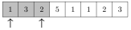
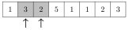
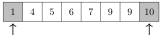
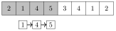
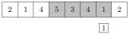
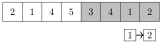

# 均摊分析

算法的时间复杂度往往只需审视算法的结构就能轻松分析：算法包含哪些循环，这些循环又执行了多少次。然而，有时直接分析并不能真实反映算法的效率。

**均摊分析**（amortized analysis）可用于分析那些包含时间复杂度会变化的操作的算法。其思路是估计算法执行期间所有此类操作所用的总时间，而不是关注单个操作。

## 双指针方法

在**双指针方法**中，使用两个指针遍历数组的值。两个指针都只能朝一个方向移动，这保证了算法的高效。接下来我们讨论两个可用双指针方法解决的问题。

#### 子数组求和

作为第一个例子，考虑这样一个问题：给定一个含 $n$ 个正整数的数组和一个目标和 $x$，我们想找出一个和为 $x$ 的子数组，或者报告不存在这样的子数组。

例如，数组

包含一个和为 8 的子数组：

这个问题可以用双指针方法在 $O(n)$ 时间内解决。思路是维护分别指向子数组第一个值和最后一个值的指针。每一轮中，左指针向右移动一步，而右指针在子数组的和不超过 $x$ 的前提下尽可能向右移动。如果和恰好等于 $x$，则找到了一个解。

举例来说，考虑以下数组和目标和 $x=8$：

初始子数组包含值 1、3 和 2，其和为 6：

接着，左指针向右移动一步。右指针不移动，因为否则子数组的和将超过 $x$。

左指针再次向右移动一步，这次右指针向右移动三步。子数组的和为 $2+5+1=8$，因此找到了一个和为 $x$ 的子数组。

算法的运行时间取决于右指针移动的步数。虽然在*单次*轮次中指针能移动多少步没有有用的上界，但我们知道在整个算法过程中指针*总共*移动 $O(n)$ 步，因为它只向右移动。

由于左指针和右指针在算法过程中都移动 $O(n)$ 步，算法在 $O(n)$ 时间内运行。

#### 2SUM 问题

另一个可用双指针方法解决的问题是下面这个，也被称为 **2SUM 问题**：给定一个含 $n$ 个数的数组和一个目标和 $x$，找出两个数组值使它们的和为 $x$，或者报告不存在这样的值。

为解决这个问题，我们首先按递增顺序对数组的值排序。之后，我们用两个指针遍历数组。左指针从第一个值开始，每一轮向右移动一步。右指针从最后一个值开始，总是向左移动，直到左值和右值之和不超过 $x$。如果和恰好等于 $x$，则找到了一个解。

例如，考虑以下数组和目标和 $x=12$：

指针的初始位置如下。值之和为 $1+10=11$，小于 $x$。

然后左指针向右移动一步。右指针向左移动三步，和变为 $4+7=11$。

此后，左指针再次向右移动一步。右指针不移动，于是找到了一个解 $5+7=12$。

算法的运行时间为 $O(n \log n)$，因为它首先用 $O(n \log n)$ 时间对数组排序，然后两个指针都移动 $O(n)$ 步。

注意，还可以用另一种方式在 $O(n \log n)$ 时间内解决这个问题，即使用二分搜索。在这种解法中，我们遍历数组，对每个数组值尝试找出另一个能得到和 $x$ 的值。这可以通过执行 $n$ 次二分搜索来完成，每次耗时 $O(\log n)$。

一个更困难的问题是 **3SUM 问题**，它要求找出*三个*数组值使其和为 $x$。利用上述算法的思路，这个问题可以在 $O(n^2)$ 时间内解决[^1]。你能看出怎么做吗？

## 最近的较小元素

均摊分析常用于估计对某个数据结构执行的操作次数。这些操作可能分布不均，以致大多数操作发生在算法的某个阶段，但操作的总次数是有限的。

举例来说，考虑这样一个问题：为每个数组元素找出其**最近的较小元素**，即数组中位于该元素之前、且比它小的第一个元素。可能存在没有这样的元素的情况，此时算法应报告这一情况。接下来我们将看到如何用栈结构高效地解决这个问题。

我们从左到右遍历数组，并维护一个存放数组元素的栈。在每个数组位置，我们不断从栈中弹出元素，直到栈顶元素小于当前元素，或者栈为空。然后，我们报告栈顶元素就是当前元素的最近较小元素，或者如果栈为空，则不存在这样的元素。最后，我们把当前元素压入栈中。

举例来说，考虑以下数组：

首先，元素 1、3 和 4 被压入栈中，因为每个元素都比前一个元素大。因此，4 的最近较小元素是 3，3 的最近较小元素是 1。

下一个元素 2 小于栈中位于顶部的两个元素。因此，元素 3 和 4 被弹出栈，然后元素 2 被压入栈中。它的最近较小元素是 1：

接着，元素 5 大于元素 2，因此它被压入栈中，其最近较小元素是 2：

此后，元素 5 被弹出栈，元素 3 和 4 被压入栈中：

最后，除 1 之外的所有元素都被弹出栈，最后一个元素 2 被压入栈中：

算法的效率取决于栈操作的总次数。如果当前元素大于栈顶元素，它会直接被压入栈中，这是高效的。然而，有时栈中可能包含若干较大的元素，弹出它们需要时间。尽管如此，每个元素被*恰好一次*压入栈，并*至多一次*弹出栈。因此，每个元素引起 $O(1)$ 次栈操作，算法在 $O(n)$ 时间内运行。

## 滑动窗口最小值

**滑动窗口**是一个固定大小的子数组，它从左到右在数组中移动。在每个窗口位置，我们想计算关于窗口内元素的某些信息。本节我们聚焦于维护**滑动窗口最小值**的问题，即我们要报告每个窗口内的最小值。

滑动窗口最小值可以用与计算最近较小元素类似的思路来计算。我们维护一个队列，其中每个元素都大于前一个元素，且队首元素始终对应窗口内的最小值。每次窗口移动后，我们从队尾移除元素，直到队尾元素小于新的窗口元素，或者队列变空。如果队首元素不再位于窗口内，我们也将其移除。最后，我们把新的窗口元素加入队尾。

举例来说，考虑以下数组：

假设滑动窗口的大小为 4。在第一个窗口位置，最小值为 1：

然后窗口向右移动一步。新元素 3 小于队列中的元素 4 和 5，因此元素 4 和 5 被移出队列，元素 3 被加入队列。最小值仍然是 1。

此后，窗口再次移动，最小元素 1 不再属于该窗口。因此，它被移出队列，此时最小值为 3。同时新元素 4 被加入队列。

下一个新元素 1 小于队列中的所有元素。因此，所有元素都被移出队列，队列中将只包含元素 1：

最后窗口到达它的最后一个位置。元素 2 被加入队列，但窗口内的最小值仍然是 1。

由于每个数组元素被恰好一次加入队列，并至多一次移出队列，算法在 $O(n)$ 时间内运行。

[^1]: 在很长一段时间里，人们认为以比 $O(n^2)$ 时间更高效的方式解决 3SUM 问题是不可能的。然而，在 2014 年，人们发现 [33] 事实并非如此。
