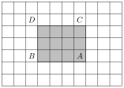
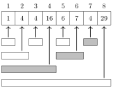
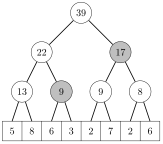
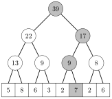
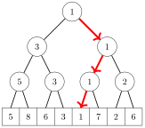

# 区间查询

本章讨论能够高效处理区间查询的数据结构。在**区间查询**中，我们的任务是根据数组的某个子数组计算出一个值。典型的区间查询包括：

- $\texttt{sum}_q(a,b)$：计算区间 $[a,b]$ 内各值之和

- $\texttt{min}_q(a,b)$：求区间 $[a,b]$ 内的最小值

- $\texttt{max}_q(a,b)$：求区间 $[a,b]$ 内的最大值

例如，考虑以下数组中的区间 $[3,6]$：


此时，$\texttt{sum}_q(3,6)=14$，$\texttt{min}_q(3,6)=1$，$\texttt{max}_q(3,6)=6$。

处理区间查询的一种简单方法是使用循环遍历区间内的所有数组值。例如，下面的函数可用于处理数组上的求和查询：

```cpp
int sum(int a, int b) {
    int s = 0;
    for (int i = a; i <= b; i++) {
        s += array[i];
    }
    return s;
}
```

该函数在 $O(n)$ 时间内运行，其中 $n$ 是数组的大小。因此，使用该函数可以在 $O(nq)$ 时间内处理 $q$ 次查询。然而，如果 $n$ 和 $q$ 都很大，这种做法会很慢。幸运的是，事实证明有一些方法可以高效得多地处理区间查询。

## 静态数组查询

我们首先关注数组是*静态*的情形，即在各次查询之间数组的值从不更新。在这种情况下，只需构造一个静态数据结构，就能给出任何可能查询的答案。

#### 求和查询

通过构造**前缀和数组**，我们可以轻松地处理静态数组上的求和查询。前缀和数组中的每个值都等于原数组中截至该位置的各值之和，即位置 $k$ 处的值为 $\texttt{sum}_q(0,k)$。前缀和数组可以在 $O(n)$ 时间内构造完成。

例如，考虑以下数组：


对应的前缀和数组如下：


由于前缀和数组包含了 $\texttt{sum}_q(0,k)$ 的所有取值，我们可以按如下方式在 $O(1)$ 时间内计算出任意 $\texttt{sum}_q(a,b)$： $$\texttt{sum}_q(a,b) = \texttt{sum}_q(0,b) - \texttt{sum}_q(0,a-1)$$ 若定义 $\texttt{sum}_q(0,-1)=0$，则上述公式在 $a=0$ 时也成立。

例如，考虑区间 $[3,6]$：


此时 $\texttt{sum}_q(3,6)=8+6+1+4=19$。这个和可以由前缀和数组中的两个值算出：


因此，$\texttt{sum}_q(3,6)=\texttt{sum}_q(0,6)-\texttt{sum}_q(0,2)=27-8=19$。

这一思路也可以推广到更高维度。例如，我们可以构造一个二维前缀和数组，用它可以在 $O(1)$ 时间内算出任意矩形子数组的和。该数组中的每个和都对应一个从数组左上角开始的子数组。

下图说明了这一思路：



灰色子数组的和可以用公式 $$S(A) - S(B) - S(C) + S(D),$$ 计算，其中 $S(X)$ 表示从左上角到 $X$ 所在位置的矩形子数组内各值之和。

#### 最小值查询

最小值查询比求和查询更难处理。即便如此，仍有一种相当简单的 $O(n \log n)$ 时间预处理方法，之后我们就能在 $O(1)$ 时间内回答任意最小值查询[^1]。注意，由于最小值查询和最大值查询的处理方式类似，我们只需关注最小值查询。

思路是预先计算出所有这样的 $\textrm{min}_q(a,b)$：其中 $b-a+1$（区间的长度）是 2 的幂。例如，对于数组


会计算出以下各值：

> **译者注**
>
> 原文将下面三个小表并排排版，从左到右分别对应区间长度为 $1$、$2$、$4$ 的情形。

| $a$ | $b$ | $\texttt{min}_q(a,b)$ |
| --- | --- | --- |
| 0 | 0 | 1 |
| 1 | 1 | 3 |
| 2 | 2 | 4 |
| 3 | 3 | 8 |
| 4 | 4 | 6 |
| 5 | 5 | 1 |
| 6 | 6 | 4 |
| 7 | 7 | 2 |

| $a$ | $b$ | $\texttt{min}_q(a,b)$ |
| --- | --- | --- |
| 0 | 1 | 1 |
| 1 | 2 | 3 |
| 2 | 3 | 4 |
| 3 | 4 | 6 |
| 4 | 5 | 1 |
| 5 | 6 | 1 |
| 6 | 7 | 2 |

| $a$ | $b$ | $\texttt{min}_q(a,b)$ |
| --- | --- | --- |
| 0 | 3 | 1 |
| 1 | 4 | 3 |
| 2 | 5 | 1 |
| 3 | 6 | 1 |
| 4 | 7 | 1 |
| 0 | 7 | 1 |

预计算的值的数量为 $O(n \log n)$，因为长度是 2 的幂的区间共有 $O(\log n)$ 种。这些值可以利用递推公式 $$\texttt{min}_q(a,b) = \min(\texttt{min}_q(a,a+w-1),\texttt{min}_q(a+w,b)),$$ 高效地计算出来，其中 $b-a+1$ 是 2 的幂，$w=(b-a+1)/2$。计算所有这些值需要 $O(n \log n)$ 时间。

在此之后，任意 $\texttt{min}_q(a,b)$ 都可以作为两个预计算值的最小值在 $O(1)$ 时间内算出。设 $k$ 为不超过 $b-a+1$ 的最大 2 的幂。我们可以用公式 $$\texttt{min}_q(a,b) = \min(\texttt{min}_q(a,a+k-1),\texttt{min}_q(b-k+1,b)).$$ 计算出 $\texttt{min}_q(a,b)$ 的值。在上述公式中，区间 $[a,b]$ 被表示为区间 $[a,a+k-1]$ 与 $[b-k+1,b]$ 的并集，二者的长度均为 $k$。

作为例子，考虑区间 $[1,6]$：


该区间的长度为 6，不超过 6 的最大 2 的幂是 4。因此区间 $[1,6]$ 是区间 $[1,4]$ 与 $[3,6]$ 的并集：


由于 $\texttt{min}_q(1,4)=3$ 且 $\texttt{min}_q(3,6)=1$，我们得出 $\texttt{min}_q(1,6)=1$。

## 树状数组

**树状数组**（binary indexed tree），又称 **Fenwick 树**[^2]，可以看作是前缀和数组的一种动态变体。它支持数组上的两种 $O(\log n)$ 时间操作：处理一次区间求和查询和更新一个值。

树状数组的优势在于，它允许我们在各次求和查询之间高效地更新数组的值。使用前缀和数组则做不到这一点，因为每次更新之后，都需要在 $O(n)$ 时间内重新构建整个前缀和数组。

#### 结构

尽管这种结构的名字是二叉索引*树*，它通常用一个数组来表示。在本节中，我们假设所有数组都从 1 开始索引，因为这会使实现更容易。

设 $p(k)$ 表示能整除 $k$ 的最大 2 的幂。我们把树状数组存储为一个数组 `tree`，使得 $$\texttt{tree}[k] = \texttt{sum}_q(k-p(k)+1,k),$$ 即，每个位置 $k$ 存储原数组中某个区间内各值之和，该区间的长度为 $p(k)$ 且以位置 $k$ 结尾。例如，由于 $p(6)=2$，$\texttt{tree}[6]$ 存储的是 $\texttt{sum}_q(5,6)$ 的值。

例如，考虑以下数组：


对应的树状数组如下：


下图更清楚地展示了树状数组中的每个值如何对应于原数组中的一个区间：


使用树状数组，任意 $\texttt{sum}_q(1,k)$ 都可以在 $O(\log n)$ 时间内算出，因为区间 $[1,k]$ 总可以被划分为 $O(\log n)$ 个区间，而这些区间的和被存储在树中。

例如，区间 $[1,7]$ 由以下区间组成：



因此，我们可以按如下方式计算相应的和： $$\texttt{sum}_q(1,7)=\texttt{sum}_q(1,4)+\texttt{sum}_q(5,6)+\texttt{sum}_q(7,7)=16+7+4=27$$

要计算 $a>1$ 时的 $\texttt{sum}_q(a,b)$，我们可以使用处理前缀和数组时用过的同一个技巧： $$\texttt{sum}_q(a,b) = \texttt{sum}_q(1,b) - \texttt{sum}_q(1,a-1).$$ 由于我们可以在 $O(\log n)$ 时间内分别算出 $\texttt{sum}_q(1,b)$ 和 $\texttt{sum}_q(1,a-1)$，总时间复杂度为 $O(\log n)$。

此外，在更新原数组中的一个值之后，树状数组中的若干个值也需要更新。例如，如果位置 3 处的值发生变化，则以下区间的和会改变：


由于每个数组元素都属于树状数组中的 $O(\log n)$ 个区间，因此只需更新树中的 $O(\log n)$ 个值。

#### 实现

树状数组的操作可以用位运算高效地实现。所需的关键事实是，我们可以用公式 $$p(k) = k \& -k.$$ 计算出任意 $p(k)$。

下面的函数计算 $\texttt{sum}_q(1,k)$ 的值：

```cpp
int sum(int k) {
    int s = 0;
    while (k >= 1) {
        s += tree[k];
        k -= k&-k;
    }
    return s;
}
```

下面的函数把位置 $k$ 处的数组值增加 $x$（$x$ 可以为正也可以为负）：

```cpp
void add(int k, int x) {
    while (k <= n) {
        tree[k] += x;
        k += k&-k;
    }
}
```

两个函数的时间复杂度都是 $O(\log n)$，因为函数会访问树状数组中的 $O(\log n)$ 个值，而每次移动到下一个位置需要 $O(1)$ 时间。

## 线段树

**线段树**[^3]是一种支持两种操作的数据结构：处理一次区间查询和更新一个数组值。线段树可以支持求和查询、最小值与最大值查询以及许多其他查询，且两种操作都能在 $O(\log n)$ 时间内完成。

与树状数组相比，线段树的优势在于它是一种更通用的数据结构。树状数组只支持求和查询[^4]，而线段树还支持其他查询。另一方面，线段树需要更多内存，实现起来也稍难一些。

#### 结构

线段树是一棵二叉树，其最底层的结点对应数组元素，其余结点则包含处理区间查询所需的信息。

在本节中，我们假设数组的大小是 2 的幂且使用从 0 开始的索引，因为为这样的数组构建线段树比较方便。如果数组的大小不是 2 的幂，我们总是可以追加额外的元素。

我们首先讨论支持求和查询的线段树。作为例子，考虑以下数组：


对应的线段树如下：


每个内部树结点都对应一个大小为 2 的幂的数组区间。在上面的树中，每个内部结点的值是对应数组值之和，它可以由其左、右子结点的值相加得到。

事实证明，任意区间 $[a,b]$ 都可以划分为 $O(\log n)$ 个区间，而这些区间的值存储在树结点中。例如，考虑区间 [2,7]：


这里 $\texttt{sum}_q(2,7)=6+3+2+7+2+6=26$。此时，以下两个树结点对应该区间：



因此，计算该和的另一种方法是 $9+17=26$。

当使用位于树中尽可能高的结点来计算和时，树的每一层至多需要两个结点。因此，结点的总数为 $O(\log n)$。

在一次数组更新之后，我们应更新所有取值依赖于被更新值的结点。这可以通过从被更新的数组元素向上遍历到顶部结点，并更新路径上的结点来完成。

下图展示了当数组中的值 7 发生变化时，哪些树结点会改变：



从底部到顶部的路径总是由 $O(\log n)$ 个结点组成，所以每次更新会改变树中的 $O(\log n)$ 个结点。

#### 实现

我们用一个含 $2n$ 个元素的数组来存储线段树，其中 $n$ 是原数组的大小，且为 2 的幂。树结点自上而下存储：$\texttt{tree}[1]$ 是顶部结点，$\texttt{tree}[2]$ 和 $\texttt{tree}[3]$ 是它的子结点，依此类推。最后，从 $\texttt{tree}[n]$ 到 $\texttt{tree}[2n-1]$ 的值对应原数组在树最底层的值。

例如，线段树


的存储方式如下：


在这种表示方式下，$\texttt{tree}[k]$ 的父结点是 $\texttt{tree}[\lfloor k/2 \rfloor]$，其子结点是 $\texttt{tree}[2k]$ 和 $\texttt{tree}[2k+1]$。注意，这意味着一个结点若是左子结点则其位置为偶数，若是右子结点则其位置为奇数。

下面的函数计算 $\texttt{sum}_q(a,b)$ 的值：

```cpp
int sum(int a, int b) {
    a += n; b += n;
    int s = 0;
    while (a <= b) {
        if (a%2 == 1) s += tree[a++];
        if (b%2 == 0) s += tree[b--];
        a /= 2; b /= 2;
    }
    return s;
}
```

该函数维护一个初始为 $[a+n,b+n]$ 的区间。接着，每一步都把该区间向树的上方移动一层，在此之前，把不属于上层区间的结点的值累加到和中。

下面的函数把位置 $k$ 处的数组值增加 $x$：

```cpp
void add(int k, int x) {
    k += n;
    tree[k] += x;
    for (k /= 2; k >= 1; k /= 2) {
        tree[k] = tree[2*k]+tree[2*k+1];
    }
}
```

首先，该函数更新树最底层的值。之后，函数更新所有内部树结点的值，直到到达树的顶部结点。

上面两个函数都在 $O(\log n)$ 时间内运行，因为含 $n$ 个元素的线段树由 $O(\log n)$ 层组成，而函数每一步都向树的上方移动一层。

#### 其他查询

对于所有这样的区间查询，即能够把区间划分为两部分、分别计算两部分的答案、再高效地合并答案的查询，线段树都能支持。这类查询的例子有最小值与最大值、最大公约数，以及位运算中的与、或和异或。

例如，下面的线段树支持最小值查询：


此时，每个树结点都包含对应数组区间中的最小值。树的顶部结点包含整个数组中的最小值。这些操作可以像之前一样实现，只不过计算的是最小值而不是和。

线段树的结构还允许我们使用二分查找来定位数组元素。例如，如果树支持最小值查询，我们可以在 $O(\log n)$ 时间内找到具有最小值的元素的位置。

例如，在上面的树中，可以沿着从顶部结点向下的路径找到具有最小值 1 的元素：



## 其他技巧

#### 索引压缩

以数组为基础构建的数据结构有一个局限：元素使用连续的整数来索引。当需要很大的索引时就会出现困难。例如，如果我们想使用索引 $10^9$，数组就得包含 $10^9$ 个元素，这会占用过多内存。

然而，我们通常可以通过**索引压缩**绕过这一局限，即把原始索引替换为索引 $1,2,3,$ 等等。如果事先知道算法过程中需要的所有索引，就可以这样做。

其思路是把每个原始索引 $x$ 替换为 $c(x)$，其中 $c$ 是压缩索引的函数。我们要求索引的顺序不变，即若 $a<b$，则 $c(a)<c(b)$。这样即使索引被压缩，我们也能方便地执行查询。

例如，如果原始索引是 $555$、$10^9$ 和 $8$，则新的索引为：

$$\begin{array}{lcl}
c(8) & = & 1 \\
c(555) & = & 2 \\
c(10^9) & = & 3 \\
\end{array}$$

#### 区间更新

到目前为止，我们实现的数据结构都支持区间查询和单个值的更新。现在让我们考虑相反的情形：需要更新区间并检索单个值。我们关注这样一个操作：把区间 $[a,b]$ 内的所有元素都增加 $x$。

令人惊讶的是，在这种情况下我们也可以使用本章介绍的数据结构。为此，我们构造一个**差分数组**，其值表示原数组中相邻值之间的差。于是，原数组就是差分数组的前缀和数组。例如，考虑以下数组：


上述数组的差分数组如下：


例如，原数组中位置 6 处的值 2 对应于差分数组中的和 $3-2+4-3=2$。

差分数组的优势在于，我们只需改变差分数组中的两个元素，就能更新原数组中的一个区间。例如，如果我们想把原数组中位置 1 到位置 4 之间的值都增加 5，只需把差分数组中位置 1 处的值增加 5，并把位置 5 处的值减少 5 即可。结果如下：


更一般地，要把区间 $[a,b]$ 内的值增加 $x$，我们把位置 $a$ 处的值增加 $x$，并把位置 $b+1$ 处的值减少 $x$。因此，只需要做单个值的更新和求和查询，所以我们可以使用树状数组或线段树。

更难的问题是要同时支持区间查询和区间更新。在第 28 章中我们会看到，连这一点也是可以做到的。

[^1]: 该技巧由 [7] 提出，有时被称为**稀疏表**（sparse table）方法。还有一些更精细的技巧 [22]，其预处理时间仅为 $O(n)$，但这类算法在算法竞赛中并不需要。

[^2]: 树状数组结构由 P. M. Fenwick 于 1994 年提出 [21]。

[^3]: 本章中自底向上的实现与 [62] 中的实现相对应。20 世纪 70 年代末曾使用类似的结构来解决几何问题 [9]。

[^4]: 事实上，使用*两棵*树状数组也可以支持最小值查询 [16]，但这比使用线段树更为复杂。
