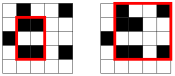
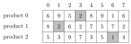

# 位操作

计算机程序中的所有数据在内部都以位的形式存储，即以 0 和 1 的形式存储。本章讨论整数的位表示，并给出使用位运算的示例。事实证明，位运算在算法竞赛中有许多用途。

## 位表示

在程序设计中，$n$ 位的整数在内部以一个由 $n$ 位组成的二进制数存储。例如，C++ 类型 `int` 是 32 位类型，这意味着每个 `int` 数都由 32 位组成。

下面是 `int` 数 43 的位表示：$$00000000000000000000000000101011$$ 表示中的各位从右到左编号。要把位表示 $b_k \cdots b_2 b_1 b_0$ 转换为一个数，可以使用公式 $$b_k 2^k + \ldots + b_2 2^2 + b_1 2^1 + b_0 2^0.$$ 例如，$$1 \cdot 2^5 + 1 \cdot 2^3 + 1 \cdot 2^1 + 1 \cdot 2^0 = 43.$$

数的位表示要么是**有符号**的，要么是**无符号**的。通常使用的是有符号表示，这意味着正数与负数都能表示。$n$ 位的有符号变量可以包含 $-2^{n-1}$ 与 $2^{n-1}-1$ 之间的任意整数。例如，C++ 中的 `int` 类型是有符号类型，因此一个 `int` 变量可以包含 $-2^{31}$ 与 $2^{31}-1$ 之间的任意整数。

有符号表示中的第一位是数的符号（非负数用 0，负数用 1），其余 $n-1$ 位包含数值的大小。这里使用的是**补码**，这意味着一个数的相反数可以通过先把该数的所有位取反，再把结果加一来得到。

例如，`int` 数 $-43$ 的位表示是 $$11111111111111111111111111010101.$$

在无符号表示中，只能使用非负数，但取值的上界更大。$n$ 位的无符号变量可以包含 $0$ 与 $2^n-1$ 之间的任意整数。例如在 C++ 中，一个 `unsigned int` 变量可以包含 $0$ 与 $2^{32}-1$ 之间的任意整数。

两种表示之间存在联系：有符号数 $-x$ 等于无符号数 $2^n-x$。例如，下面的代码表明有符号数 $x=-43$ 等于无符号数 $y=2^{32}-43$：

```cpp
int x = -43;
unsigned int y = x;
cout << x << "\n"; // -43
cout << y << "\n"; // 4294967253
```

如果一个数大于位表示的上界，该数就会溢出。在有符号表示中，$2^{n-1}-1$ 之后的数是 $-2^{n-1}$；在无符号表示中，$2^n-1$ 之后的数是 $0$。例如，考虑下面的代码：

```cpp
int x = 2147483647
cout << x << "\n"; // 2147483647
x++;
cout << x << "\n"; // -2147483648
```

初始时，$x$ 的值是 $2^{31}-1$。这是 `int` 变量能存储的最大值，因此 $2^{31}-1$ 之后的数是 $-2^{31}$。

## 位运算

#### 与运算

**与**运算 $x$ & $y$ 得到的数，在 $x$ 与 $y$ 两者对应位都为 1 的位置上为 1。例如，$22$ & $26$ = 18，因为

|     |       |        |
|----:|------:|-------:|
|     | 10110 | \(22\) |
|   & | 11010 | \(26\) |
|   = | 10010 | \(18\) |

利用与运算，可以判断一个数 $x$ 是否为偶数，因为当 $x$ 为偶数时 $x$ & $1$ = 0，当 $x$ 为奇数时 $x$ & $1$ = 1。更一般地，$x$ 能被 $2^k$ 整除，当且仅当 $x$ & $(2^k-1)$ = 0。

#### 或运算

**或**运算 $x$ \| $y$ 得到的数，在 $x$ 与 $y$ 中至少有一个对应位为 1 的位置上为 1。例如，$22$ \| $26$ = 30，因为

|     |       |        |
|----:|------:|-------:|
|     | 10110 | \(22\) |
|  \| | 11010 | \(26\) |
|   = | 11110 | \(30\) |

#### 异或运算

**异或**运算 $x$ $\oplus$ $y$ 得到的数，在 $x$ 与 $y$ 中恰好有一个对应位为 1 的位置上为 1。例如，$22$ $\oplus$ $26$ = 12，因为

|          |       |        |
|---------:|------:|-------:|
|          | 10110 | \(22\) |
| $\oplus$ | 11010 | \(26\) |
|        = | 01100 | \(12\) |

#### 非运算

**非**运算 \~$x$ 得到的数中，$x$ 的所有位都被取反。公式 \~$x = -x-1$ 成立，例如 \~$29 = -30$。

非运算在比特层面上的结果取决于位表示的长度，因为该运算会取反所有位。例如，若这些数是 32 位的 `int` 数，结果如下：

|       |     |       |                                  |
|------:|----:|------:|---------------------------------:|
|   $x$ |   = |    29 | 00000000000000000000000000011101 |
| \~$x$ |   = | $-30$ | 11111111111111111111111111100010 |

#### 移位运算

左移 $x < < k$ 在数的末尾添加 $k$ 个 0 位，右移 $x > > k$ 去掉数的最后 $k$ 位。例如，$14 < < 2 = 56$，因为 $14$ 和 $56$ 分别对应 1110 和 111000。类似地，$49 > > 3 = 6$，因为 $49$ 和 $6$ 分别对应 110001 和 110。

注意，$x < < k$ 相当于把 $x$ 乘以 $2^k$，$x > > k$ 相当于把 $x$ 除以 $2^k$ 并向下取整。

#### 应用

形如 $1 < < k$ 的数在第 $k$ 位为 1，其余各位都为 0，因此可以用这样的数来访问数中的单个位。特别地，一个数的第 $k$ 位为 1，当且仅当 $x$ & $(1 < < k)$ 不为零。下面的代码输出一个 `int` 数 $x$ 的位表示：

```cpp
for (int i = 31; i >= 0; i--) {
    if (x&(1<<i)) cout << "1";
    else cout << "0";
}
```

用类似的思路还可以修改数中的单个位。例如，公式 $x$ \| $(1 < < k)$ 把 $x$ 的第 $k$ 位设为 1，公式 $x$ & \~$(1 < < k)$ 把 $x$ 的第 $k$ 位设为 0，公式 $x$ $\oplus$ $(1 < < k)$ 把 $x$ 的第 $k$ 位取反。

公式 $x$ & $(x-1)$ 把 $x$ 的最后一个 1 位设为 0，公式 $x$ & $-x$ 把除最后一个 1 位之外的所有 1 位都设为 0。公式 $x$ \| $(x-1)$ 把最后一个 1 位之后的所有位取反。另请注意，正数 $x$ 是 2 的幂，当且仅当 $x$ & $(x-1) = 0$。

#### 附加函数

g++ 编译器提供了以下用于统计位的函数：

- $\texttt{\_\_builtin\_clz}(x)$：数开头 0 的个数

- $\texttt{\_\_builtin\_ctz}(x)$：数末尾 0 的个数

- $\texttt{\_\_builtin\_popcount}(x)$：数中 1 的个数

- $\texttt{\_\_builtin\_parity}(x)$：数中 1 的个数的奇偶性（偶数或奇数）

这些函数的用法如下：

```cpp
int x = 5328; // 00000000000000000001010011010000
cout << __builtin_clz(x) << "\n"; // 19
cout << __builtin_ctz(x) << "\n"; // 4
cout << __builtin_popcount(x) << "\n"; // 5
cout << __builtin_parity(x) << "\n"; // 1
```

上述函数只支持 `int` 数，但也有带后缀 `ll` 的 `long long` 版本可供使用。

## 表示集合

集合 $\{0,1,2,\ldots,n-1\}$ 的任意子集都可以表示为一个 $n$ 位整数，其中为 1 的位表明哪些元素属于该子集。这是表示集合的一种高效方式，因为每个元素只需一位内存，而集合运算可以用位运算来实现。

例如，由于 `int` 是 32 位类型，一个 `int` 数可以表示集合 $\{0,1,2,\ldots,31\}$ 的任意子集。集合 $\{1,3,4,8\}$ 的位表示是 $$00000000000000000000000100011010,$$ 它对应数 $2^8+2^4+2^3+2^1=282$。

#### 集合的实现

下面的代码声明了一个 `int` 变量 $x$，它可以包含 $\{0,1,2,\ldots,31\}$ 的一个子集。此后，代码把元素 1、3、4 和 8 加入集合，并输出集合的大小。

```cpp
int x = 0;
x |= (1<<1);
x |= (1<<3);
x |= (1<<4);
x |= (1<<8);
cout << __builtin_popcount(x) << "\n"; // 4
```

接着，下面的代码输出属于该集合的所有元素：

```cpp
for (int i = 0; i < 32; i++) {
    if (x&(1<<i)) cout << i << " ";
}
// output: 1 3 4 8
```

#### 集合运算

集合运算可以如下用位运算实现：

|              | 集合写法        | 位写法        |
|:-------------|:----------------|:--------------|
| 交集         | $a \cap b$      | $a$ & $b$     |
| 并集         | $a \cup b$      | $a$ \| $b$    |
| 补集         | $\bar a$        | \~$a$         |
| 差集         | $a \setminus b$ | $a$ & (\~$b$) |

例如，下面的代码先构造集合 $x=\{1,3,4,8\}$ 和 $y=\{3,6,8,9\}$，再构造集合 $z = x \cup y = \{1,3,4,6,8,9\}$：

```cpp
int x = (1<<1)|(1<<3)|(1<<4)|(1<<8);
int y = (1<<3)|(1<<6)|(1<<8)|(1<<9);
int z = x|y;
cout << __builtin_popcount(z) << "\n"; // 6
```

#### 遍历子集

下面的代码遍历 $\{0,1,\ldots,n-1\}$ 的所有子集：

```cpp
for (int b = 0; b < (1<<n); b++) {
    // process subset b
}
```

下面的代码遍历恰好含 $k$ 个元素的子集：

```cpp
for (int b = 0; b < (1<<n); b++) {
    if (__builtin_popcount(b) == k) {
        // process subset b
    }
}
```

下面的代码遍历集合 $x$ 的所有子集：

```cpp
int b = 0;
do {
    // process subset b
} while (b=(b-x)&x);
```

## 位优化

许多算法都可以用位运算来优化。这类优化不会改变算法的时间复杂度，但可能对代码的实际运行时间有很大影响。本节讨论这类情形的例子。

#### 汉明距离

两个等长字符串 $a$ 和 $b$ 之间的**汉明距离** $\texttt{hamming}(a,b)$ 是这两个字符串对应位置不同的个数。例如，$$\texttt{hamming}(01101,11001)=2.$$

考虑如下问题：给定一个含 $n$ 个位串的列表，每个位串长度为 $k$，计算列表中两个位串之间的最小汉明距离。例如，对 $[00111,01101,11110]$ 的答案是 2，因为

- $\texttt{hamming}(00111,01101)=2$，

- $\texttt{hamming}(00111,11110)=3$，且

- $\texttt{hamming}(01101,11110)=3$。

解决该问题的一种直接方式是遍历所有位串对并计算它们的汉明距离，这得到一个 $O(n^2 k)$ 时间的算法。下面的函数可用于计算距离：

```cpp
int hamming(string a, string b) {
    int d = 0;
    for (int i = 0; i < k; i++) {
        if (a[i] != b[i]) d++;
    }
    return d;
}
```

不过，如果 $k$ 较小，我们可以把位串存储为整数，并用位运算来计算汉明距离，从而优化代码。特别地，若 $k \le 32$，我们可以直接把位串存储为 `int` 值，并使用下面的函数来计算距离：

```cpp
int hamming(int a, int b) {
    return __builtin_popcount(a^b);
}
```

在上面的函数中，异或运算构造出一个位串，它在 $a$ 与 $b$ 不同的位置上为 1。然后，用 `__builtin_popcount` 函数统计 1 的个数。

为了比较这两种实现，我们生成了一个含 10000 个长度为 30 的随机位串的列表。使用第一种方法，搜索耗时 13.5 秒；进行位优化之后，只需 0.5 秒。因此，位优化后的代码几乎比原代码快 30 倍。

#### 统计子网格

再看一个例子，考虑如下问题：给定一个 $n \times n$ 的网格，其中每个方格要么是黑色（1），要么是白色（0），计算四个角都是黑色的子网格的个数。例如，网格


含有两个这样的子网格：



该问题有一个 $O(n^3)$ 时间的算法：遍历所有 $O(n^2)$ 个行对，并对每个行对 $(a,b)$ 用 $O(n)$ 时间计算同时在这两行中都含黑色方格的列数。下面的代码假定 $\texttt{color}[y][x]$ 表示第 $y$ 行第 $x$ 列的颜色：

```cpp
int count = 0;
for (int i = 0; i < n; i++) {
    if (color[a][i] == 1 && color[b][i] == 1) count++;
}
```

那么，这些列对应 $\texttt{count}(\texttt{count}-1)/2$ 个四角全黑的子网格，因为我们可以从中任选两列来构成一个子网格。

为了优化这个算法，我们把网格按列分成若干块，使每块由 $N$ 个连续列组成。于是，每一行都存储为一个 $N$ 位数的列表，这些数描述了各方格的颜色。现在我们可以用位运算同时处理 $N$ 列。在下面的代码中，$\texttt{color}[y][k]$ 用位表示一块 $N$ 个颜色。

```cpp
int count = 0;
for (int i = 0; i <= n/N; i++) {
    count += __builtin_popcount(color[a][i]&color[b][i]);
}
```

所得算法的时间复杂度为 $O(n^3/N)$。

我们生成了一个大小为 $2500 \times 2500$ 的随机网格，并比较了原实现与位优化实现。原代码耗时 $29.6$ 秒，而位优化版本在 $N=32$（`int` 数）时只需 $3.1$ 秒，在 $N=64$（`long long` 数）时只需 $1.7$ 秒。

## 动态规划

对于状态包含元素子集的动态规划算法，位运算提供了一种高效而便捷的实现方式，因为这类状态可以存储为整数。接下来我们讨论把位运算与动态规划结合起来的例子。

#### 最优选择

作为第一个例子，考虑如下问题：给定 $k$ 件商品在 $n$ 天内的价格，我们想购买每件商品恰好一次。不过，每天最多只能买一件商品。最小总价是多少？例如，考虑如下情形（$k=3$，$n=8$）：


在这种情形下，最小总价是 $5$：



设 $\texttt{price}[x][d]$ 表示商品 $x$ 在第 $d$ 天的价格。例如，在上面的情形中 $\texttt{price}[2][3] = 7$。再设 $\texttt{total}(S,d)$ 表示在第 $d$ 天结束前购买商品子集 $S$ 的最小总价。利用这个函数，问题的解为 $\texttt{total}(\{0 \ldots k-1\},n-1)$。

首先，$\texttt{total}(\emptyset,d) = 0$，因为购买空集不需要任何花费；而 $\texttt{total}(\{x\},0) = \texttt{price}[x][0]$，因为第一天只有一种方式购买一件商品。然后，可以使用如下递推式：$$\begin{equation*}
\begin{split}
\texttt{total}(S,d) = \min( & \texttt{total}(S,d-1), \\
& \min_{x \in S} (\texttt{total}(S \setminus x,d-1)+\texttt{price}[x][d]))
\end{split}
\end{equation*}$$ 这意味着我们要么在第 $d$ 天不买任何商品，要么购买一件属于 $S$ 的商品 $x$。在后一种情况下，我们从 $S$ 中移除 $x$，并把 $x$ 的价格计入总价。

下一步是用动态规划计算该函数的值。为了存储函数值，我们声明一个数组

```cpp
int total[1<<K][N];
```

其中 $K$ 和 $N$ 是适当大的常量。数组的第一维对应一个子集的位表示。

首先，$d=0$ 的情形可以如下处理：

```cpp
for (int x = 0; x < k; x++) {
    total[1<<x][0] = price[x][0];
}
```

然后，递推式可以翻译成如下代码：

```cpp
for (int d = 1; d < n; d++) {
    for (int s = 0; s < (1<<k); s++) {
        total[s][d] = total[s][d-1];
        for (int x = 0; x < k; x++) {
            if (s&(1<<x)) {
                total[s][d] = min(total[s][d],
                                    total[s^(1<<x)][d-1]+price[x][d]);
            }
        }
    }
}
```

该算法的时间复杂度为 $O(n 2^k k)$。

#### 从排列到子集

利用动态规划，往往可以把对排列的遍历改为对子集的遍历[^1]。这样做的好处是：排列的个数 $n!$ 远大于子集的个数 $2^n$。例如，若 $n=20$，则 $n! \approx 2.4 \cdot 10^{18}$，而 $2^n \approx 10^6$。因此，对于某些 $n$ 值，我们可以高效地遍历子集，却无法遍历排列。

举一个例子，考虑如下问题：有一部最大载重为 $x$ 的电梯，以及 $n$ 个体重已知、想从底层前往顶层的人。如果这些人以最优顺序乘坐电梯，那么所需的最少趟数是多少？

例如，设 $x=10$、$n=5$，各人体重如下：

| 人     | 体重   |
|:-------|:-------|
| 0      | 2      |
| 1      | 3      |
| 2      | 3      |
| 3      | 5      |
| 4      | 6      |

在这种情况下，最少趟数是 2。一种最优顺序是 $\{0,2,3,1,4\}$，它把人分成两趟：先是 $\{0,2,3\}$（总重 10），然后是 $\{1,4\}$（总重 9）。

通过测试 $n$ 个人的所有可能排列，可以在 $O(n! n)$ 时间内轻松解决该问题。不过，我们可以用动态规划得到更高效的 $O(2^n n)$ 时间算法。其思路是对每个人的子集计算两个值：所需的最少趟数，以及最后一趟中乘坐者的最小总重量。

设 $\texttt{weight}[p]$ 表示人 $p$ 的体重。我们定义两个函数：$\texttt{rides}(S)$ 是子集 $S$ 的最少趟数，$\texttt{last}(S)$ 是最后一趟的最小重量。例如，在上面的情形中 $$\texttt{rides}(\{1,3,4\})=2  \textrm{and}
 \texttt{last}(\{1,3,4\})=5,$$ 因为最优的两趟是 $\{1,4\}$ 和 $\{3\}$，且第二趟的重量为 5。当然，我们的最终目标是计算 $\texttt{rides}(\{0 \ldots n-1\})$ 的值。

我们可以先递归地计算函数值，再应用动态规划。其思路是遍历属于 $S$ 的所有人，并最优地选择最后一个进入电梯的人 $p$。每一种这样的选择都会给出一个针对更小人数子集的子问题。若 $\texttt{last}(S \setminus p)+\texttt{weight}[p] \le x$，我们可以把 $p$ 加入最后一趟；否则，我们必须新开一趟，其中最初只包含 $p$。

为了实现动态规划，我们声明一个数组

```cpp
pair<int,int> best[1<<N];
```

它对每个子集 $S$ 存储一个数对 $(\texttt{rides}(S),\texttt{last}(S))$。空组的取值设置如下：

```cpp
best[0] = {1,0};
```

然后，我们可以如下填充该数组：

```cpp
for (int s = 1; s < (1<<n); s++) {
    // initial value: n+1 rides are needed
    best[s] = {n+1,0};
    for (int p = 0; p < n; p++) {
        if (s&(1<<p)) {
            auto option = best[s^(1<<p)];
            if (option.second+weight[p] <= x) {
                // add p to an existing ride
                option.second += weight[p];
            } else {
                // reserve a new ride for p
                option.first++;
                option.second = weight[p];
            }
            best[s] = min(best[s], option);
        }
    }
}
```

注意，上面的循环保证：对于任意两个满足 $S_1 \subset S_2$ 的子集 $S_1$ 和 $S_2$，我们都会先处理 $S_1$、后处理 $S_2$。因此，动态规划的取值是按正确顺序计算的。

#### 统计子集

本章最后一个问题如下：设 $X=\{0 \ldots n-1\}$，每个子集 $S \subset X$ 都被赋予一个整数 $\texttt{value}[S]$。我们的任务是对每个 $S$ 计算 $$\texttt{sum}(S) = \sum_{A \subset S} \texttt{value}[A],$$ 即 $S$ 的各子集的取值之和。

例如，设 $n=3$，各取值如下：

2

- $\texttt{value}[\emptyset] = 3$

- $\texttt{value}[\{0\}] = 1$

- $\texttt{value}[\{1\}] = 4$

- $\texttt{value}[\{0,1\}] = 5$

- $\texttt{value}[\{2\}] = 5$

- $\texttt{value}[\{0,2\}] = 1$

- $\texttt{value}[\{1,2\}] = 3$

- $\texttt{value}[\{0,1,2\}] = 3$

在这种情况下，例如，$$\begin{equation*}
\begin{split}
\texttt{sum}(\{0,2\}) &= \texttt{value}[\emptyset]+\texttt{value}[\{0\}]+\texttt{value}[\{2\}]+\texttt{value}[\{0,2\}] \\
                      &= 3 + 1 + 5 + 1 = 10.
\end{split}
\end{equation*}$$

由于总共有 $2^n$ 个子集，一种可行的做法是用 $O(2^{2n})$ 时间遍历所有子集对。不过，利用动态规划，我们可以在 $O(2^n n)$ 时间内解决该问题。其思路是关注那些对“可从 $S$ 中移除的元素”加以限制的和。

设 $\texttt{partial}(S,k)$ 表示 $S$ 的子集取值之和，但限制只能从 $S$ 中移除元素 $0 \ldots k$。例如，$$\texttt{partial}(\{0,2\},1)=\texttt{value}[\{2\}]+\texttt{value}[\{0,2\}],$$ 因为我们只能移除元素 $0 \ldots 1$。我们可以用 `partial` 的值来计算 `sum` 的值，因为 $$\texttt{sum}(S) = \texttt{partial}(S,n-1).$$ 该函数的边界情况是 $$\texttt{partial}(S,-1)=\texttt{value}[S],$$ 因为此时不能从 $S$ 中移除任何元素。然后，在一般情况下可以使用如下递推式：$$\begin{equation*}
    \texttt{partial}(S,k) = \begin{cases}
               \texttt{partial}(S,k-1) & k \notin S \\
               \texttt{partial}(S,k-1) + \texttt{partial}(S \setminus \{k\},k-1) & k \in S
           \end{cases}
\end{equation*}$$ 这里我们关注元素 $k$。若 $k \in S$，我们有两种选择：既可以把 $k$ 保留在 $S$ 中，也可以把它从 $S$ 中移除。

计算这些和有特别巧妙的方式。我们可以声明一个数组

```cpp
int sum[1<<N];
```

它将包含每个子集的和。该数组的初始化如下：

```cpp
for (int s = 0; s < (1<<n); s++) {
    sum[s] = value[s];
}
```

然后，我们可以如下填充该数组：

```cpp
for (int k = 0; k < n; k++) {
    for (int s = 0; s < (1<<n); s++) {
        if (s&(1<<k)) sum[s] += sum[s^(1<<k)];
    }
}
```

这段代码把 $k=0 \ldots n-1$ 时 $\texttt{partial}(S,k)$ 的值计算到数组 `sum` 中。由于 $\texttt{partial}(S,k)$ 总是基于 $\texttt{partial}(S,k-1)$，我们可以复用数组 `sum`，从而得到一种非常高效的实现。

[^1]: 这项技术由 M. Held 和 R. M. Karp 于 1962 年提出 [34]。
