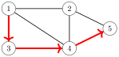
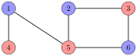
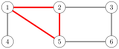

# Basics of graphs

Many programming problems can be solved by modeling the problem as a graph problem and using an appropriate graph algorithm. A typical example of a graph is a network of roads and cities in a country. Sometimes, though, the graph is hidden in the problem and it may be difficult to detect it.

This part of the book discusses graph algorithms, especially focusing on topics that are important in competitive programming. In this chapter, we go through concepts related to graphs, and study different ways to represent graphs in algorithms.

## Graph terminology

A **graph** consists of **nodes** and **edges**. In this book, the variable $n$ denotes the number of nodes in a graph, and the variable $m$ denotes the number of edges. The nodes are numbered using integers $1,2,\ldots,n$.

For example, the following graph consists of 5 nodes and 7 edges:


A **path** leads from node $a$ to node $b$ through edges of the graph. The **length** of a path is the number of edges in it. For example, the above graph contains a path $1 \rightarrow 3 \rightarrow 4 \rightarrow 5$ of length 3 from node 1 to node 5:



A path is a **cycle** if the first and last node is the same. For example, the above graph contains a cycle $1 \rightarrow 3 \rightarrow 4 \rightarrow 1$. A path is **simple** if each node appears at most once in the path.

#### Connectivity

A graph is **connected** if there is a path between any two nodes. For example, the following graph is connected:


The following graph is not connected, because it is not possible to get from node 4 to any other node:


The connected parts of a graph are called its **components**. For example, the following graph contains three components: $\{1,\,2,\,3\}$, $\{4,\,5,\,6,\,7\}$ and $\{8\}$.


A **tree** is a connected graph that consists of $n$ nodes and $n-1$ edges. There is a unique path between any two nodes of a tree. For example, the following graph is a tree:


#### Edge directions

A graph is **directed** if the edges can be traversed in one direction only. For example, the following graph is directed:


The above graph contains a path $3 \rightarrow 1 \rightarrow 2 \rightarrow 5$ from node $3$ to node $5$, but there is no path from node $5$ to node $3$.

#### Edge weights

In a **weighted** graph, each edge is assigned a **weight**. The weights are often interpreted as edge lengths. For example, the following graph is weighted:


The length of a path in a weighted graph is the sum of the edge weights on the path. For example, in the above graph, the length of the path $1 \rightarrow 2 \rightarrow 5$ is $12$, and the length of the path $1 \rightarrow 3 \rightarrow 4 \rightarrow 5$ is $11$. The latter path is the **shortest** path from node $1$ to node $5$.

#### Neighbors and degrees

Two nodes are **neighbors** or **adjacent** if there is an edge between them. The **degree** of a node is the number of its neighbors. For example, in the following graph, the neighbors of node 2 are 1, 4 and 5, so its degree is 3.


The sum of degrees in a graph is always $2m$, where $m$ is the number of edges, because each edge increases the degree of exactly two nodes by one. For this reason, the sum of degrees is always even.

A graph is **regular** if the degree of every node is a constant $d$. A graph is **complete** if the degree of every node is $n-1$, i.e., the graph contains all possible edges between the nodes.

In a directed graph, the **indegree** of a node is the number of edges that end at the node, and the **outdegree** of a node is the number of edges that start at the node. For example, in the following graph, the indegree of node 2 is 2, and the outdegree of node 2 is 1.


#### Colorings

In a **coloring** of a graph, each node is assigned a color so that no adjacent nodes have the same color.

A graph is **bipartite** if it is possible to color it using two colors. It turns out that a graph is bipartite exactly when it does not contain a cycle with an odd number of edges. For example, the graph


is bipartite, because it can be colored as follows:



However, the graph


is not bipartite, because it is not possible to color the following cycle of three nodes using two colors:



#### Simplicity

A graph is **simple** if no edge starts and ends at the same node, and there are no multiple edges between two nodes. Often we assume that graphs are simple. For example, the following graph is *not* simple:


## Graph representation

There are several ways to represent graphs in algorithms. The choice of a data structure depends on the size of the graph and the way the algorithm processes it. Next we will go through three common representations.

#### Adjacency list representation

In the adjacency list representation, each node $x$ in the graph is assigned an **adjacency list** that consists of nodes to which there is an edge from $x$. Adjacency lists are the most popular way to represent graphs, and most algorithms can be efficiently implemented using them.

A convenient way to store the adjacency lists is to declare an array of vectors as follows:

```cpp
vector<int> adj[N];
```

The constant $N$ is chosen so that all adjacency lists can be stored. For example, the graph


can be stored as follows:

```cpp
adj[1].push_back(2);
adj[2].push_back(3);
adj[2].push_back(4);
adj[3].push_back(4);
adj[4].push_back(1);
```

If the graph is undirected, it can be stored in a similar way, but each edge is added in both directions.

For a weighted graph, the structure can be extended as follows:

```cpp
vector<pair<int,int>> adj[N];
```

In this case, the adjacency list of node $a$ contains the pair $(b,w)$ always when there is an edge from node $a$ to node $b$ with weight $w$. For example, the graph


can be stored as follows:

```cpp
adj[1].push_back({2,5});
adj[2].push_back({3,7});
adj[2].push_back({4,6});
adj[3].push_back({4,5});
adj[4].push_back({1,2});
```

The benefit of using adjacency lists is that we can efficiently find the nodes to which we can move from a given node through an edge. For example, the following loop goes through all nodes to which we can move from node $s$:

```cpp
for (auto u : adj[s]) {
    // process node u
}
```

#### Adjacency matrix representation

An **adjacency matrix** is a two-dimensional array that indicates which edges the graph contains. We can efficiently check from an adjacency matrix if there is an edge between two nodes. The matrix can be stored as an array

```cpp
int adj[N][N];
```

where each value $\texttt{adj}[a][b]$ indicates whether the graph contains an edge from node $a$ to node $b$. If the edge is included in the graph, then $\texttt{adj}[a][b]=1$, and otherwise $\texttt{adj}[a][b]=0$. For example, the graph


can be represented as follows:


If the graph is weighted, the adjacency matrix representation can be extended so that the matrix contains the weight of the edge if the edge exists. Using this representation, the graph


corresponds to the following matrix:


The drawback of the adjacency matrix representation is that the matrix contains $n^2$ elements, and usually most of them are zero. For this reason, the representation cannot be used if the graph is large.

#### Edge list representation

An **edge list** contains all edges of a graph in some order. This is a convenient way to represent a graph if the algorithm processes all edges of the graph and it is not needed to find edges that start at a given node.

The edge list can be stored in a vector

```cpp
vector<pair<int,int>> edges;
```

where each pair $(a,b)$ denotes that there is an edge from node $a$ to node $b$. Thus, the graph


can be represented as follows:

```cpp
edges.push_back({1,2});
edges.push_back({2,3});
edges.push_back({2,4});
edges.push_back({3,4});
edges.push_back({4,1});
```

If the graph is weighted, the structure can be extended as follows:

```cpp
vector<tuple<int,int,int>> edges;
```

Each element in this list is of the form $(a,b,w)$, which means that there is an edge from node $a$ to node $b$ with weight $w$. For example, the graph


can be represented as follows[^1]:

```cpp
edges.push_back({1,2,5});
edges.push_back({2,3,7});
edges.push_back({2,4,6});
edges.push_back({3,4,5});
edges.push_back({4,1,2});
```

[^1]: In some older compilers, the function `make_tuple` must be used instead of the braces (for example, `make_tuple(1,2,5)` instead of `{1,2,5}`).
