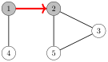
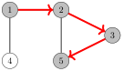
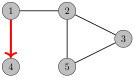
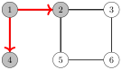
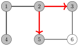
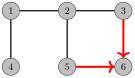
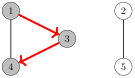
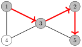
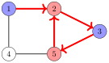

# 图的遍历

本章讨论两种基本的图算法：深度优先搜索与广度优先搜索。这两种算法都会给定图中的一个起点，并访问从起点出发能够到达的所有结点。两种算法的区别在于访问结点的顺序。

## 深度优先搜索

**深度优先搜索**（DFS）是一种直接的图遍历技术。算法从起点出发，沿着图中的边，前往从起点能够到达的所有其他结点。

深度优先搜索只要还能发现新结点，就始终沿着图中的一条路径前进。此后，它回退到之前的结点，并开始探索图的其他部分。算法会记录已访问的结点，因此每个结点只被处理一次。

#### 示例

让我们考察深度优先搜索如何处理下面这个图：


我们可以从图中的任意结点开始搜索；现在我们从结点 1 开始搜索。

搜索首先前往结点 2：



此后，结点 3 和 5 将被访问：



结点 5 的邻接结点是 2 和 3，但搜索已经访问过它们两个，所以是时候返回之前的结点了。结点 3 和 2 的邻接结点也都已被访问，因此接下来我们从结点 1 移动到结点 4：



此后，搜索终止，因为它已经访问了所有结点。

深度优先搜索的时间复杂度为 $O(n+m)$，其中 $n$ 是结点数，$m$ 是边数，因为算法对每个结点和每条边都只处理一次。

#### 实现

深度优先搜索可以方便地用递归实现。下面的函数 `dfs` 从给定结点开始一次深度优先搜索。该函数假定图以邻接表的形式存储在数组中

```cpp
vector<int> adj[N];
```

并另外维护一个数组

```cpp
bool visited[N];
```

用于记录已访问的结点。初始时，数组的每个值都是 `false`，当搜索到达结点 $s$ 时，`visited`[$s$] 的值变为 `true`。该函数可以实现如下：

```cpp
void dfs(int s) {
    if (visited[s]) return;
    visited[s] = true;
    // 处理结点 s
    for (auto u: adj[s]) {
        dfs(u);
    }
}
```

## 广度优先搜索

**广度优先搜索**（BFS）按照到起点的距离递增的顺序访问结点。因此，我们可以用广度优先搜索计算从起点到所有其他结点的距离。不过，广度优先搜索比深度优先搜索更难实现。

广度优先搜索一层接一层地经过各个结点。首先，搜索探索到起点的距离为 1 的结点，然后是距离为 2 的结点，依此类推。这个过程一直持续到所有结点都被访问为止。

#### 示例

让我们考察广度优先搜索如何处理下面这个图：


假设搜索从结点 1 开始。首先，我们处理从结点 1 经由一条边就能到达的所有结点：



此后，我们前往结点 3 和 5：



最后，我们访问结点 6：



现在我们计算出了从起点到图中所有结点的距离。各距离如下：

| 结点 | 距离 |
|:-----|:---------|
| 1    | 0        |
| 2    | 1        |
| 3    | 2        |
| 4    | 1        |
| 5    | 2        |
| 6    | 3        |
|      |          |

与深度优先搜索一样，广度优先搜索的时间复杂度为 $O(n+m)$，其中 $n$ 是结点数，$m$ 是边数。

#### 实现

广度优先搜索比深度优先搜索更难实现，因为该算法会访问图中不同部位的结点。一种典型的实现基于一个包含结点的队列。每一步都处理队列中的下一个结点。

下面的代码假定图以邻接表的形式存储，并维护以下数据结构：

```cpp
queue<int> q;
bool visited[N];
int distance[N];
```

队列 `q` 按照距离递增的顺序包含待处理的结点。新结点总是被添加到队列末尾，而队列开头的结点就是下一个要处理的结点。数组 `visited` 记录搜索已经访问过哪些结点，数组 `distance` 将包含从起点到图中所有结点的距离。

搜索可以实现如下，从结点 $x$ 开始：

```cpp
visited[x] = true;
distance[x] = 0;
q.push(x);
while (!q.empty()) {
    int s = q.front(); q.pop();
    // 处理结点 s
    for (auto u : adj[s]) {
        if (visited[u]) continue;
        visited[u] = true;
        distance[u] = distance[s]+1;
        q.push(u);
    }
}
```

## 应用

利用图的遍历算法，我们可以检验图的许多性质。通常，深度优先搜索和广度优先搜索都可以使用，但在实践中，深度优先搜索是更好的选择，因为它更容易实现。在下面的应用中，我们假定图是无向的。

#### 连通性检查

如果图中任意两个结点之间都存在一条路径，那么该图是连通的。因此，我们可以从任意一个结点开始，判断能否到达所有其他结点，以此来检查图是否连通。

例如，在下面这个图中


从结点 $1$ 开始的深度优先搜索访问了以下结点：



由于搜索没有访问所有结点，我们可以断定该图不连通。以类似的方式，我们还可以找出图的所有连通分量：遍历各个结点，只要当前结点还不属于任何分量，就总是开始一次新的深度优先搜索。

#### 寻找环

如果图遍历过程中发现某个结点的邻接结点（不是当前路径中的前一个结点）已被访问，那么图中就包含一个环。例如，下面这个图


包含两个环，我们可以按如下方式找到其中一个：



从结点 2 移动到结点 5 之后，我们注意到结点 5 的邻接结点 3 已被访问。因此，图中包含一个经过结点 3 的环，例如 $3 \rightarrow 2 \rightarrow 5 \rightarrow 3$。

判断图是否包含环的另一种方法是简单地计算每个分量中的结点数和边数。如果一个分量包含 $c$ 个结点且没有环，那么它必然恰好包含 $c-1$ 条边（因此它一定是一棵树）。如果有 $c$ 条或更多条边，那么该分量必定包含一个环。

#### 二分性检查

如果可以用两种颜色给图的结点染色，使得没有相邻结点具有相同的颜色，那么该图是二分图。令人惊讶的是，用图的遍历算法检查一个图是否为二分图非常容易。

思路是把起点染成蓝色，把它的所有邻接结点染成红色，把它们的邻接结点染成蓝色，依此类推。如果在搜索的某个时刻发现两个相邻结点具有相同的颜色，这就意味着该图不是二分图。否则该图是二分图，并且已经找到了一种染色方案。

例如，下面这个图


不是二分图，因为从结点 1 开始的搜索按如下方式进行：



我们注意到结点 2 和结点 5 的颜色都是红色，而它们在图中是相邻结点。因此，该图不是二分图。

这个算法总是有效的，因为当只有两种颜色可用时，一个分量中起点的颜色决定了该分量中所有其他结点的颜色。起点是红色还是蓝色并无差别。

注意，在一般情况下，判断图中结点能否用 $k$ 种颜色染色，使得没有相邻结点具有相同颜色，是很困难的。即使当 $k=3$ 时，也没有已知的高效算法，该问题是 NP 困难的。
