# Shortest paths

Finding a shortest path between two nodes of a graph is an important problem that has many practical applications. For example, a natural problem related to a road network is to calculate the shortest possible length of a route between two cities, given the lengths of the roads.

In an unweighted graph, the length of a path equals the number of its edges, and we can simply use breadth-first search to find a shortest path. However, in this chapter we focus on weighted graphs where more sophisticated algorithms are needed for finding shortest paths.

## Bellman--Ford algorithm

The **Bellman--Ford algorithm**[^1] finds shortest paths from a starting node to all nodes of the graph. The algorithm can process all kinds of graphs, provided that the graph does not contain a cycle with negative length. If the graph contains a negative cycle, the algorithm can detect this.

The algorithm keeps track of distances from the starting node to all nodes of the graph. Initially, the distance to the starting node is 0 and the distance to all other nodes in infinite. The algorithm reduces the distances by finding edges that shorten the paths until it is not possible to reduce any distance.

#### Example

Let us consider how the Bellman--Ford algorithm works in the following graph:

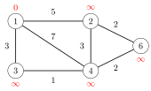

Each node of the graph is assigned a distance. Initially, the distance to the starting node is 0, and the distance to all other nodes is infinite.

The algorithm searches for edges that reduce distances. First, all edges from node 1 reduce distances:

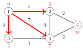

After this, edges $2 \rightarrow 5$ and $3 \rightarrow 4$ reduce distances:

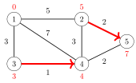

Finally, there is one more change:

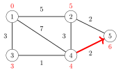

After this, no edge can reduce any distance. This means that the distances are final, and we have successfully calculated the shortest distances from the starting node to all nodes of the graph.

For example, the shortest distance 3 from node 1 to node 5 corresponds to the following path:

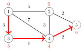

#### Implementation

The following implementation of the Bellman--Ford algorithm determines the shortest distances from a node $x$ to all nodes of the graph. The code assumes that the graph is stored as an edge list `edges` that consists of tuples of the form $(a,b,w)$, meaning that there is an edge from node $a$ to node $b$ with weight $w$.

The algorithm consists of $n-1$ rounds, and on each round the algorithm goes through all edges of the graph and tries to reduce the distances. The algorithm constructs an array `distance` that will contain the distances from $x$ to all nodes of the graph. The constant `INF` denotes an infinite distance.

```cpp
for (int i = 1; i <= n; i++) distance[i] = INF;
distance[x] = 0;
for (int i = 1; i <= n-1; i++) {
    for (auto e : edges) {
        int a, b, w;
        tie(a, b, w) = e;
        distance[b] = min(distance[b], distance[a]+w);
    }
}
```

The time complexity of the algorithm is $O(nm)$, because the algorithm consists of $n-1$ rounds and iterates through all $m$ edges during a round. If there are no negative cycles in the graph, all distances are final after $n-1$ rounds, because each shortest path can contain at most $n-1$ edges.

In practice, the final distances can usually be found faster than in $n-1$ rounds. Thus, a possible way to make the algorithm more efficient is to stop the algorithm if no distance can be reduced during a round.

#### Negative cycles

The Bellman--Ford algorithm can also be used to check if the graph contains a cycle with negative length. For example, the graph


contains a negative cycle $2 \rightarrow 3 \rightarrow 4 \rightarrow 2$ with length $-4$.

If the graph contains a negative cycle, we can shorten infinitely many times any path that contains the cycle by repeating the cycle again and again. Thus, the concept of a shortest path is not meaningful in this situation.

A negative cycle can be detected using the Bellman--Ford algorithm by running the algorithm for $n$ rounds. If the last round reduces any distance, the graph contains a negative cycle. Note that this algorithm can be used to search for a negative cycle in the whole graph regardless of the starting node.

#### SPFA algorithm

The **SPFA algorithm** ("Shortest Path Faster Algorithm") [23] is a variant of the Bellman--Ford algorithm, that is often more efficient than the original algorithm. The SPFA algorithm does not go through all the edges on each round, but instead, it chooses the edges to be examined in a more intelligent way.

The algorithm maintains a queue of nodes that might be used for reducing the distances. First, the algorithm adds the starting node $x$ to the queue. Then, the algorithm always processes the first node in the queue, and when an edge $a \rightarrow b$ reduces a distance, node $b$ is added to the queue.

The efficiency of the SPFA algorithm depends on the structure of the graph: the algorithm is often efficient, but its worst case time complexity is still $O(nm)$ and it is possible to create inputs that make the algorithm as slow as the original Bellman--Ford algorithm.

## Dijkstra's algorithm

**Dijkstra's algorithm**[^2] finds shortest paths from the starting node to all nodes of the graph, like the Bellman--Ford algorithm. The benefit of Dijsktra's algorithm is that it is more efficient and can be used for processing large graphs. However, the algorithm requires that there are no negative weight edges in the graph.

Like the Bellman--Ford algorithm, Dijkstra's algorithm maintains distances to the nodes and reduces them during the search. Dijkstra's algorithm is efficient, because it only processes each edge in the graph once, using the fact that there are no negative edges.

#### Example

Let us consider how Dijkstra's algorithm works in the following graph when the starting node is node 1:

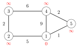

Like in the Bellman--Ford algorithm, initially the distance to the starting node is 0 and the distance to all other nodes is infinite.

At each step, Dijkstra's algorithm selects a node that has not been processed yet and whose distance is as small as possible. The first such node is node 1 with distance 0.

When a node is selected, the algorithm goes through all edges that start at the node and reduces the distances using them:

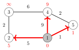

In this case, the edges from node 1 reduced the distances of nodes 2, 4 and 5, whose distances are now 5, 9 and 1.

The next node to be processed is node 5 with distance 1. This reduces the distance to node 4 from 9 to 3:

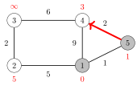

After this, the next node is node 4, which reduces the distance to node 3 to 9:

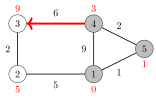

A remarkable property in Dijkstra's algorithm is that whenever a node is selected, its distance is final. For example, at this point of the algorithm, the distances 0, 1 and 3 are the final distances to nodes 1, 5 and 4.

After this, the algorithm processes the two remaining nodes, and the final distances are as follows:

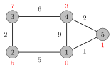

#### Negative edges

The efficiency of Dijkstra's algorithm is based on the fact that the graph does not contain negative edges. If there is a negative edge, the algorithm may give incorrect results. As an example, consider the following graph:


The shortest path from node 1 to node 4 is $1 \rightarrow 3 \rightarrow 4$ and its length is 1. However, Dijkstra's algorithm finds the path $1 \rightarrow 2 \rightarrow 4$ by following the minimum weight edges. The algorithm does not take into account that on the other path, the weight $-5$ compensates the previous large weight $6$.

#### Implementation

The following implementation of Dijkstra's algorithm calculates the minimum distances from a node $x$ to other nodes of the graph. The graph is stored as adjacency lists so that `adj[`$a$`]` contains a pair $(b,w)$ always when there is an edge from node $a$ to node $b$ with weight $w$.

An efficient implementation of Dijkstra's algorithm requires that it is possible to efficiently find the minimum distance node that has not been processed. An appropriate data structure for this is a priority queue that contains the nodes ordered by their distances. Using a priority queue, the next node to be processed can be retrieved in logarithmic time.

In the following code, the priority queue `q` contains pairs of the form $(-d,x)$, meaning that the current distance to node $x$ is $d$. The array $\texttt{distance}$ contains the distance to each node, and the array $\texttt{processed}$ indicates whether a node has been processed. Initially the distance is $0$ to $x$ and $\infty$ to all other nodes.

```cpp
for (int i = 1; i <= n; i++) distance[i] = INF;
distance[x] = 0;
q.push({0,x});
while (!q.empty()) {
    int a = q.top().second; q.pop();
    if (processed[a]) continue;
    processed[a] = true;
    for (auto u : adj[a]) {
        int b = u.first, w = u.second;
        if (distance[a]+w < distance[b]) {
            distance[b] = distance[a]+w;
            q.push({-distance[b],b});
        }
    }
}
```

Note that the priority queue contains *negative* distances to nodes. The reason for this is that the default version of the C++ priority queue finds maximum elements, while we want to find minimum elements. By using negative distances, we can directly use the default priority queue[^3]. Also note that there may be several instances of the same node in the priority queue; however, only the instance with the minimum distance will be processed.

The time complexity of the above implementation is $O(n+m \log m)$, because the algorithm goes through all nodes of the graph and adds for each edge at most one distance to the priority queue.

## Floyd--Warshall algorithm

The **Floyd--Warshall algorithm**[^4] provides an alternative way to approach the problem of finding shortest paths. Unlike the other algorithms of this chapter, it finds all shortest paths between the nodes in a single run.

The algorithm maintains a two-dimensional array that contains distances between the nodes. First, distances are calculated only using direct edges between the nodes, and after this, the algorithm reduces distances by using intermediate nodes in paths.

#### Example

Let us consider how the Floyd--Warshall algorithm works in the following graph:


Initially, the distance from each node to itself is $0$, and the distance between nodes $a$ and $b$ is $x$ if there is an edge between nodes $a$ and $b$ with weight $x$. All other distances are infinite.

In this graph, the initial array is as follows:

|     |        1 |        2 |        3 |        4 |        5 |
|----:|---------:|---------:|---------:|---------:|---------:|
|   1 |        0 |        5 | $\infty$ |        9 |        1 |
|   2 |        5 |        0 |        2 | $\infty$ | $\infty$ |
|   3 | $\infty$ |        2 |        0 |        7 | $\infty$ |
|   4 |        9 | $\infty$ |        7 |        0 |        2 |
|   5 |        1 | $\infty$ | $\infty$ |        2 |        0 |

The algorithm consists of consecutive rounds. On each round, the algorithm selects a new node that can act as an intermediate node in paths from now on, and distances are reduced using this node.

On the first round, node 1 is the new intermediate node. There is a new path between nodes 2 and 4 with length 14, because node 1 connects them. There is also a new path between nodes 2 and 5 with length 6.

|     |        1 |      2 |        3 |      4 |        5 |
|----:|---------:|-------:|---------:|-------:|---------:|
|   1 |        0 |      5 | $\infty$ |      9 |        1 |
|   2 |        5 |      0 |        2 | **14** |    **6** |
|   3 | $\infty$ |      2 |        0 |      7 | $\infty$ |
|   4 |        9 | **14** |        7 |      0 |        2 |
|   5 |        1 |  **6** | $\infty$ |      2 |        0 |

On the second round, node 2 is the new intermediate node. This creates new paths between nodes 1 and 3 and between nodes 3 and 5:

|     |     1 |   2 |     3 |   4 |     5 |
|----:|------:|----:|------:|----:|------:|
|   1 |     0 |   5 | **7** |   9 |     1 |
|   2 |     5 |   0 |     2 |  14 |     6 |
|   3 | **7** |   2 |     0 |   7 | **8** |
|   4 |     9 |  14 |     7 |   0 |     2 |
|   5 |     1 |   6 | **8** |   2 |     0 |

On the third round, node 3 is the new intermediate round. There is a new path between nodes 2 and 4:

|     |   1 |     2 |   3 |     4 |   5 |
|----:|----:|------:|----:|------:|----:|
|   1 |   0 |     5 |   7 |     9 |   1 |
|   2 |   5 |     0 |   2 | **9** |   6 |
|   3 |   7 |     2 |   0 |     7 |   8 |
|   4 |   9 | **9** |   7 |     0 |   2 |
|   5 |   1 |     6 |   8 |     2 |   0 |

The algorithm continues like this, until all nodes have been appointed intermediate nodes. After the algorithm has finished, the array contains the minimum distances between any two nodes:

|     |   1 |   2 |   3 |   4 |   5 |
|----:|----:|----:|----:|----:|----:|
|   1 |   0 |   5 |   7 |   3 |   1 |
|   2 |   5 |   0 |   2 |   8 |   6 |
|   3 |   7 |   2 |   0 |   7 |   8 |
|   4 |   3 |   8 |   7 |   0 |   2 |
|   5 |   1 |   6 |   8 |   2 |   0 |

For example, the array tells us that the shortest distance between nodes 2 and 4 is 8. This corresponds to the following path:

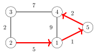

#### Implementation

The advantage of the Floyd--Warshall algorithm that it is easy to implement. The following code constructs a distance matrix where $\texttt{distance}[a][b]$ is the shortest distance between nodes $a$ and $b$. First, the algorithm initializes `distance` using the adjacency matrix `adj` of the graph:

```cpp
for (int i = 1; i <= n; i++) {
    for (int j = 1; j <= n; j++) {
        if (i == j) distance[i][j] = 0;
        else if (adj[i][j]) distance[i][j] = adj[i][j];
        else distance[i][j] = INF;
    }
}
```

After this, the shortest distances can be found as follows:

```cpp
for (int k = 1; k <= n; k++) {
    for (int i = 1; i <= n; i++) {
        for (int j = 1; j <= n; j++) {
            distance[i][j] = min(distance[i][j],
                                   distance[i][k]+distance[k][j]);
        }
    }
}
```

The time complexity of the algorithm is $O(n^3)$, because it contains three nested loops that go through the nodes of the graph.

Since the implementation of the Floyd--Warshall algorithm is simple, the algorithm can be a good choice even if it is only needed to find a single shortest path in the graph. However, the algorithm can only be used when the graph is so small that a cubic time complexity is fast enough.

[^1]: The algorithm is named after R. E. Bellman and L. R. Ford who published it independently in 1958 and 1956, respectively [5, 27].

[^2]: E. W. Dijkstra published the algorithm in 1959 [15]; however, his original paper does not mention how to implement the algorithm efficiently.

[^3]: Of course, we could also declare the priority queue as in Chapter 4.5 and use positive distances, but the implementation would be a bit longer.

[^4]: The algorithm is named after R. W. Floyd and S. Warshall who published it independently in 1962 [26, 78].
