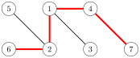
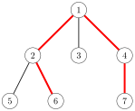
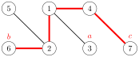
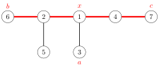
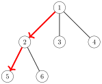
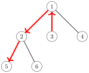
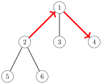

# 树算法

**树**是一个连通、无环的图，由 $n$ 个结点和 $n-1$ 条边组成。从树中删去任意一条边都会把它分成两个连通分量，向树中加入任意一条边都会产生一个环。此外，树中任意两个结点之间总存在唯一一条路径。

例如，下面这棵树由 8 个结点和 7 条边组成：


树的**叶子**是度为 1 的结点，即只有一个邻居的结点。例如，上面这棵树的叶子是结点 3、5、7 和 8。

在一棵**有根**树中，指定其中一个结点作为树的**根**，所有其他结点都置于根之下。例如，在下面这棵树中，结点 1 是根结点。


在有根树中，一个结点的**子结点**是它下方的邻居，而一个结点的**父结点**是它上方的邻居。每个结点恰好有一个父结点，根结点除外，它没有父结点。例如，在上面这棵树中，结点 2 的子结点是结点 5 和 6，它的父结点是结点 1。

有根树的结构是*递归*的：树中的每个结点都可作为一棵**子树**的根，该子树包含这个结点本身，以及它的所有子结点的子树中的全部结点。例如，在上面这棵树中，结点 2 的子树由结点 2、5、6 和 8 组成：


## 树的遍历

通用的图遍历算法可以用来遍历树中的结点。然而，树的遍历比一般图的遍历更易于实现，因为树中没有环，无法从多个方向到达同一个结点。

遍历树的典型做法是从任意一个结点开始进行深度优先搜索。可以使用下面这个递归函数：

```cpp
void dfs(int s, int e) {
    // process node s
    for (auto u : adj[s]) {
        if (u != e) dfs(u, s);
    }
}
```

该函数接受两个参数：当前结点 $s$ 和前一个结点 $e$。参数 $e$ 的作用是确保搜索只移动到尚未访问过的结点。

下面这个函数调用从结点 $x$ 开始搜索：

```cpp
dfs(x, 0);
```

在第一次调用中 $e=0$，因为不存在前一个结点，允许在树中沿任意方向前进。

#### 动态规划

动态规划可以在树的遍历过程中计算一些信息。利用动态规划，我们可以例如在 $O(n)$ 时间内，为有根树的每个结点计算其子树中的结点数，或者从该结点到某个叶子的最长路径的长度。

举一个例子，我们来为每个结点 $s$ 计算一个值 $\texttt{count}[s]$：它的子树中的结点数。子树包含结点本身以及它的所有子结点的子树中的全部结点，因此我们可以用下面的代码递归地计算结点数：

```cpp
void dfs(int s, int e) {
    count[s] = 1;
    for (auto u : adj[s]) {
        if (u == e) continue;
        dfs(u, s);
        count[s] += count[u];
    }
}
```

## 直径

树的**直径**是两个结点之间路径的最大长度。例如，考虑下面这棵树：


这棵树的直径是 4，对应于下面这条路径：



注意，可能存在若干条长度最大的路径。在上面的路径中，我们可以把结点 6 换成结点 5，从而得到另一条长度为 4 的路径。

接下来我们讨论两种在 $O(n)$ 时间内计算树直径的算法。第一种算法基于动态规划，第二种算法使用两次深度优先搜索。

#### 算法 1

处理许多树问题的通用方法是先任意地为树选定根。在此之后，我们可以尝试对每一棵子树分别求解。我们计算直径的第一种算法就基于这一思路。

一个重要的观察是：有根树中的每条路径都有一个*最高点*——属于该路径的最高的结点。因此，我们可以为每个结点计算以其为最高点的最长路径的长度。这些路径中的某一条就对应于树的直径。

例如，在下面这棵树中，结点 1 就是对应于直径的那条路径上的最高点：



我们为每个结点 $x$ 计算两个值：

- $\texttt{toLeaf}(x)$：从 $x$ 到任意叶子的路径的最大长度

- $\texttt{maxLength}(x)$：以 $x$ 为最高点的路径的最大长度

例如，在上面这棵树中，$\texttt{toLeaf}(1)=2$，因为存在路径 $1 \rightarrow 2 \rightarrow 6$；而 $\texttt{maxLength}(1)=4$，因为存在路径 $6 \rightarrow 2 \rightarrow 1 \rightarrow 4 \rightarrow 7$。在这种情况下，$\texttt{maxLength}(1)$ 就等于直径。

动态规划可以在 $O(n)$ 时间内为所有结点计算上述值。首先，为了计算 $\texttt{toLeaf}(x)$，我们遍历 $x$ 的子结点，选择一个 $\texttt{toLeaf}(c)$ 最大的子结点 $c$，并把这个值加一。然后，为了计算 $\texttt{maxLength}(x)$，我们选择两个不同的子结点 $a$ 和 $b$，使得和 $\texttt{toLeaf}(a)+\texttt{toLeaf}(b)$ 最大，并把这个和加二。

#### 算法 2

计算树直径的另一种高效方法基于两次深度优先搜索。首先，我们在树中任选一个结点 $a$，找到距 $a$ 最远的结点 $b$。然后，找到距 $b$ 最远的结点 $c$。树的直径就是 $b$ 与 $c$ 之间的距离。

在下面这个图中，$a$、$b$ 和 $c$ 可以是：



这是一个优雅的方法，但它为什么成立呢？

把树以另一种方式画出来会有所帮助：让对应于直径的那条路径呈水平方向，所有其他结点都从它上面悬挂下来：



结点 $x$ 标示出从结点 $a$ 出发的路径与对应于直径的那条路径相接的位置。距 $a$ 最远的结点是结点 $b$、结点 $c$，或者是某个距结点 $x$ 至少同样远的其他结点。因此，这个结点总是可以作为对应于直径的路径端点的一个有效选择。

## 全部最长路径

我们的下一个问题是，为树中的每个结点计算从该结点出发的路径的最大长度。这可以看作树直径问题的一个推广，因为这些长度中最大的那个就等于树的直径。这个问题同样可以在 $O(n)$ 时间内解决。

举一个例子，考虑下面这棵树：


令 $\texttt{maxLength}(x)$ 表示从结点 $x$ 出发的路径的最大长度。例如，在上面这棵树中，$\texttt{maxLength}(4)=3$，因为存在路径 $4 \rightarrow 1 \rightarrow 2 \rightarrow 6$。下面是这些值的完整表格：

|                         |     |     |     |     |     |     |     |
|:------------------------|:----|:----|:----|:----|:----|:----|:----|
| 结点 $x$                | 1   | 2   | 3   | 4   | 5   | 6   |     |
| $\texttt{maxLength}(x)$ | 2   | 2   | 3   | 3   | 3   | 3   |     |

同样在这个问题中，求解的一个良好起点是任意地为树选定根：


问题的第一部分是，为每个结点 $x$ 计算经过 $x$ 的某个子结点的路径的最大长度。例如，从结点 1 出发的最长路径经过它的子结点 2：



这一部分很容易在 $O(n)$ 时间内解决，因为我们可以像前面那样使用动态规划。

接着，问题的第二部分是，为每个结点 $x$ 计算经过其父结点 $p$ 的路径的最大长度。例如，从结点 3 出发的最长路径经过它的父结点 1：



乍一看，似乎我们应该选择从 $p$ 出发的最长路径。然而，这*并不*总是可行，因为从 $p$ 出发的最长路径可能经过 $x$。下面是这种情况的一个例子：



即便如此，我们仍然可以在 $O(n)$ 时间内解决第二部分，方法是：为每个结点 $x$ 存储*两个*最大长度：

- $\texttt{maxLength}_1(x)$：从 $x$ 出发的路径的最大长度

- $\texttt{maxLength}_2(x)$：从 $x$ 出发、方向不同于第一条路径的另一条路径的最大长度

例如，在上面这个图中，$\texttt{maxLength}_1(1)=2$，对应路径 $1 \rightarrow 2 \rightarrow 5$；而 $\texttt{maxLength}_2(1)=1$，对应路径 $1 \rightarrow 3$。

最后，如果对应于 $\texttt{maxLength}_1(p)$ 的路径经过 $x$，我们就得出最大长度为 $\texttt{maxLength}_2(p)+1$；否则最大长度为 $\texttt{maxLength}_1(p)+1$。

## 二叉树

**二叉树**是一种有根树，其中每个结点都有一棵左子树和一棵右子树。一个结点的子树可能为空。因此，二叉树中的每个结点有零个、一个或两个子结点。

例如，下面这棵树就是一棵二叉树：


二叉树的结点有三种自然的排列顺序，对应于递归遍历树的不同方式：

- **前序**：先处理根，然后遍历左子树，再遍历右子树

- **中序**：先遍历左子树，然后处理根，再遍历右子树

- **后序**：先遍历左子树，然后遍历右子树，再处理根

对于上面这棵树，前序的结点序列是 $[1,2,4,5,6,3,7]$，中序是 $[4,2,6,5,1,3,7]$，后序是 $[4,6,5,2,7,3,1]$。

如果我们知道一棵树的前序和中序，就能重建这棵树的确切结构。例如，上面这棵树是唯一一棵前序为 $[1,2,4,5,6,3,7]$、中序为 $[4,2,6,5,1,3,7]$ 的树。类似地，后序和中序也能确定一棵树的结构。

然而，如果我们只知道一棵树的前序和后序，情况就不同了。在这种情况下，可能有多棵树的排列顺序与之相符。例如，在下面两棵树中


前序都是 $[1,2]$，后序都是 $[2,1]$，但两棵树的结构却不同。
