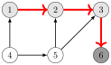
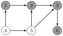
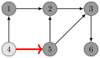
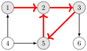
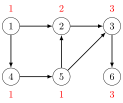
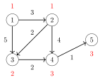

# 有向图

在本章中，我们关注两类有向图：

- **无环图**：图中没有环，因此不存在从任何结点到其自身的路径[^1]。

- **后继图**：每个结点的出度为 1，因此每个结点都有唯一的一个后继。

事实证明，在这两种情况下，我们都可以设计出基于图的特殊性质的高效算法。

## 拓扑排序

**拓扑排序**是对有向图结点的一种排序，使得如果存在从结点 $a$ 到结点 $b$ 的路径，那么结点 $a$ 在排序中出现在结点 $b$ 之前。例如，对于图


其中一种拓扑排序是 $[4,1,5,2,3,6]$：


无环图总是存在拓扑排序。然而，如果图中含有环，就不可能构造拓扑排序，因为环中的任何结点都无法在排序中位于该环其他结点之前。事实证明，深度优先搜索既可以用来检查一个有向图是否含有环，又能在图中不含环时构造出一个拓扑排序。

#### 算法

思路是遍历图中的结点，只要当前结点尚未被处理过，就总是以它作为起点开始一次深度优先搜索。在搜索过程中，结点有三种可能的状态：

- 状态 0：该结点尚未被处理（白色）

- 状态 1：该结点正在被处理（浅灰色）

- 状态 2：该结点已被处理（深灰色）

初始时，每个结点的状态都是 0。当搜索第一次到达某个结点时，它的状态变为 1。最后，当该结点的所有后继都被处理完后，它的状态变为 2。

如果图中含有环，我们会在搜索过程中发现这一点，因为迟早会到达一个状态为 1 的结点。在这种情况下，无法构造拓扑排序。

如果图中不含环，我们可以这样构造拓扑排序：每当某个结点的状态变为 2 时，就把该结点加入一个列表。这个列表的逆序就是一个拓扑排序。

#### 例 1

在示例图中，搜索首先从结点 1 进行到结点 6：



现在结点 6 已被处理，因此将它加入列表。之后，结点 3、2 和 1 也相继加入列表：



此时，列表为 $[6,3,2,1]$。下一次搜索从结点 4 开始：



于是，最终的列表为 $[6,3,2,1,5,4]$。我们已经处理了所有结点，因此找到了一个拓扑排序。该拓扑排序就是列表的逆序 $[4,5,1,2,3,6]$：


注意，拓扑排序并不唯一，一个图可能有多种拓扑排序。

#### 例 2

现在让我们考虑一个无法构造拓扑排序的图，因为它含有环：


搜索过程如下：



搜索到达了状态为 1 的结点 2，这意味着图中含有环。在这个例子中，存在一个环 $2 \rightarrow 3 \rightarrow 5 \rightarrow 2$。

## 动态规划

如果有向图是无环的，就可以对它应用动态规划。例如，对于从起始结点到终止结点的路径，我们可以高效地解决以下问题：

- 有多少条不同的路径？

- 最短/最长路径是什么？

- 路径中边的最少/最多数量是多少？

- 哪些结点一定出现在任何路径中？

#### 统计路径数量

作为例子，让我们计算下面这个图中从结点 1 到结点 6 的路径数量：


这样的路径总共有三条：

- $1 \rightarrow 2 \rightarrow 3 \rightarrow 6$

- $1 \rightarrow 4 \rightarrow 5 \rightarrow 2 \rightarrow 3 \rightarrow 6$

- $1 \rightarrow 4 \rightarrow 5 \rightarrow 3 \rightarrow 6$

记 $\texttt{paths}(x)$ 表示从结点 1 到结点 $x$ 的路径数量。作为基本情况，$\texttt{paths}(1)=1$。然后，为了计算 $\texttt{paths}(x)$ 的其他值，我们可以使用递推式 $$\texttt{paths}(x) = \texttt{paths}(a_1)+\texttt{paths}(a_2)+\cdots+\texttt{paths}(a_k)$$ 其中 $a_1,a_2,\ldots,a_k$ 是存在指向 $x$ 的边的那些结点。由于图是无环的，$\texttt{paths}(x)$ 的值可以按照拓扑排序的顺序来计算。上面这个图的一个拓扑排序如下：


因此，路径数量如下：



例如，为了计算 $\texttt{paths}(3)$ 的值，我们可以使用公式 $\texttt{paths}(2)+\texttt{paths}(5)$，因为存在从结点 2 和 5 指向结点 3 的边。由于 $\texttt{paths}(2)=2$ 且 $\texttt{paths}(5)=1$，我们得出 $\texttt{paths}(3)=3$。

#### 扩展 Dijkstra 算法

Dijkstra 算法的一个副产品是有向无环图，它对于原图中的每个结点，指出从起始结点出发、使用一条最短路到达该结点的各种可能方式。可以对这个图应用动态规划。例如，在图中


从结点 1 出发的最短路可能使用以下这些边：


现在我们可以，例如，使用动态规划计算从结点 1 到结点 5 的最短路数量：



#### 把问题表示为图

实际上，任何动态规划问题都可以表示为一个有向无环图。在这样的图中，每个结点对应一个动态规划状态，而边则表示各状态之间的依赖关系。

作为一个例子，考虑用硬币 $\{c_1,c_2,\ldots,c_k\}$ 凑成金额 $n$ 的问题。在这个问题中，我们可以构造一个图，其中每个结点对应一个金额，边则展示硬币可以如何选取。例如，对于硬币 $\{1,3,4\}$ 和 $n=6$，图如下：


使用这种表示方法，从结点 0 到结点 $n$ 的最短路对应使用硬币数最少的方案，而从结点 0 到结点 $n$ 的路径总数等于方案总数。

## 后继路径

在本章的剩余部分，我们将聚焦于**后继图**。在这些图中，每个结点的出度为 1，即恰好有一条边从每个结点出发。一个后继图由一个或多个连通分量组成，每个连通分量包含一个环以及若干条通向该环的路径。

后继图有时被称为**函数图**。原因在于，任何后继图都对应一个定义该图各条边的函数。该函数的参数是图中的一个结点，函数值给出该结点的后继。

例如，函数

|                $x$ |   1 |   2 |   3 |   4 |   5 |   6 |   7 |   8 |   9 |
|-------------------:|----:|----:|----:|----:|----:|----:|----:|----:|----:|
| $\texttt{succ}(x)$ |   3 |   5 |   7 |   6 |   2 |   2 |   1 |   6 |   3 |

定义了下图：


由于后继图的每个结点都有唯一的一个后继，我们也可以定义一个函数 $\texttt{succ}(x,k)$，它给出从结点 $x$ 出发向前走 $k$ 步将到达的结点。例如，在上面这个图中 $\texttt{succ}(4,6)=2$，因为从结点 4 出发走 6 步将到达结点 2：


计算 $\texttt{succ}(x,k)$ 的一个直接方法是从结点 $x$ 出发向前走 $k$ 步，这需要 $O(k)$ 时间。然而，通过预处理，任何 $\texttt{succ}(x,k)$ 的值都可以在 $O(\log k)$ 时间内求出。

思路是预先计算所有 $\texttt{succ}(x,k)$ 的值，其中 $k$ 是 2 的幂且不超过 $u$，$u$ 是我们将要走的最大步数。这可以高效完成，因为我们可以使用下面的递推式：

$$\begin{equation*}
    \texttt{succ}(x,k) = \begin{cases}
               \texttt{succ}(x)              & k = 1\\
               \texttt{succ}(\texttt{succ}(x,k/2),k/2)   & k > 1\\
           \end{cases}
\end{equation*}$$

预处理这些值需要 $O(n \log u)$ 时间，因为每个结点要计算 $O(\log u)$ 个值。在上面这个图中，最初的一些值如下：

|                  $x$ |   1 |   2 |   3 |   4 |   5 |   6 |   7 |   8 |   9 |
|---------------------:|----:|----:|----:|----:|----:|----:|----:|----:|----:|
| $\texttt{succ}(x,1)$ |   3 |   5 |   7 |   6 |   2 |   2 |   1 |   6 |   3 |
| $\texttt{succ}(x,2)$ |   7 |   2 |   1 |   2 |   5 |   5 |   3 |   2 |   7 |
| $\texttt{succ}(x,4)$ |   3 |   2 |   7 |   2 |   5 |   5 |   1 |   2 |   3 |
| $\texttt{succ}(x,8)$ |   7 |   2 |   1 |   2 |   5 |   5 |   3 |   2 |   7 |
|             $\cdots$ |     |     |     |     |     |     |     |     |     |

在这之后，任何 $\texttt{succ}(x,k)$ 的值都可以通过把步数 $k$ 表示成若干个 2 的幂之和来计算。例如，如果要计算 $\texttt{succ}(x,11)$ 的值，我们首先写出表示 $11=8+2+1$。利用它，$$\texttt{succ}(x,11)=\texttt{succ}(\texttt{succ}(\texttt{succ}(x,8),2),1).$$ 例如，在前面这个图中 $$\texttt{succ}(4,11)=\texttt{succ}(\texttt{succ}(\texttt{succ}(4,8),2),1)=5.$$

这样的表示总是由 $O(\log k)$ 项组成，因此计算 $\texttt{succ}(x,k)$ 的值需要 $O(\log k)$ 时间。

## 环检测

考虑一个只包含一条以环结束的路径的后继图。我们可能会问以下问题：如果从起始结点开始行走，环中的第一个结点是哪个，以及环包含多少个结点？

例如，在图中


我们从结点 1 开始行走，属于环的第一个结点是结点 4，而环由三个结点（4、5 和 6）组成。

检测环的一个简单方法是在图中行走，并记录所有已访问过的结点。一旦某个结点被第二次访问，我们就可以断定它是环中的第一个结点。该方法在 $O(n)$ 时间内运行，并且同样使用 $O(n)$ 内存。

然而，还有更好的环检测算法。这类算法的时间复杂度仍然是 $O(n)$，但它们只使用 $O(1)$ 内存。当 $n$ 很大时，这是一个重要的改进。接下来我们将讨论达到这些性质的 Floyd 算法。

#### Floyd 算法

**Floyd 算法**[^2] 使用两个指针 $a$ 和 $b$ 在图中向前行走。两个指针都从结点 $x$ 出发，它是图的起始结点。然后，每一轮中，指针 $a$ 向前走一步，指针 $b$ 向前走两步。这个过程一直持续到两个指针相遇：

```cpp
a = succ(x);
b = succ(succ(x));
while (a != b) {
    a = succ(a);
    b = succ(succ(b));
}
```

此时，指针 $a$ 已经走了 $k$ 步，指针 $b$ 已经走了 $2k$ 步，因此环的长度整除 $k$。于是，属于环的第一个结点可以通过把指针 $a$ 移到结点 $x$，然后让两个指针一步步向前推进，直到它们再次相遇来找到。

```cpp
a = x;
while (a != b) {
    a = succ(a);
    b = succ(b);
}
first = a;
```

在这之后，环的长度可以这样计算：

```cpp
b = succ(a);
length = 1;
while (a != b) {
    b = succ(b);
    length++;
}
```

[^1]: 有向无环图有时被称为 DAG。

[^2]: 该算法的思想出现在 [50] 中，并被归功于 R. W. Floyd；然而，Floyd 是否真的发现了这个算法尚不为人知。
