# 强连通性

在有向图中，边只能沿一个方向遍历，因此即使图是连通的，也不保证从一个结点到另一个结点一定存在路径。正因如此，定义一种比连通性要求更强的新概念是有意义的。

如果图中从任意结点出发都能到达图中的所有其他结点，则称该图是**强连通的**。例如，在下图中，左图是强连通的，而右图不是。

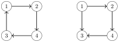

右图不是强连通的，因为例如从结点 2 到结点 1 不存在路径。

图的**强连通分量**把图划分为尽可能大的强连通部分。强连通分量构成一个无环的**分量图**，它表示原图的深层结构。

例如，对于图

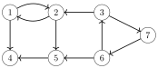

其强连通分量如下：

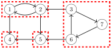

对应的分量图如下：

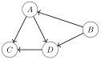

这些分量是 $A=\{1,2\}$、$B=\{3,6,7\}$、$C=\{4\}$ 和 $D=\{5\}$。

分量图是一个无环有向图，因此比原图更易于处理。由于图中不含环，我们总能构造出拓扑序，并使用第 16 章所介绍的动态规划技术。

## Kosaraju 算法

**Kosaraju 算法**[^1] 是寻找有向图强连通分量的一种高效方法。该算法执行两次深度优先搜索：第一次搜索根据图的结构构造一个结点列表，第二次搜索则形成强连通分量。

#### 第一次搜索

Kosaraju 算法的第一阶段按深度优先搜索处理结点的顺序构造一个结点列表。该算法遍历所有结点，并在每个尚未处理的结点处开始一次深度优先搜索。每个结点在被处理完之后会被加入列表。

在示例图中，结点的处理顺序如下：

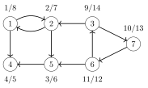

记号 $x/y$ 表示处理该结点始于时刻 $x$、结束于时刻 $y$。因此，对应的列表如下：

| 结点 | 处理时刻 |
|:-----|:----------------|
| 4    | 5               |
| 5    | 6               |
| 2    | 7               |
| 1    | 8               |
| 6    | 12              |
| 7    | 13              |
| 3    | 14              |
|      |                 |

#### 第二次搜索

该算法的第二阶段形成图的强连通分量。首先，算法将图中的每一条边反向。这保证了在第二次搜索期间，我们找到的强连通分量总是不含多余的结点。

反转所有边之后，示例图如下：

在此之后，算法按*逆序*遍历第一次搜索生成的结点列表。如果某个结点不属于任何分量，算法就创建一个新分量，并开始一次深度优先搜索，把搜索过程中找到的所有新结点加入这个新分量。

在示例图中，第一个分量从结点 3 开始：

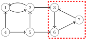

注意，由于所有边都已反向，该分量不会"泄漏"到图中的其他部分。

列表中接下来的结点是结点 7 和结点 6，但它们已经属于某个分量，因此下一个新分量从结点 1 开始：

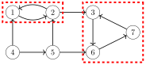

最后，算法处理结点 5 和结点 4，它们构成剩余的强连通分量：

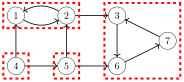

该算法的时间复杂度是 $O(n+m)$，因为算法执行了两次深度优先搜索。

## 2SAT 问题

强连通性也与 **2SAT 问题**[^2] 相关。在该问题中，给定一个逻辑公式 $$(a_1 \lor b_1) \land (a_2 \lor b_2) \land \cdots \land (a_m \lor b_m),$$ 其中每个 $a_i$ 和 $b_i$ 要么是一个逻辑变量（$x_1,x_2,\ldots,x_n$），要么是一个逻辑变量的否定（$\lnot x_1, \lnot x_2, \ldots, \lnot x_n$）。符号 "$\land$" 和 "$\lor$" 分别表示逻辑运算符"与"和"或"。我们的任务是为每个变量指派一个值，使公式为真，或者说明这是不可能的。

例如，公式 $$L_1 = (x_2 \lor \lnot x_1) \land
      (\lnot x_1 \lor \lnot x_2) \land
      (x_1 \lor x_3) \land
      (\lnot x_2 \lor \lnot x_3) \land
      (x_1 \lor x_4)$$ 在变量按如下方式指派时为真：

$$\begin{cases}
x_1 = \textrm{false} \\
x_2 = \textrm{false} \\
x_3 = \textrm{true} \\
x_4 = \textrm{true} \\
\end{cases}$$

然而，公式 $$L_2 = (x_1 \lor x_2) \land
      (x_1 \lor \lnot x_2) \land
      (\lnot x_1 \lor x_3) \land
      (\lnot x_1 \lor \lnot x_3)$$ 无论我们如何指派值，始终为假。原因在于，我们无法为 $x_1$ 选择一个值而不产生矛盾。如果 $x_1$ 为假，则 $x_2$ 和 $\lnot x_2$ 都应同时为真，这是不可能的；而如果 $x_1$ 为真，则 $x_3$ 和 $\lnot x_3$ 都应同时为真，这同样不可能。

2SAT 问题可以用一个图来表示，其结点对应变量 $x_i$ 和否定 $\lnot x_i$，边则决定变量之间的连接关系。每一对 $(a_i \lor b_i)$ 生成两条边：$\lnot a_i \to b_i$ 和 $\lnot b_i \to a_i$。这意味着如果 $a_i$ 不成立，则 $b_i$ 必须成立，反之亦然。

公式 $L_1$ 的图如下：  
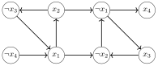

公式 $L_2$ 的图如下：  
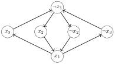

图的结构告诉我们，是否可能为变量指派值使公式为真。结果表明，这恰好可以在不存在这样的结点 $x_i$ 和 $\lnot x_i$（即两个结点属于同一个强连通分量）时做到。如果存在这样的结点，则图中既包含从 $x_i$ 到 $\lnot x_i$ 的路径，也包含从 $\lnot x_i$ 到 $x_i$ 的路径，因此 $x_i$ 和 $\lnot x_i$ 都应为真，这是不可能的。

在公式 $L_1$ 的图中，不存在两个结点 $x_i$ 和 $\lnot x_i$ 都属于同一个强连通分量的情况，因此解存在。在公式 $L_2$ 的图中，所有结点都属于同一个强连通分量，因此解不存在。

如果解存在，可以通过按逆拓扑序遍历分量图的结点来求出变量的值。在每一步中，我们处理一个不含指向未处理分量的边的分量。如果该分量中的变量尚未被指派值，则按照该分量中的值来确定它们的值；如果它们已经有值，则保持不变。这一过程持续进行，直到每个变量都被指派了值。

公式 $L_1$ 的分量图如下：

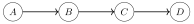

这些分量是 $A = \{\lnot x_4\}$、$B = \{x_1, x_2, \lnot x_3\}$、$C = \{\lnot x_1, \lnot x_2, x_3\}$ 和 $D = \{x_4\}$。在构造解时，我们首先处理分量 $D$，其中 $x_4$ 变为真。在此之后，我们处理分量 $C$，其中 $x_1$ 和 $x_2$ 变为假，$x_3$ 变为真。所有变量都已被指派值，因此剩余的分量 $A$ 和 $B$ 不会改变这些变量。

注意，该方法之所以有效，是因为图具有一种特殊结构：如果存在从结点 $x_i$ 到结点 $x_j$ 的路径，以及从结点 $x_j$ 到结点 $\lnot x_j$ 的路径，那么结点 $x_i$ 永远不会变为真。原因在于，同时也存在从结点 $\lnot x_j$ 到结点 $\lnot x_i$ 的路径，于是 $x_i$ 和 $x_j$ 都变为假。

一个更难的问题是 **3SAT 问题**，其中公式的每个部分都具有 $(a_i \lor b_i \lor c_i)$ 的形式。该问题是 NP-hard 的，因此目前尚无求解它的高效算法。

[^1]: 根据 [1]，S. R. Kosaraju 于 1978 年发明了该算法，但并未发表。1981 年，M. Sharir 重新发现了同一算法并予以发表 [57]。

[^2]: 这里介绍的算法出自 [4]。此外还有另一个著名的线性时间算法 [19]，它基于回溯法。
