# 树查询

本章讨论处理有根树的子树与路径上查询的各种技巧。例如，这类查询包括：

- 一个结点的第 $k$ 个祖先是什么？

- 一个结点的子树中数值之和是多少？

- 两个结点之间的路径上数值之和是多少？

- 两个结点的最近公共祖先是什么？

## 查找祖先

有根树中结点 $x$ 的第 $k$ 个**祖先**是从 $x$ 向上移动 $k$ 层所到达的结点。我们用 $\texttt{ancestor}(x,k)$ 表示结点 $x$ 的第 $k$ 个祖先（若不存在这样的祖先则为 $0$）。例如，在下面这棵树中，$\texttt{ancestor}(2,1)=1$ 且 $\texttt{ancestor}(8,2)=4$。

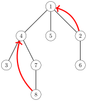

计算任意 $\texttt{ancestor}(x,k)$ 的一种简单方法是在树中进行 $k$ 次移动。然而，这种方法的时间复杂度为 $O(k)$，可能较慢，因为一棵 $n$ 个结点的树可能包含一条 $n$ 个结点的链。

幸运的是，使用与第 16.3 章类似的技巧，经过预处理后可以在 $O(\log k)$ 时间内高效地计算任意 $\texttt{ancestor}(x,k)$。其思路是预计算出所有 $\texttt{ancestor}(x,k)$，其中 $k \le n$ 是 2 的幂。例如，上述树的值如下：

|                      $x$ |   1 |   2 |   3 |   4 |   5 |   6 |   7 |   8 |     |
|-------------------------:|----:|----:|----:|----:|----:|----:|----:|----:|----:|
| $\texttt{ancestor}(x,1)$ |   0 |   1 |   4 |   1 |   1 |   2 |   4 |   7 |     |
| $\texttt{ancestor}(x,2)$ |   0 |   0 |   1 |   0 |   0 |   1 |   1 |   4 |     |
| $\texttt{ancestor}(x,4)$ |   0 |   0 |   0 |   0 |   0 |   0 |   0 |   0 |     |
|                 $\cdots$ |     |     |     |     |     |     |     |     |     |

预处理的耗时为 $O(n \log n)$，因为每个结点需要计算 $O(\log n)$ 个值。之后，通过将 $k$ 表示为若干 2 的幂之和，可以在 $O(\log k)$ 时间内计算任意 $\texttt{ancestor}(x,k)$。

## 子树与路径

**树遍历数组**按从根结点出发的深度优先搜索访问结点的顺序，包含有根树的各结点。例如，在树


中，深度优先搜索的过程如下：

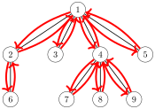

因此，相应的树遍历数组如下：


#### 子树查询

树的每个子树都对应于树遍历数组的一个子数组，该子数组的第一个元素是子树的根结点。例如，下面的子数组包含结点 $4$ 的子树中的各个结点：


利用这一事实，我们可以高效地处理与树的子树相关的查询。作为一个例子，考虑这样一个问题：每个结点被赋予一个值，我们的任务是支持以下查询：

- 更新某个结点的值

- 计算某个结点的子树中数值之和

考虑下面这棵树，其中蓝色数字是各结点的值。例如，结点 $4$ 的子树之和为 $3+4+3+1=11$。

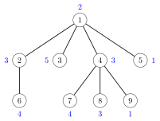

思路是构造一个树遍历数组，其中对每个结点包含三个值：结点的标识、子树的大小以及结点的值。例如，上述树的数组如下：


利用这个数组，我们可以先找出子树的大小，再找到相应结点的值，从而计算任意子树中数值之和。例如，结点 $4$ 的子树中的值可以这样找到：

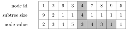

为了高效地回答查询，只需将各结点的值存储在树状数组或线段树中。之后，我们便可以在 $O(\log n)$ 时间内既更新一个值又计算数值之和。

#### 路径查询

利用树遍历数组，我们还可以高效地计算从根结点到树中任意结点的路径上数值之和。考虑这样一个问题：我们的任务是支持以下查询：

- 修改某个结点的值

- 计算从根到某个结点的路径上数值之和

例如，在下面这棵树中，从根结点到结点 7 的数值之和为 $4+5+5=14$：

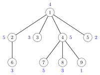

我们可以像之前那样来解决这个问题，不过现在数组最后一行的每个值是从根到该结点路径上的数值之和。例如，下面的数组对应于上述树：


当某个结点的值增加 $x$ 时，其子树中所有结点的和都增加 $x$。例如，若结点 4 的值增加 1，则数组的变化如下：

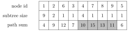

因此，为了同时支持这两种操作，我们应当能够增大一个区间内的所有值并查询单个值。这可以利用树状数组或线段树在 $O(\log n)$ 时间内完成（见第 9.4 章）。

## 最近公共祖先

有根树中两个结点的**最近公共祖先**是子树同时包含这两个结点的最低结点。一个典型问题是高效地处理查询两个结点最近公共祖先的询问。

例如，在下面这棵树中，结点 5 和结点 8 的最近公共祖先是结点 2：

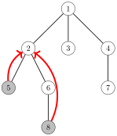

接下来我们讨论两种高效查找两个结点最近公共祖先的技巧。

#### 方法 1

解决该问题的一种方法是利用我们能够高效查找树中任意结点第 $k$ 个祖先这一事实。借此，我们可以将查找最近公共祖先的问题分成两部分。

我们使用两个指针，初始时分别指向需要查找最近公共祖先的两个结点。首先，我们将其中一个指针向上移动，使两个指针指向同一层上的结点。

在示例情形中，我们将第二个指针向上移动一层，使其指向结点 6，它与结点 5 处于同一层：

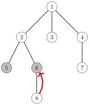

之后，我们确定两个指针向上移动所需的最少步数，使它们指向同一个结点。指针在此之后所指的结点就是最近公共祖先。

在示例情形中，只需将两个指针都向上移动一步到结点 2，它就是最近公共祖先：

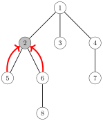

由于算法的两部分都可以利用预计算的信息在 $O(\log n)$ 时间内完成，因此我们可以在 $O(\log n)$ 时间内查找任意两个结点的最近公共祖先。

#### 方法 2

另一种解决该问题的方法基于树遍历数组[^1]。同样地，思路是使用深度优先搜索来遍历各结点：

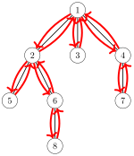

然而，我们使用一个与之前不同的树遍历数组：每当深度优先搜索经过某个结点时，我们*总是*将该结点加入数组，而不仅仅在首次访问时加入。因此，一个有 $k$ 个子结点的结点在数组中出现 $k+1$ 次，数组中总共有 $2n-1$ 个结点。

我们在数组中存储两个值：结点的标识以及结点在树中的深度。下面的数组对应于上述树：


现在，我们可以通过查找数组中介于结点 $a$ 和 $b$ 之间深度*最小*的结点，来找到结点 $a$ 和 $b$ 的最近公共祖先。例如，结点 $5$ 和 $8$ 的最近公共祖先可以这样找到：


结点 5 位于位置 2，结点 8 位于位置 5，而位置 $2 \ldots 5$ 之间深度最小的结点是位于位置 3 的结点 2，其深度为 2。因此，结点 5 和 8 的最近公共祖先是结点 2。

于是，要查找两个结点的最近公共祖先，只需处理一个区间最小值查询。由于该数组是静态的，我们经过 $O(n \log n)$ 时间的预处理后，可以在 $O(1)$ 时间内处理这类查询。

#### 结点的距离

结点 $a$ 和 $b$ 之间的距离等于从 $a$ 到 $b$ 的路径长度。事实证明，计算结点间距离的问题可以归结为查找它们的最近公共祖先。

首先，我们任意地为树定根。之后，结点 $a$ 和 $b$ 之间的距离可以用公式 $$\texttt{depth}(a)+\texttt{depth}(b)-2 \cdot \texttt{depth}(c),$$ 来计算，其中 $c$ 是 $a$ 和 $b$ 的最近公共祖先，$\texttt{depth}(s)$ 表示结点 $s$ 的深度。例如，考虑结点 5 和 8 之间的距离：

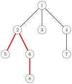

结点 5 和 8 的最近公共祖先是结点 2。各结点的深度为 $\texttt{depth}(5)=3$、$\texttt{depth}(8)=4$ 以及 $\texttt{depth}(2)=2$，因此结点 5 和 8 之间的距离为 $3+4-2\cdot2=3$。

## 离线算法

到目前为止，我们讨论的都是树查询的*在线*算法。这类算法能够一个接一个地处理查询，使得在收到下一个查询之前先回答当前查询。

然而，在许多问题中，在线性质并非必要。在本节中，我们关注*离线*算法。这类算法给定一组查询，可以按任意顺序回答。与在线算法相比，设计离线算法通常更容易。

#### 合并数据结构

构造离线算法的一种方法是执行深度优先树遍历，并在结点处维护数据结构。在每个结点 $s$ 处，我们基于 $s$ 的子结点们的数据结构创建一个数据结构 $\texttt{d}[s]$。然后，利用这个数据结构处理所有与 $s$ 相关的查询。

作为一个例子，考虑以下问题：给定一棵树，其中每个结点都有某个值。我们的任务是处理形如「计算结点 $s$ 的子树中值为 $x$ 的结点个数」的查询。例如，在下面这棵树中，结点 $4$ 的子树包含两个值为 3 的结点。


在这个问题中，我们可以使用 map 结构来回答查询。例如，结点 4 及其子结点的 map 如下：


如果我们为每个结点创建这样的数据结构，就能轻松地处理所有给定的查询，因为我们可以创建完某个结点的数据结构后立即处理所有与该结点相关的查询。例如，上述结点 4 的 map 结构告诉我们，其子树包含两个值为 3 的结点。

然而，从头创建所有数据结构会太慢。相反，在每个结点 $s$ 处，我们创建一个初始数据结构 $\texttt{d}[s]$，其中只包含 $s$ 的值。之后，我们遍历 $s$ 的子结点，并将 $\texttt{d}[s]$ 与所有数据结构 $\texttt{d}[u]$ *合并*，其中 $u$ 是 $s$ 的子结点。

例如，在上述树中，结点 $4$ 的 map 通过合并以下 map 得到：


这里第一个 map 是结点 4 的初始数据结构，其余三个 map 对应于结点 7、8 和 9。

在结点 $s$ 处的合并可以这样进行：我们遍历 $s$ 的子结点，并在每个子结点 $u$ 处合并 $\texttt{d}[s]$ 和 $\texttt{d}[u]$。我们总是将 $\texttt{d}[u]$ 的内容复制到 $\texttt{d}[s]$。然而在此之前，如果 $\texttt{d}[s]$ 比 $\texttt{d}[u]$ 小，我们就*交换* $\texttt{d}[s]$ 和 $\texttt{d}[u]$ 的内容。通过这样做，每个值在树遍历过程中只会被复制 $O(\log n)$ 次，从而保证算法是高效的。

为了高效地交换两个数据结构 $a$ 和 $b$ 的内容，我们只需使用以下代码：

```cpp
swap(a,b);
```

可以保证，当 $a$ 和 $b$ 是 C++ 标准库数据结构时，上述代码在常数时间内完成。

#### 最近公共祖先

对于处理一组最近公共祖先查询，也存在一种离线算法[^2]。该算法基于并查集数据结构（见第 15.2 章），其优点是比本章前面讨论的算法更易于实现。

该算法的输入是一组结点对，并针对每一对确定这两个结点的最近公共祖先。该算法执行深度优先树遍历，并维护不相交的结点集合。初始时，每个结点属于一个单独的集合。对于每个集合，我们还存储属于该集合的树中最高结点。

当算法访问结点 $x$ 时，它会遍历所有需要查找 $x$ 与 $y$ 最近公共祖先的结点 $y$。如果 $y$ 已经被访问过，算法就报告 $x$ 与 $y$ 的最近公共祖先是 $y$ 所在集合中的最高结点。然后，在处理完结点 $x$ 之后，算法将 $x$ 及其父结点的集合合并。

例如，假设我们想要在下面这棵树中查找结点对 $(5,8)$ 和 $(2,7)$ 的最近公共祖先：


在下面的树中，灰色结点表示已访问的结点，虚线分组表示属于同一集合的结点。当算法访问结点 8 时，它注意到结点 5 已被访问，且其所在集合中的最高结点是 2。因此，结点 5 和 8 的最近公共祖先是 2：

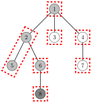

后来，当访问结点 7 时，算法确定结点 2 和 7 的最近公共祖先是 1：

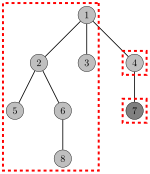

[^1]: 这种最近公共祖先算法在 [7] 中提出。这种技巧有时被称为 **Euler tour technique**（欧拉遍历技巧）[66]。

[^2]: 该算法由 R. E. Tarjan 于 1979 年发表 [65]。
