# Paths and circuits

This chapter focuses on two types of paths in graphs:

- An **Eulerian path** is a path that goes through each edge exactly once.

- A **Hamiltonian path** is a path that visits each node exactly once.

While Eulerian and Hamiltonian paths look like similar concepts at first glance, the computational problems related to them are very different. It turns out that there is a simple rule that determines whether a graph contains an Eulerian path, and there is also an efficient algorithm to find such a path if it exists. On the contrary, checking the existence of a Hamiltonian path is a NP-hard problem, and no efficient algorithm is known for solving the problem.

## Eulerian paths

An **Eulerian path**[^1] is a path that goes exactly once through each edge of the graph. For example, the graph

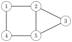

has an Eulerian path from node 2 to node 5:

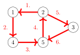

An **Eulerian circuit** is an Eulerian path that starts and ends at the same node. For example, the graph

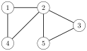

has an Eulerian circuit that starts and ends at node 1:

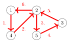

#### Existence

The existence of Eulerian paths and circuits depends on the degrees of the nodes. First, an undirected graph has an Eulerian path exactly when all the edges belong to the same connected component and

- the degree of each node is even *or*

- the degree of exactly two nodes is odd, and the degree of all other nodes is even.

In the first case, each Eulerian path is also an Eulerian circuit. In the second case, the odd-degree nodes are the starting and ending nodes of an Eulerian path which is not an Eulerian circuit.

For example, in the graph

nodes 1, 3 and 4 have a degree of 2, and nodes 2 and 5 have a degree of 3. Exactly two nodes have an odd degree, so there is an Eulerian path between nodes 2 and 5, but the graph does not contain an Eulerian circuit.

In a directed graph, we focus on indegrees and outdegrees of the nodes. A directed graph contains an Eulerian path exactly when all the edges belong to the same connected component and

- in each node, the indegree equals the outdegree, *or*

- in one node, the indegree is one larger than the outdegree, in another node, the outdegree is one larger than the indegree, and in all other nodes, the indegree equals the outdegree.

In the first case, each Eulerian path is also an Eulerian circuit, and in the second case, the graph contains an Eulerian path that begins at the node whose outdegree is larger and ends at the node whose indegree is larger.

For example, in the graph

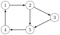

nodes 1, 3 and 4 have both indegree 1 and outdegree 1, node 2 has indegree 1 and outdegree 2, and node 5 has indegree 2 and outdegree 1. Hence, the graph contains an Eulerian path from node 2 to node 5:

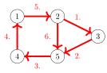

#### Hierholzer's algorithm

**Hierholzer's algorithm**[^2] is an efficient method for constructing an Eulerian circuit. The algorithm consists of several rounds, each of which adds new edges to the circuit. Of course, we assume that the graph contains an Eulerian circuit; otherwise Hierholzer's algorithm cannot find it.

First, the algorithm constructs a circuit that contains some (not necessarily all) of the edges of the graph. After this, the algorithm extends the circuit step by step by adding subcircuits to it. The process continues until all edges have been added to the circuit.

The algorithm extends the circuit by always finding a node $x$ that belongs to the circuit but has an outgoing edge that is not included in the circuit. The algorithm constructs a new path from node $x$ that only contains edges that are not yet in the circuit. Sooner or later, the path will return to node $x$, which creates a subcircuit.

If the graph only contains an Eulerian path, we can still use Hierholzer's algorithm to find it by adding an extra edge to the graph and removing the edge after the circuit has been constructed. For example, in an undirected graph, we add the extra edge between the two odd-degree nodes.

Next we will see how Hierholzer's algorithm constructs an Eulerian circuit for an undirected graph.

#### Example

Let us consider the following graph:

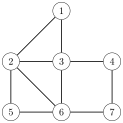

Suppose that the algorithm first creates a circuit that begins at node 1. A possible circuit is $1 \rightarrow 2 \rightarrow 3 \rightarrow 1$:

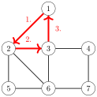

After this, the algorithm adds the subcircuit $2 \rightarrow 5 \rightarrow 6 \rightarrow 2$ to the circuit:

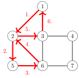

Finally, the algorithm adds the subcircuit $6 \rightarrow 3 \rightarrow 4 \rightarrow 7 \rightarrow 6$ to the circuit:

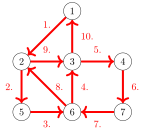

Now all edges are included in the circuit, so we have successfully constructed an Eulerian circuit.

## Hamiltonian paths

A **Hamiltonian path** is a path that visits each node of the graph exactly once. For example, the graph

contains a Hamiltonian path from node 1 to node 3:

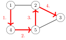

If a Hamiltonian path begins and ends at the same node, it is called a **Hamiltonian circuit**. The graph above also has an Hamiltonian circuit that begins and ends at node 1:

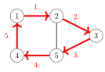

#### Existence

No efficient method is known for testing if a graph contains a Hamiltonian path, and the problem is NP-hard. Still, in some special cases, we can be certain that a graph contains a Hamiltonian path.

A simple observation is that if the graph is complete, i.e., there is an edge between all pairs of nodes, it also contains a Hamiltonian path. Also stronger results have been achieved:

- **Dirac's theorem**: If the degree of each node is at least $n/2$, the graph contains a Hamiltonian path.

- **Ore's theorem**: If the sum of degrees of each non-adjacent pair of nodes is at least $n$, the graph contains a Hamiltonian path.

A common property in these theorems and other results is that they guarantee the existence of a Hamiltonian path if the graph has *a large number* of edges. This makes sense, because the more edges the graph contains, the more possibilities there is to construct a Hamiltonian path.

#### Construction

Since there is no efficient way to check if a Hamiltonian path exists, it is clear that there is also no method to efficiently construct the path, because otherwise we could just try to construct the path and see whether it exists.

A simple way to search for a Hamiltonian path is to use a backtracking algorithm that goes through all possible ways to construct the path. The time complexity of such an algorithm is at least $O(n!)$, because there are $n!$ different ways to choose the order of $n$ nodes.

A more efficient solution is based on dynamic programming (see Chapter 10.5). The idea is to calculate values of a function $\texttt{possible}(S,x)$, where $S$ is a subset of nodes and $x$ is one of the nodes. The function indicates whether there is a Hamiltonian path that visits the nodes of $S$ and ends at node $x$. It is possible to implement this solution in $O(2^n n^2)$ time.

## De Bruijn sequences

A **De Bruijn sequence** is a string that contains every string of length $n$ exactly once as a substring, for a fixed alphabet of $k$ characters. The length of such a string is $k^n+n-1$ characters. For example, when $n=3$ and $k=2$, an example of a De Bruijn sequence is $$0001011100.$$ The substrings of this string are all combinations of three bits: 000, 001, 010, 011, 100, 101, 110 and 111.

It turns out that each De Bruijn sequence corresponds to an Eulerian path in a graph. The idea is to construct a graph where each node contains a string of $n-1$ characters and each edge adds one character to the string. The following graph corresponds to the above scenario:

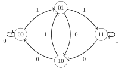

An Eulerian path in this graph corresponds to a string that contains all strings of length $n$. The string contains the characters of the starting node and all characters of the edges. The starting node has $n-1$ characters and there are $k^n$ characters in the edges, so the length of the string is $k^n+n-1$.

## Knight's tours

A **knight's tour** is a sequence of moves of a knight on an $n \times n$ chessboard following the rules of chess such that the knight visits each square exactly once. A knight's tour is called a *closed* tour if the knight finally returns to the starting square and otherwise it is called an *open* tour.

For example, here is an open knight's tour on a $5 \times 5$ board:

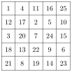

A knight's tour corresponds to a Hamiltonian path in a graph whose nodes represent the squares of the board, and two nodes are connected with an edge if a knight can move between the squares according to the rules of chess.

A natural way to construct a knight's tour is to use backtracking. The search can be made more efficient by using *heuristics* that attempt to guide the knight so that a complete tour will be found quickly.

#### Warnsdorf's rule

**Warnsdorf's rule** is a simple and effective heuristic for finding a knight's tour[^3]. Using the rule, it is possible to efficiently construct a tour even on a large board. The idea is to always move the knight so that it ends up in a square where the number of possible moves is as *small* as possible.

For example, in the following situation, there are five possible squares to which the knight can move (squares $a \ldots e$):

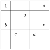

In this situation, Warnsdorf's rule moves the knight to square $a$, because after this choice, there is only a single possible move. The other choices would move the knight to squares where there would be three moves available.

[^1]: L. Euler studied such paths in 1736 when he solved the famous Königsberg bridge problem. This was the birth of graph theory.

[^2]: The algorithm was published in 1873 after Hierholzer's death [39].

[^3]: This heuristic was proposed in Warnsdorf's book [77] in 1823. There are also polynomial algorithms for finding knight's tours [58], but they are more complicated.
