# 流与割

在本章中，我们关注以下两个问题：

- **求最大流**：我们最多能从某个结点向另一个结点发送多少流量？

- **求最小割**：分离图中两个结点的最小权边集是什么？

这两个问题的输入都是一个带权有向图，其中包含两个特殊结点：*源点* 是一个没有入边的结点，*汇点* 是一个没有出边的结点。

作为示例，我们将使用下面这个图，其中结点 1 是源点，结点 6 是汇点：

#### 最大流

在**最大流**问题中，我们的任务是从源点向汇点发送尽可能多的流量。每条边的权值是一个容量，它限制了能通过该边的流量。在每个中间结点处，流入与流出的流量必须相等。

例如，示例图中最大流的流量为 7。下图展示了我们如何安排这条流：

记号 $v/k$ 表示有 $v$ 单位的流量通过一条容量为 $k$ 单位的边。流的大小为 $7$，因为源点发送了 $3+4$ 单位的流量，而汇点接收了 $5+2$ 单位的流量。很容易看出这条流是最大的，因为指向汇点的所有边的总容量为 $7$。

#### 最小割

在**最小割**问题中，我们的任务是从图中删去一组边，使得删去后不存在从源点到汇点的路径，并且删去的边的总权值最小。

示例图中割的最小大小为 7。只需删去边 $2 \rightarrow 3$ 和 $4 \rightarrow 5$：

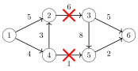

删去这些边后，将不存在从源点到汇点的路径。割的大小为 $7$，因为删去的边的权值为 $6$ 和 $1$。这个割是最小的，因为不存在从图中删去边、使其总权值小于 $7$ 的合法方式。  

在上面的例子中，最大流的流量与最小割的大小相同，这并非巧合。事实证明，最大流与最小割 *总是* 一样大，所以这两个概念是同一枚硬币的两面。

接下来我们将讨论 Ford--Fulkerson 算法，它可用于求图的最大流与最小割。该算法也有助于我们理解它们 *为何* 一样大。

## Ford--Fulkerson 算法

**Ford--Fulkerson 算法** [28] 求图的最大流。该算法从一条空流开始，每一步都寻找一条能从源点通向汇点、并能产生更多流量的路径。最终，当算法无法再增加流量时，就已经找到了最大流。

该算法使用一种特殊的图表示，其中每条原有的边在另一个方向上有一条反向边。每条边的权值表示我们还能通过它路由多少流量。在算法开始时，每条原有边的权值等于该边的容量，而每条反向边的权值为零。

示例图的新表示如下：

#### 算法描述

Ford--Fulkerson 算法由若干轮组成。在每一轮中，算法寻找一条从源点到汇点的路径，使得该路径上的每条边都具有正权值。如果有多条可行路径，我们可以任选其一。

例如，假设我们选择如下路径：

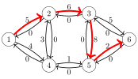

选择路径后，流量增加 $x$ 个单位，其中 $x$ 是路径上最小的边权值。此外，路径上每条边的权值减少 $x$，而每条反向边的权值增加 $x$。

在上述路径中，各边的权值为 5、6、8 和 2。最小权值为 2，所以流量增加 2，新的图如下：

其思想是，增加流量会减少未来能通过这些边的流量。另一方面，如果后来发现以另一种方式安排流量更有利，也可以利用图中的反向边来撤销流量。

只要存在一条从源点到汇点、由正权值边构成的路径，算法就会增加流量。在当前示例中，我们的下一条路径可以如下：

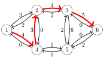

这条路径上最小的边权值为 3，所以该路径使流量增加 3，处理完这条路径后的总流量为 5。

新的图将如下：

在达到最大流之前，我们还需要再进行两轮。例如，我们可以选择路径 $1 \rightarrow 2 \rightarrow 3 \rightarrow 6$ 和 $1 \rightarrow 4 \rightarrow 5 \rightarrow 3 \rightarrow 6$。这两条路径都使流量增加 1，最终的图如下：

不再可能增加流量了，因为不存在一条从源点到汇点、所有边权值均为正的路径。因此，算法终止，最大流为 7。

#### 寻找路径

Ford--Fulkerson 算法并没有规定我们应当如何选择增加流量的路径。无论怎样选择，算法迟早都会终止并正确地求出最大流。然而，算法的效率取决于路径的选择方式。

一种简单的找路径方法是使用深度优先搜索。通常这效果很好，但在最坏情况下，每条路径只能使流量增加 1，算法会很慢。幸运的是，我们可以使用以下技术之一来避免这种情况：

**Edmonds--Karp 算法** [21] 选择路径时，使得路径上的边数尽可能少。这可以通过使用广度优先搜索而非深度优先搜索来寻找路径来实现。可以证明，这样能保证流量快速增加，且算法的时间复杂度为 $O(m^2 n)$。

**伸缩算法（scaling algorithm）** [2] 使用深度优先搜索来寻找每条边的权值都至少达到某个阈值的路径。初始时，阈值为某个较大的数，例如图中所有边权值之和。每当找不到路径时，阈值就除以 2。该算法的时间复杂度为 $O(m^2 \log c)$，其中 $c$ 是初始阈值。

在实践中，伸缩算法更容易实现，因为它可以使用深度优先搜索来寻找路径。对于程序设计竞赛中通常出现的问题，这两种算法都足够高效。

#### 最小割

事实证明，一旦 Ford--Fulkerson 算法求出最大流，它也就确定了一个最小割。设 $A$ 为可以从源点出发、经由正权值边到达的结点集合。在示例图中，$A$ 包含结点 1、2 和 4：

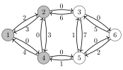

此时，最小割由原图中满足以下条件的边组成：起点在 $A$ 中某个结点、终点在 $A$ 外某个结点，且在最大流中其容量被完全使用。在上图中，这样的边是 $2 \rightarrow 3$ 和 $4 \rightarrow 5$，它们对应最小割 $6+1=7$。

为什么算法产生的流是最大流，而割是最小割？原因在于，图中不可能存在一条比图中任意割的权值都大的流。因此，每当一条流与一个割一样大时，它们就分别是最大流与最小割。

让我们考虑图中任意一个割，其中源点属于 $A$、汇点属于 $B$，且两个集合之间有一些边：

割的大小是从 $A$ 到 $B$ 的边之和。这是图中流量的一个上界，因为流量必须从 $A$ 流向 $B$。于是，最大流的流量小于或等于图中任意割的大小。

另一方面，Ford--Fulkerson 算法产生的流，其流量 *恰好* 等于图中某个割的大小。因此，这条流必定是最大流，而那个割必定是最小割。

## 不相交路径

许多图问题都可以归约为最大流问题来求解。我们的第一个这类问题如下：给定一个有源点和汇点的有向图，任务是求出从源点到汇点的最多不相交路径数。

#### 边不相交路径

我们首先关注求出从源点到汇点的最多 **边不相交路径** 的问题。这意味着我们应当构造一组路径，使得每条边至多出现在一条路径中。

例如，考虑下面的图：

在这个图中，边不相交路径的最大数目为 2。我们可以选择路径 $1 \rightarrow 2 \rightarrow 4 \rightarrow 3 \rightarrow 6$ 和 $1 \rightarrow 4 \rightarrow 5 \rightarrow 6$，如下所示：

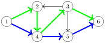

事实证明，边不相交路径的最大数目等于图的最大流（假设每条边的容量为 1）。在构造出最大流之后，可以通过从源点到汇点贪心地沿路径走，找出这些边不相交路径。

#### 结点不相交路径

现在让我们考虑另一个问题：求从源点到汇点的最多 **结点不相交路径**。在这个问题中，除源点和汇点外的每个结点至多出现在一条路径中。结点不相交路径的数目可能小于边不相交路径的数目。

例如，在前面的图中，结点不相交路径的最大数目为 1：

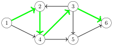

这个问题也可以归约为最大流问题。由于每个结点至多出现在一条路径中，我们必须限制通过结点的流量。一种标准做法是把每个结点拆成两个结点，使得第一个结点承接原结点的入边，第二个结点承接原结点的出边，并在第一个结点与第二个结点之间添加一条新边。

在我们的示例中，图变为如下：

该图的最大流如下：

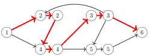

因此，从源点到汇点的结点不相交路径的最大数目为 1。

## 最大匹配

**最大匹配**问题要求在一个无向图中找出一个最大规模的结点对集合，使得每一对都由一条边相连，且每个结点至多属于一对。

对于一般图，求最大匹配存在多项式算法 [20]，但这类算法很复杂，在程序设计竞赛中很少见到。然而，在二分图中，最大匹配问题要容易解得得多，因为我们可以把它归约为最大流问题。

#### 求最大匹配

二分图的结点总是可以分成两组，使得图中所有的边都从左组指向右组。例如，在下面的二分图中，两组分别是 $\{1,2,3,4\}$ 和 $\{5,6,7,8\}$。

这个图的最大匹配大小为 3：

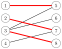

我们可以通过向图中添加两个新结点，把二分图最大匹配问题归约为最大流问题：一个源点和一个汇点。我们还添加从源点到每个左结点的边，以及从每个右结点到汇点的边。之后，图中最大流的流量就等于原图最大匹配的大小。

例如，对上面这个图的归约如下：

这个图的最大流如下：

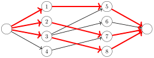

#### Hall 定理

**Hall 定理**可用于判断一个二分图是否存在包含全部左侧或右侧结点的匹配。如果左侧和右侧结点数目相同，Hall 定理告诉我们是否能构造出一个包含图中所有结点的**完美匹配**。

假设我们想求一个包含全部左侧结点的匹配。设 $X$ 为任意的左侧结点集合，$f(X)$ 为它们邻居的集合。根据 Hall 定理，包含全部左侧结点的匹配存在，当且仅当对每个 $X$，条件 $|X| \le |f(X)|$ 都成立。

让我们在示例图中研究 Hall 定理。首先，取 $X=\{1,3\}$，得到 $f(X)=\{5,6,8\}$：

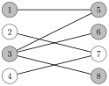

Hall 定理的条件成立，因为 $|X|=2$ 且 $|f(X)|=3$。接下来，取 $X=\{2,4\}$，得到 $f(X)=\{7\}$：

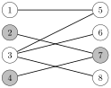

在这种情况下，$|X|=2$ 而 $|f(X)|=1$，所以 Hall 定理的条件不成立。这意味着无法为该图构造完美匹配。这个结果并不令人意外，因为我们已知该图的最大匹配为 3 而不是 4。

如果 Hall 定理的条件不成立，集合 $X$ 就给出了我们 *为何* 不能构造这种匹配的一个解释。由于 $X$ 中的结点比 $f(X)$ 多，$X$ 中的结点无法全部配对。例如，在上图中，结点 2 和结点 4 都应当与结点 7 相连，这是不可能的。

#### Kőnig 定理

图的**最小结点覆盖**是满足以下条件的最小结点集合：图中每条边至少有一个端点在该集合中。在一般图中，求最小结点覆盖是一个 NP 难问题。然而，如果图是二分图，**Kőnig 定理**告诉我们，最小结点覆盖的大小与最大匹配的大小总是相等。于是，我们可以用最大流算法来计算最小结点覆盖的大小。

让我们考虑下面这个最大匹配大小为 3 的图：

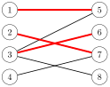

现在 Kőnig 定理告诉我们，最小结点覆盖的大小也是 3。这样的覆盖可以如下构造：

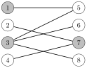

*不* 属于最小结点覆盖的结点构成一个**最大独立集**。这是满足集合中没有两个结点由一条边相连的最大可能结点集合。同样地，在一般图中求最大独立集是一个 NP 难问题，但在二分图中我们可以利用 Kőnig 定理高效地求解。在示例图中，最大独立集如下：

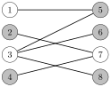

## 路径覆盖

**路径覆盖**是图中的一组路径，使得图中每个结点至少属于一条路径。事实证明，在有向无环图中，我们可以把求最小路径覆盖的问题归约为在另一个图中求最大流的问题。

#### 结点不相交路径覆盖

在**结点不相交路径覆盖**中，每个结点恰好属于一条路径。作为示例，考虑下面的图：

这个图的最小结点不相交路径覆盖由三条路径组成。例如，我们可以选择如下路径：

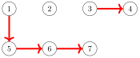

注意其中一条路径只包含结点 2，所以路径可能不含任何边。

我们可以通过构造一个 *匹配图* 来求最小结点不相交路径覆盖，其中原图的每个结点由两个结点表示：一个左结点和一个右结点。如果原图中存在一条从某结点到另一结点的边，则匹配图中也存在一条从左结点到右结点的边。此外，匹配图包含一个源点和一个汇点，并有从源点到所有左结点的边，以及从所有右结点到汇点的边。

所得图中的最大匹配对应于原图中的最小结点不相交路径覆盖。例如，对于上面这个图，下面的匹配图包含一个大小为 4 的最大匹配：

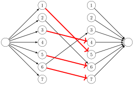

匹配图最大匹配中的每条边都对应于原图最小结点不相交路径覆盖中的一条边。因此，最小结点不相交路径覆盖的大小为 $n-c$，其中 $n$ 是原图中的结点数，$c$ 是最大匹配的大小。

#### 一般路径覆盖

**一般路径覆盖**是允许一个结点属于多条路径的路径覆盖。最小一般路径覆盖可能小于最小结点不相交路径覆盖，因为一个结点可以在路径中被多次使用。再次考虑下面的图：

这个图的最小一般路径覆盖由两条路径组成。例如，第一条路径可以如下：

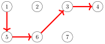

第二条路径可以如下：

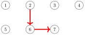

最小一般路径覆盖的求法与最小结点不相交路径覆盖几乎相同。只需向匹配图中添加一些新边，使得只要原图中存在一条从 $a$ 到 $b$ 的路径（可能经过若干条边），匹配图中就存在一条边 $a \rightarrow b$。

上面这个图的匹配图如下：

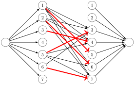

#### Dilworth 定理

**反链**是图中满足以下条件的结点集合：利用图中的边，无法从其中任一结点到达另一个结点。**Dilworth 定理**指出，在有向无环图中，最小一般路径覆盖的大小等于最大反链的大小。

例如，在下面的图中，结点 3 和结点 7 构成一个反链：

这是一个最大反链，因为不可能构造出任何包含三个结点的反链。我们之前已经看到，这个图的最小一般路径覆盖由两条路径组成。
