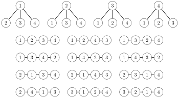

# Combinatorics

**Combinatorics** studies methods for counting combinations of objects. Usually, the goal is to find a way to count the combinations efficiently without generating each combination separately.

As an example, consider the problem of counting the number of ways to represent an integer $n$ as a sum of positive integers. For example, there are 8 representations for $4$:

2

- $1+1+1+1$

- $1+1+2$

- $1+2+1$

- $2+1+1$

- $2+2$

- $3+1$

- $1+3$

- $4$

A combinatorial problem can often be solved using a recursive function. In this problem, we can define a function $f(n)$ that gives the number of representations for $n$. For example, $f(4)=8$ according to the above example. The values of the function can be recursively calculated as follows: $$\begin{equation*}
    f(n) = \begin{cases}
               1               & n = 0\\
               f(0)+f(1)+\cdots+f(n-1) & n > 0\\
           \end{cases}
\end{equation*}$$ The base case is $f(0)=1$, because the empty sum represents the number 0. Then, if $n>0$, we consider all ways to choose the first number of the sum. If the first number is $k$, there are $f(n-k)$ representations for the remaining part of the sum. Thus, we calculate the sum of all values of the form $f(n-k)$ where $k<n$.

The first values for the function are: $$\begin{array}{lcl}
f(0) & = & 1 \\
f(1) & = & 1 \\
f(2) & = & 2 \\
f(3) & = & 4 \\
f(4) & = & 8 \\
\end{array}$$

Sometimes, a recursive formula can be replaced with a closed-form formula. In this problem, $$f(n)=2^{n-1},$$ which is based on the fact that there are $n-1$ possible positions for +-signs in the sum and we can choose any subset of them.

## Binomial coefficients

The **binomial coefficient** ${n \choose k}$ equals the number of ways we can choose a subset of $k$ elements from a set of $n$ elements. For example, ${5 \choose 3}=10$, because the set $\{1,2,3,4,5\}$ has 10 subsets of 3 elements: $$\{1,2,3\}, \{1,2,4\}, \{1,2,5\}, \{1,3,4\}, \{1,3,5\},
\{1,4,5\}, \{2,3,4\}, \{2,3,5\}, \{2,4,5\}, \{3,4,5\}$$

#### Formula 1

Binomial coefficients can be recursively calculated as follows:

$${n \choose k}  =  {n-1 \choose k-1} + {n-1 \choose k}$$

The idea is to fix an element $x$ in the set. If $x$ is included in the subset, we have to choose $k-1$ elements from $n-1$ elements, and if $x$ is not included in the subset, we have to choose $k$ elements from $n-1$ elements.

The base cases for the recursion are $${n \choose 0}  =  {n \choose n} = 1,$$ because there is always exactly one way to construct an empty subset and a subset that contains all the elements.

#### Formula 2

Another way to calculate binomial coefficients is as follows: $${n \choose k}  =  \frac{n!}{k!(n-k)!}.$$

There are $n!$ permutations of $n$ elements. We go through all permutations and always include the first $k$ elements of the permutation in the subset. Since the order of the elements in the subset and outside the subset does not matter, the result is divided by $k!$ and $(n-k)!$

#### Properties

For binomial coefficients, $${n \choose k}  =  {n \choose n-k},$$ because we actually divide a set of $n$ elements into two subsets: the first contains $k$ elements and the second contains $n-k$ elements.

The sum of binomial coefficients is $${n \choose 0}+{n \choose 1}+{n \choose 2}+\ldots+{n \choose n}=2^n.$$

The reason for the name "binomial coefficient" can be seen when the binomial $(a+b)$ is raised to the $n$th power:

$$(a+b)^n =
{n \choose 0} a^n b^0 +
{n \choose 1} a^{n-1} b^1 +
\ldots +
{n \choose n-1} a^1 b^{n-1} +
{n \choose n} a^0 b^n.$$

Binomial coefficients also appear in **Pascal's triangle** where each value equals the sum of two above values:

#### Boxes and balls

"Boxes and balls" is a useful model, where we count the ways to place $k$ balls in $n$ boxes. Let us consider three scenarios:

*Scenario 1*: Each box can contain at most one ball. For example, when $n=5$ and $k=2$, there are 10 solutions:

In this scenario, the answer is directly the binomial coefficient ${n \choose k}$.

*Scenario 2*: A box can contain multiple balls. For example, when $n=5$ and $k=2$, there are 15 solutions:

The process of placing the balls in the boxes can be represented as a string that consists of symbols "o" and "$\rightarrow$". Initially, assume that we are standing at the leftmost box. The symbol "o" means that we place a ball in the current box, and the symbol "$\rightarrow$" means that we move to the next box to the right.

Using this notation, each solution is a string that contains $k$ times the symbol "o" and $n-1$ times the symbol "$\rightarrow$". For example, the upper-right solution in the above picture corresponds to the string "$\rightarrow$ $\rightarrow$ o $\rightarrow$ o $\rightarrow$". Thus, the number of solutions is ${k+n-1 \choose k}$.

*Scenario 3*: Each box may contain at most one ball, and in addition, no two adjacent boxes may both contain a ball. For example, when $n=5$ and $k=2$, there are 6 solutions:

In this scenario, we can assume that $k$ balls are initially placed in boxes and there is an empty box between each two adjacent boxes. The remaining task is to choose the positions for the remaining empty boxes. There are $n-2k+1$ such boxes and $k+1$ positions for them. Thus, using the formula of scenario 2, the number of solutions is ${n-k+1 \choose n-2k+1}$.

#### Multinomial coefficients

The **multinomial coefficient** $${n \choose k_1,k_2,\ldots,k_m} = \frac{n!}{k_1! k_2! \cdots k_m!},$$ equals the number of ways we can divide $n$ elements into subsets of sizes $k_1,k_2,\ldots,k_m$, where $k_1+k_2+\cdots+k_m=n$. Multinomial coefficients can be seen as a generalization of binomial cofficients; if $m=2$, the above formula corresponds to the binomial coefficient formula.

## Catalan numbers

The **Catalan number** $C_n$ equals the number of valid parenthesis expressions that consist of $n$ left parentheses and $n$ right parentheses.

For example, $C_3=5$, because we can construct the following parenthesis expressions using three left and right parentheses:

- `()()()`

- `(())()`

- `()(())`

- `((()))`

- `(()())`

#### Parenthesis expressions

What is exactly a *valid parenthesis expression*? The following rules precisely define all valid parenthesis expressions:

- An empty parenthesis expression is valid.

- If an expression $A$ is valid, then also the expression `(`$A$`)` is valid.

- If expressions $A$ and $B$ are valid, then also the expression $AB$ is valid.

Another way to characterize valid parenthesis expressions is that if we choose any prefix of such an expression, it has to contain at least as many left parentheses as right parentheses. In addition, the complete expression has to contain an equal number of left and right parentheses.

#### Formula 1

Catalan numbers can be calculated using the formula $$C_n = \sum_{i=0}^{n-1} C_{i} C_{n-i-1}.$$

The sum goes through the ways to divide the expression into two parts such that both parts are valid expressions and the first part is as short as possible but not empty. For any $i$, the first part contains $i+1$ pairs of parentheses and the number of expressions is the product of the following values:

- $C_{i}$: the number of ways to construct an expression using the parentheses of the first part, not counting the outermost parentheses

- $C_{n-i-1}$: the number of ways to construct an expression using the parentheses of the second part

The base case is $C_0=1$, because we can construct an empty parenthesis expression using zero pairs of parentheses.

#### Formula 2

Catalan numbers can also be calculated using binomial coefficients: $$C_n = \frac{1}{n+1} {2n \choose n}$$ The formula can be explained as follows:

There are a total of ${2n \choose n}$ ways to construct a (not necessarily valid) parenthesis expression that contains $n$ left parentheses and $n$ right parentheses. Let us calculate the number of such expressions that are *not* valid.

If a parenthesis expression is not valid, it has to contain a prefix where the number of right parentheses exceeds the number of left parentheses. The idea is to reverse each parenthesis that belongs to such a prefix. For example, the expression `())()(` contains a prefix `())`, and after reversing the prefix, the expression becomes `)((()(`.

The resulting expression consists of $n+1$ left parentheses and $n-1$ right parentheses. The number of such expressions is ${2n \choose n+1}$, which equals the number of non-valid parenthesis expressions. Thus, the number of valid parenthesis expressions can be calculated using the formula $${2n \choose n}-{2n \choose n+1} = {2n \choose n} - \frac{n}{n+1} {2n \choose n} = \frac{1}{n+1} {2n \choose n}.$$

#### Counting trees

Catalan numbers are also related to trees:

- there are $C_n$ binary trees of $n$ nodes

- there are $C_{n-1}$ rooted trees of $n$ nodes

For example, for $C_3=5$, the binary trees are

and the rooted trees are

## Inclusion-exclusion

**Inclusion-exclusion** is a technique that can be used for counting the size of a union of sets when the sizes of the intersections are known, and vice versa. A simple example of the technique is the formula $$|A \cup B| = |A| + |B| - |A \cap B|,$$ where $A$ and $B$ are sets and $|X|$ denotes the size of $X$. The formula can be illustrated as follows:

Our goal is to calculate the size of the union $A \cup B$ that corresponds to the area of the region that belongs to at least one circle. The picture shows that we can calculate the area of $A \cup B$ by first summing the areas of $A$ and $B$ and then subtracting the area of $A \cap B$.

The same idea can be applied when the number of sets is larger. When there are three sets, the inclusion-exclusion formula is $$|A \cup B \cup C| = |A| + |B| + |C| - |A \cap B|  - |A \cap C|  - |B \cap C| + |A \cap B \cap C|$$ and the corresponding picture is

In the general case, the size of the union $X_1 \cup X_2 \cup \cdots \cup X_n$ can be calculated by going through all possible intersections that contain some of the sets $X_1,X_2,\ldots,X_n$. If the intersection contains an odd number of sets, its size is added to the answer, and otherwise its size is subtracted from the answer.

Note that there are similar formulas for calculating the size of an intersection from the sizes of unions. For example, $$|A \cap B| = |A| + |B| - |A \cup B|$$ and $$|A \cap B \cap C| = |A| + |B| + |C| - |A \cup B|  - |A \cup C|  - |B \cup C| + |A \cup B \cup C| .$$

#### Derangements

As an example, let us count the number of **derangements** of elements $\{1,2,\ldots,n\}$, i.e., permutations where no element remains in its original place. For example, when $n=3$, there are two derangements: $(2,3,1)$ and $(3,1,2)$.

One approach for solving the problem is to use inclusion-exclusion. Let $X_k$ be the set of permutations that contain the element $k$ at position $k$. For example, when $n=3$, the sets are as follows: $$\begin{array}{lcl}
X_1 & = & \{(1,2,3),(1,3,2)\} \\
X_2 & = & \{(1,2,3),(3,2,1)\} \\
X_3 & = & \{(1,2,3),(2,1,3)\} \\
\end{array}$$ Using these sets, the number of derangements equals $$n! - |X_1 \cup X_2 \cup \cdots \cup X_n|,$$ so it suffices to calculate the size of the union. Using inclusion-exclusion, this reduces to calculating sizes of intersections which can be done efficiently. For example, when $n=3$, the size of $|X_1 \cup X_2 \cup X_3|$ is $$\begin{array}{lcl}
 & & |X_1| + |X_2| + |X_3| - |X_1 \cap X_2|  - |X_1 \cap X_3|  - |X_2 \cap X_3| + |X_1 \cap X_2 \cap X_3| \\
 & = & 2+2+2-1-1-1+1 \\
 & = & 4, \\
\end{array}$$ so the number of solutions is $3!-4=2$.

It turns out that the problem can also be solved without using inclusion-exclusion. Let $f(n)$ denote the number of derangements for $\{1,2,\ldots,n\}$. We can use the following recursive formula:

$$\begin{equation*}
    f(n) = \begin{cases}
               0               & n = 1\\
               1               & n = 2\\
               (n-1)(f(n-2) + f(n-1)) & n>2 \\
           \end{cases}
\end{equation*}$$

The formula can be derived by considering the possibilities how the element 1 changes in the derangement. There are $n-1$ ways to choose an element $x$ that replaces the element 1. In each such choice, there are two options:

*Option 1:* We also replace the element $x$ with the element 1. After this, the remaining task is to construct a derangement of $n-2$ elements.

*Option 2:* We replace the element $x$ with some other element than 1. Now we have to construct a derangement of $n-1$ element, because we cannot replace the element $x$ with the element $1$, and all other elements must be changed.

## Burnside's lemma

**Burnside's lemma** can be used to count the number of combinations so that only one representative is counted for each group of symmetric combinations. Burnside's lemma states that the number of combinations is $$\sum_{k=1}^n \frac{c(k)}{n},$$ where there are $n$ ways to change the position of a combination, and there are $c(k)$ combinations that remain unchanged when the $k$th way is applied.

As an example, let us calculate the number of necklaces of $n$ pearls, where each pearl has $m$ possible colors. Two necklaces are symmetric if they are similar after rotating them. For example, the necklace

has the following symmetric necklaces:

There are $n$ ways to change the position of a necklace, because we can rotate it $0,1,\ldots,n-1$ steps clockwise. If the number of steps is 0, all $m^n$ necklaces remain the same, and if the number of steps is 1, only the $m$ necklaces where each pearl has the same color remain the same.

More generally, when the number of steps is $k$, a total of $$m^{\textrm{gcd}(k,n)}$$ necklaces remain the same, where $\textrm{gcd}(k,n)$ is the greatest common divisor of $k$ and $n$. The reason for this is that blocks of pearls of size $\textrm{gcd}(k,n)$ will replace each other. Thus, according to Burnside's lemma, the number of necklaces is $$\sum_{i=0}^{n-1} \frac{m^{\textrm{gcd}(i,n)}}{n}.$$ For example, the number of necklaces of length 4 with 3 colors is $$\frac{3^4+3+3^2+3}{4} = 24.$$

## Cayley's formula

**Cayley's formula** states that there are $n^{n-2}$ labeled trees that contain $n$ nodes. The nodes are labeled $1,2,\ldots,n$, and two trees are different if either their structure or labeling is different.

For example, when $n=4$, the number of labeled trees is $4^{4-2}=16$:

Next we will see how Cayley's formula can be derived using Prüfer codes.

#### Prüfer code

A **Prüfer code** is a sequence of $n-2$ numbers that describes a labeled tree. The code is constructed by following a process that removes $n-2$ leaves from the tree. At each step, the leaf with the smallest label is removed, and the label of its only neighbor is added to the code.

For example, let us calculate the Prüfer code of the following graph:

First we remove node 1 and add node 4 to the code:

Then we remove node 3 and add node 4 to the code:

Finally we remove node 4 and add node 2 to the code:

Thus, the Prüfer code of the graph is $[4,4,2]$.

We can construct a Prüfer code for any tree, and more importantly, the original tree can be reconstructed from a Prüfer code. Hence, the number of labeled trees of $n$ nodes equals $n^{n-2}$, the number of Prüfer codes of size $n$.
