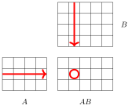

# 矩阵

**矩阵**（matrix）是一个数学概念，在程序设计中对应一个二维数组。例如，$$A =
 \begin{bmatrix}
  6 & 13 & 7 & 4 \\
  7 & 0 & 8 & 2 \\
  9 & 5 & 4 & 18 \\
 \end{bmatrix}$$ 是一个大小为 $3 \times 4$ 的矩阵，即有 3 行 4 列。记号 $[i,j]$ 表示矩阵中第 $i$ 行第 $j$ 列的元素。例如，在上面的矩阵中，$A[2,3]=8$ 且 $A[3,1]=9$。

矩阵的一个特例是**向量**（vector），它是一个大小为 $n \times 1$ 的一维矩阵。例如，$$V =
\begin{bmatrix}
4 \\
7 \\
5 \\
\end{bmatrix}$$ 是一个包含三个元素的向量。

矩阵 $A$ 的**转置**（transpose）$A^T$ 通过交换 $A$ 的行与列得到，即 $A^T[i,j]=A[j,i]$：$$A^T =
 \begin{bmatrix}
  6 & 7 & 9 \\
  13 & 0 & 5 \\
  7 & 8 & 4 \\
  4 & 2 & 18 \\
 \end{bmatrix}$$

若矩阵的行数与列数相同，则称其为**方阵**（square matrix）。例如，下面的矩阵是一个方阵：

$$S =
 \begin{bmatrix}
  3 & 12 & 4  \\
  5 & 9 & 15  \\
  0 & 2 & 4 \\
 \end{bmatrix}$$

## 运算

矩阵 $A$ 与 $B$ 的和 $A+B$ 在两者大小相同时才有定义。其结果是一个矩阵，其中每个元素等于 $A$ 与 $B$ 中对应元素之和。

例如，$$\begin{bmatrix}
  6 & 1 & 4 \\
  3 & 9 & 2 \\
 \end{bmatrix}
+
 \begin{bmatrix}
  4 & 9 & 3 \\
  8 & 1 & 3 \\
 \end{bmatrix}
=
 \begin{bmatrix}
  6+4 & 1+9 & 4+3 \\
  3+8 & 9+1 & 2+3 \\
 \end{bmatrix}
=
 \begin{bmatrix}
  10 & 10 & 7 \\
  11 & 10 & 5 \\
 \end{bmatrix}.$$

用数值 $x$ 乘以矩阵 $A$，意味着 $A$ 的每个元素都乘以 $x$。例如，$$2 \cdot \begin{bmatrix}
  6 & 1 & 4 \\
  3 & 9 & 2 \\
 \end{bmatrix}
=
 \begin{bmatrix}
  2 \cdot 6 & 2\cdot1 & 2\cdot4 \\
  2\cdot3 & 2\cdot9 & 2\cdot2 \\
 \end{bmatrix}
=
 \begin{bmatrix}
  12 & 2 & 8 \\
  6 & 18 & 4 \\
 \end{bmatrix}.$$

#### 矩阵乘法

矩阵 $A$ 与 $B$ 的乘积 $AB$ 在 $A$ 的大小为 $a \times n$ 且 $B$ 的大小为 $n \times b$ 时才有定义，即 $A$ 的宽度等于 $B$ 的高度。其结果是一个大小为 $a \times b$ 的矩阵，其中的元素按下面的公式计算：$$AB[i,j] = \sum_{k=1}^n A[i,k] \cdot B[k,j].$$

其含义是，$AB$ 的每个元素都是 $A$ 与 $B$ 中元素的乘积之和，如下图所示：

例如，

$$\begin{bmatrix}
  1 & 4 \\
  3 & 9 \\
  8 & 6 \\
 \end{bmatrix}
\cdot
 \begin{bmatrix}
  1 & 6 \\
  2 & 9 \\
 \end{bmatrix}
=
 \begin{bmatrix}
  1 \cdot 1 + 4 \cdot 2 & 1 \cdot 6 + 4 \cdot 9 \\
  3 \cdot 1 + 9 \cdot 2 & 3 \cdot 6 + 9 \cdot 9 \\
  8 \cdot 1 + 6 \cdot 2 & 8 \cdot 6 + 6 \cdot 9 \\
 \end{bmatrix}
=
 \begin{bmatrix}
  9 & 42 \\
  21 & 99 \\
  20 & 102 \\
 \end{bmatrix}.$$

矩阵乘法满足结合律，因此 $A(BC)=(AB)C$ 成立，但它不满足交换律，所以通常 $AB = BA$ 并不成立。

**单位矩阵**（identity matrix）是一个方阵，其中对角线上的每个元素都是 1，其余元素都是 0。例如，下面的矩阵是 $3 \times 3$ 单位矩阵：$$I = \begin{bmatrix}
  1 & 0 & 0 \\
  0 & 1 & 0 \\
  0 & 0 & 1 \\
 \end{bmatrix}$$

将一个矩阵乘以单位矩阵不会改变它。例如，$$\begin{bmatrix}
  1 & 0 & 0 \\
  0 & 1 & 0 \\
  0 & 0 & 1 \\
 \end{bmatrix}
\cdot
 \begin{bmatrix}
  1 & 4 \\
  3 & 9 \\
  8 & 6 \\
 \end{bmatrix}
=
 \begin{bmatrix}
  1 & 4 \\
  3 & 9 \\
  8 & 6 \\
 \end{bmatrix}  \textrm{and}
 \begin{bmatrix}
  1 & 4 \\
  3 & 9 \\
  8 & 6 \\
 \end{bmatrix}
\cdot
 \begin{bmatrix}
  1 & 0 \\
  0 & 1 \\
 \end{bmatrix}
=
 \begin{bmatrix}
  1 & 4 \\
  3 & 9 \\
  8 & 6 \\
 \end{bmatrix}.$$

使用朴素算法，我们可以在 $O(n^3)$ 时间内计算两个 $n \times n$ 矩阵的乘积。矩阵乘法还有更高效的算法[^1]，但它们多半只有理论意义，在算法竞赛中并不需要这类算法。

#### 矩阵幂

矩阵 $A$ 的幂 $A^k$ 在 $A$ 为方阵时才有定义。其定义基于矩阵乘法：$$A^k = \underbrace{A \cdot A \cdot A \cdots A}_{\textrm{$k$ times}}$$ 例如，

$$\begin{bmatrix}
  2 & 5 \\
  1 & 4 \\
 \end{bmatrix}^3 =
 \begin{bmatrix}
  2 & 5 \\
  1 & 4 \\
 \end{bmatrix} \cdot
 \begin{bmatrix}
  2 & 5 \\
  1 & 4 \\
 \end{bmatrix} \cdot
 \begin{bmatrix}
  2 & 5 \\
  1 & 4 \\
 \end{bmatrix} =
 \begin{bmatrix}
  48 & 165 \\
  33 & 114 \\
 \end{bmatrix}.$$ 此外，$A^0$ 是单位矩阵。例如，$$\begin{bmatrix}
  2 & 5 \\
  1 & 4 \\
 \end{bmatrix}^0 =
 \begin{bmatrix}
  1 & 0 \\
  0 & 1 \\
 \end{bmatrix}.$$

利用第 21.2 章的算法，可以在 $O(n^3 \log k)$ 时间内高效地计算矩阵 $A^k$。例如，$$\begin{bmatrix}
  2 & 5 \\
  1 & 4 \\
 \end{bmatrix}^8 =
 \begin{bmatrix}
  2 & 5 \\
  1 & 4 \\
 \end{bmatrix}^4 \cdot
 \begin{bmatrix}
  2 & 5 \\
  1 & 4 \\
 \end{bmatrix}^4.$$

#### 行列式

矩阵 $A$ 的**行列式**（determinant）$\det(A)$ 在 $A$ 为方阵时才有定义。若 $A$ 的大小为 $1 \times 1$，则 $\det(A)=A[1,1]$。更大矩阵的行列式用下面的公式递归计算：$$\det(A)=\sum_{j=1}^n A[1,j] C[1,j],$$ 其中 $C[i,j]$ 是 $A$ 在 $[i,j]$ 处的**代数余子式**（cofactor）。代数余子式用下面的公式计算：$$C[i,j] = (-1)^{i+j} \det(M[i,j]),$$ 其中 $M[i,j]$ 由从 $A$ 中去掉第 $i$ 行和第 $j$ 列得到。由于代数余子式中的系数 $(-1)^{i+j}$，各项行列式的符号正负交替。例如，$$\det(
 \begin{bmatrix}
  3 & 4 \\
  1 & 6 \\
 \end{bmatrix}
) = 3 \cdot 6 - 4 \cdot 1 = 14$$ 且 $$\det(
 \begin{bmatrix}
  2 & 4 & 3 \\
  5 & 1 & 6 \\
  7 & 2 & 4 \\
 \end{bmatrix}
) =
2 \cdot
\det(
 \begin{bmatrix}
  1 & 6 \\
  2 & 4 \\
 \end{bmatrix}
)
-4 \cdot
\det(
 \begin{bmatrix}
  5 & 6 \\
  7 & 4 \\
 \end{bmatrix}
)
+3 \cdot
\det(
 \begin{bmatrix}
  5 & 1 \\
  7 & 2 \\
 \end{bmatrix}
) = 81.$$

$A$ 的行列式告诉我们是否存在**逆矩阵**（inverse matrix）$A^{-1}$ 使得 $A \cdot A^{-1} = I$，其中 $I$ 是单位矩阵。事实上，$A^{-1}$ 恰在 $\det(A) \neq 0$ 时存在，并且可以用下面的公式计算：

$$A^{-1}[i,j] = \frac{C[j,i]}{det(A)}.$$

例如，

$$\underbrace{
 \begin{bmatrix}
  2 & 4 & 3\\
  5 & 1 & 6\\
  7 & 2 & 4\\
 \end{bmatrix}
}_{A}
\cdot
\underbrace{
 \frac{1}{81}
 \begin{bmatrix}
   -8 & -10 & 21 \\
   22 & -13 & 3 \\
   3 & 24 & -18 \\
 \end{bmatrix}
}_{A^{-1}}
=
\underbrace{
 \begin{bmatrix}
  1 & 0 & 0 \\
  0 & 1 & 0 \\
  0 & 0 & 1 \\
 \end{bmatrix}
}_{I}.$$

## 线性递推

**线性递推**（linear recurrence）是一个函数 $f(n)$，其初始值为 $f(0),f(1),\ldots,f(k-1)$，更大的值用下面的公式递归计算：$$f(n) = c_1 f(n-1) + c_2 f(n-2) + \ldots + c_k f (n-k),$$ 其中 $c_1,c_2,\ldots,c_k$ 为常数系数。

利用动态规划，可以通过依次计算 $f(0),f(1),\ldots,f(n)$ 的所有值，在 $O(kn)$ 时间内求出 $f(n)$ 的任意值。然而，若 $k$ 较小，则可以用矩阵运算在 $O(k^3 \log n)$ 时间内更高效地计算 $f(n)$。

#### 斐波那契数

线性递推的一个简单例子是下面这个定义斐波那契数的函数：$$\begin{array}{lcl}
f(0) & = & 0 \\
f(1) & = & 1 \\
f(n) & = & f(n-1)+f(n-2) \\
\end{array}$$ 此时 $k=2$ 且 $c_1=c_2=1$。

为了高效地计算斐波那契数，我们把斐波那契公式表示为一个 $2 \times 2$ 的方阵 $X$，使其满足：$$X \cdot
 \begin{bmatrix}
  f(i) \\
  f(i+1) \\
 \end{bmatrix}
=
 \begin{bmatrix}
  f(i+1) \\
  f(i+2) \\
 \end{bmatrix}$$ 于是 $f(i)$ 与 $f(i+1)$ 的值作为 $X$ 的“输入”，$X$ 据此计算出 $f(i+1)$ 与 $f(i+2)$ 的值。这样的矩阵是

$$X =
 \begin{bmatrix}
  0 & 1 \\
  1 & 1 \\
 \end{bmatrix}.$$

例如，$$\begin{bmatrix}
  0 & 1 \\
  1 & 1 \\
 \end{bmatrix}
\cdot
 \begin{bmatrix}
  f(5) \\
  f(6) \\
 \end{bmatrix}
=
 \begin{bmatrix}
  0 & 1 \\
  1 & 1 \\
 \end{bmatrix}
\cdot
 \begin{bmatrix}
  5 \\
  8 \\
 \end{bmatrix}
=
 \begin{bmatrix}
  8 \\
  13 \\
 \end{bmatrix}
=
 \begin{bmatrix}
  f(6) \\
  f(7) \\
 \end{bmatrix}.$$ 于是，我们可以用下面的公式计算 $f(n)$：$$\begin{bmatrix}
  f(n) \\
  f(n+1) \\
 \end{bmatrix}
=
X^n \cdot
 \begin{bmatrix}
  f(0) \\
  f(1) \\
 \end{bmatrix}
=
 \begin{bmatrix}
  0 & 1 \\
  1 & 1 \\
 \end{bmatrix}^n
\cdot
 \begin{bmatrix}
  0 \\
  1 \\
 \end{bmatrix}.$$ $X^n$ 的值可以在 $O(\log n)$ 时间内计算，因此 $f(n)$ 的值也可以在 $O(\log n)$ 时间内计算。

#### 一般情形

现在我们考虑一般情形，即 $f(n)$ 是任意线性递推。我们的目标依然是构造一个矩阵 $X$，使得

$$X \cdot
 \begin{bmatrix}
  f(i) \\
  f(i+1) \\
  \vdots \\
  f(i+k-1) \\
 \end{bmatrix}
=
 \begin{bmatrix}
  f(i+1) \\
  f(i+2) \\
  \vdots \\
  f(i+k) \\
 \end{bmatrix}.$$ 这样的矩阵是 $$X =
 \begin{bmatrix}
  0 & 1 & 0 & 0 & \cdots & 0 \\
  0 & 0 & 1 & 0 & \cdots & 0 \\
  0 & 0 & 0 & 1 & \cdots & 0 \\
  \vdots & \vdots & \vdots & \vdots & \ddots & \vdots \\
  0 & 0 & 0 & 0 & \cdots & 1 \\
  c_k & c_{k-1} & c_{k-2} & c_{k-3} & \cdots & c_1 \\
 \end{bmatrix}.$$ 在前 $k-1$ 行中，除一个元素为 1 外，其余元素都是 0。这些行把 $f(i)$ 替换为 $f(i+1)$，把 $f(i+1)$ 替换为 $f(i+2)$，依此类推。最后一行包含递推的系数，用来计算新值 $f(i+k)$。

现在，可以用下面的公式在 $O(k^3 \log n)$ 时间内计算 $f(n)$：$$\begin{bmatrix}
  f(n) \\
  f(n+1) \\
  \vdots \\
  f(n+k-1) \\
 \end{bmatrix}
=
X^n \cdot
 \begin{bmatrix}
  f(0) \\
  f(1) \\
  \vdots \\
  f(k-1) \\
 \end{bmatrix}.$$

## 图与矩阵

#### 路径计数

图的邻接矩阵的幂有一个有趣的性质。当 $V$ 是无权图的邻接矩阵时，矩阵 $V^n$ 包含图中结点之间长度为 $n$ 条边的路径数目。

例如，对于图

其邻接矩阵为 $$V= \begin{bmatrix}
  0 & 0 & 0 & 1 & 0 & 0 \\
  1 & 0 & 0 & 0 & 1 & 1 \\
  0 & 1 & 0 & 0 & 0 & 0 \\
  0 & 1 & 0 & 0 & 0 & 0 \\
  0 & 0 & 0 & 0 & 0 & 0 \\
  0 & 0 & 1 & 0 & 1 & 0 \\
 \end{bmatrix}.$$ 现在，例如矩阵 $$V^4= \begin{bmatrix}
  0 & 0 & 1 & 1 & 1 & 0 \\
  2 & 0 & 0 & 0 & 2 & 2 \\
  0 & 2 & 0 & 0 & 0 & 0 \\
  0 & 2 & 0 & 0 & 0 & 0 \\
  0 & 0 & 0 & 0 & 0 & 0 \\
  0 & 0 & 1 & 1 & 1 & 0 \\
 \end{bmatrix}$$ 包含结点之间长度为 4 条边的路径数目。例如，$V^4[2,5]=2$，因为从结点 2 到结点 5 有两条长度为 4 条边的路径：$2 \rightarrow 1 \rightarrow 4 \rightarrow 2 \rightarrow 5$ 和 $2 \rightarrow 6 \rightarrow 3 \rightarrow 2 \rightarrow 5$。

#### 最短路

在带权图中使用类似的想法，我们可以计算每对结点之间恰好包含 $n$ 条边的最短路径长度。为此，我们需要以一种新的方式定义矩阵乘法，使得我们不是计算路径数目，而是最小化路径长度。

作为例子，考虑下面的图：

我们构造一个邻接矩阵，其中 $\infty$ 表示边不存在，其他值对应边权。该矩阵为 $$V= \begin{bmatrix}
  \infty & \infty & \infty & 4 & \infty & \infty \\
  2 & \infty & \infty & \infty & 1 & 2 \\
  \infty & 4 & \infty & \infty & \infty & \infty \\
  \infty & 1 & \infty & \infty & \infty & \infty \\
  \infty & \infty & \infty & \infty & \infty & \infty \\
  \infty & \infty & 3 & \infty & 2 & \infty \\
 \end{bmatrix}.$$

现在，我们不用公式 $$AB[i,j] = \sum_{k=1}^n A[i,k] \cdot B[k,j]$$ 而是用公式 $$AB[i,j] = \min_{k=1}^n A[i,k] + B[k,j]$$ 来定义矩阵乘法，即我们求最小值而非求和，求元素之和而非求积。经过这样的修改后，矩阵的幂就对应图中的最短路径。

例如，由于 $$V^4= \begin{bmatrix}
  \infty & \infty & 10 & 11 & 9 & \infty \\
  9 & \infty & \infty & \infty & 8 & 9 \\
  \infty & 11 & \infty & \infty & \infty & \infty \\
  \infty & 8 & \infty & \infty & \infty & \infty \\
  \infty & \infty & \infty & \infty & \infty & \infty \\
  \infty & \infty & 12 & 13 & 11 & \infty \\
 \end{bmatrix},$$ 我们可以得出，从结点 2 到结点 5 长度为 4 条边的最短路径长度为 8。这样的一条路径是 $2 \rightarrow 1 \rightarrow 4 \rightarrow 2 \rightarrow 5$。

#### Kirchhoff 定理

**Kirchhoff 定理**给出了一种把图的生成树数目表示为某个特殊矩阵的行列式的方法。例如，图

有三棵生成树：

为了计算生成树的数目，我们构造一个**拉普拉斯矩阵**（Laplacean matrix）$L$，其中 $L[i,i]$ 是结点 $i$ 的度数，若结点 $i$ 与 $j$ 之间有边，则 $L[i,j]=-1$，否则 $L[i,j]=0$。上述图的拉普拉斯矩阵如下：$$L= \begin{bmatrix}
  3 & -1 & -1 & -1 \\
  -1 & 1 & 0 & 0 \\
  -1 & 0 & 2 & -1 \\
  -1 & 0 & -1 & 2 \\
 \end{bmatrix}$$

可以证明，生成树的数目等于从 $L$ 中去掉任意一行和任意一列后所得矩阵的行列式。例如，如果我们去掉第一行和第一列，结果为

$$\det(
\begin{bmatrix}
  1 & 0 & 0 \\
  0 & 2 & -1 \\
  0 & -1 & 2 \\
 \end{bmatrix}
) =3.$$ 无论我们从 $L$ 中去掉哪一行和哪一列，行列式总是相同的。

注意第 22.5 章的 Cayley 公式是 Kirchhoff 定理的一个特例，因为对于 $n$ 个结点的完全图，

$$\det(
\begin{bmatrix}
  n-1 & -1 & \cdots & -1 \\
  -1 & n-1 & \cdots & -1 \\
  \vdots & \vdots & \ddots & \vdots \\
  -1 & -1 & \cdots & n-1 \\
 \end{bmatrix}
) =n^{n-2}.$$

[^1]: 第一个这样的算法是 Strassen 算法，发表于 1969 年 [71]，其时间复杂度为 $O(n^{2.80735})$；目前最好的算法 [30] 的时间复杂度为 $O(n^{2.37286})$。
