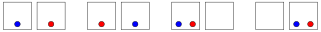
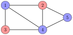

# 概率

**概率**是一个介于 $0$ 与 $1$ 之间的实数，用来表示某个事件发生的可能性。如果某个事件必然发生，它的概率是 1；如果某个事件不可能发生，它的概率是 0。事件发生的概率记为 $P(\cdots)$，其中三个点描述该事件。

例如，掷一枚骰子时，结果是 $1$ 到 $6$ 之间的整数，每种结果的概率都是 $1/6$。例如，我们可以计算以下概率：

- $P(\textrm{''the outcome is 4''})=1/6$

- $P(\textrm{''the outcome is not 6''})=5/6$

- $P(\textrm{''the outcome is even''})=1/2$

## 计算

要计算某个事件的概率，我们可以使用组合计数，也可以模拟生成该事件的过程。作为一个例子，让我们计算从一副洗好的牌中抽出三张同点数牌（例如 $\spadesuit 8$、$\clubsuit 8$ 和 $\diamondsuit 8$）的概率。

#### 方法 1

我们可以用下面的公式来计算概率

$$\frac{\textrm{number of desired outcomes}}{\textrm{total number of outcomes}}.$$

在这个问题中，期望的结果是每张牌的点数都相同的那些结果。这样的结果有 $13 {4 \choose 3}$ 种，因为牌的点数有 $13$ 种可能，而从 $4$ 种花色中选出 $3$ 种的方式有 ${4 \choose 3}$ 种。

总共有 ${52 \choose 3}$ 种结果，因为我们是从 52 张牌中选出 3 张。因此，该事件的概率是

$$\frac{13 {4 \choose 3}}{{52 \choose 3}} = \frac{1}{425}.$$

#### 方法 2

计算概率的另一种方式是模拟生成该事件的过程。在这个例子中，我们抽出三张牌，所以该过程由三步组成。我们要求过程中的每一步都成功。

抽第一张牌必定成功，因为没有限制。第二步成功的概率是 $3/51$，因为还剩 51 张牌，其中 3 张与第一张牌点数相同。类似地，第三步成功的概率是 $2/50$。

整个过程成功的概率是

$$1 \cdot \frac{3}{51} \cdot \frac{2}{50} = \frac{1}{425}.$$

## 事件

概率论中的事件可以表示为一个集合 $$A \subset X,$$ 其中 $X$ 包含所有可能的结果，而 $A$ 是结果的一个子集。例如，掷骰子时，结果是 $$X = \{1,2,3,4,5,6\}.$$ 那么，例如事件「结果是偶数」对应于集合 $$A = \{2,4,6\}.$$

每个结果 $x$ 被赋予一个概率 $p(x)$。那么，事件 $A$ 的概率 $P(A)$ 可以用公式表示为各结果概率之和 $$P(A) = \sum_{x \in A} p(x).$$ 例如，掷骰子时，每个结果 $x$ 都有 $p(x)=1/6$，所以事件「结果是偶数」的概率是 $$p(2)+p(4)+p(6)=1/2.$$

$X$ 中所有结果的概率之和必须为 1，即 $P(X)=1$。

由于概率论中的事件是集合，我们可以用标准的集合运算来操作它们：

- **补集** $\bar A$ 表示「$A$ 不发生」。例如，掷骰子时，$A=\{2,4,6\}$ 的补集是 $\bar A = \{1,3,5\}$。

- **并集** $A \cup B$ 表示「$A$ 或 $B$ 发生」。例如，$A=\{2,5\}$ 与 $B=\{4,5,6\}$ 的并集是 $A \cup B = \{2,4,5,6\}$。

- **交集** $A \cap B$ 表示「$A$ 与 $B$ 都发生」。例如，$A=\{2,5\}$ 与 $B=\{4,5,6\}$ 的交集是 $A \cap B = \{5\}$。

#### 补集

补集 $\bar A$ 的概率用下面的公式计算 $$P(\bar A)=1-P(A).$$

有时，我们可以通过求解相反的问题，从而轻松地利用补集解决一个题目。例如，掷骰子十次至少出现一次六点的概率是 $$1-(5/6)^{10}.$$

这里 $5/6$ 是单次投掷结果不是六点的概率，而 $(5/6)^{10}$ 是十次投掷都不是六点的概率。它的补集就是该题目的答案。

#### 并集

并集 $A \cup B$ 的概率用下面的公式计算 $$P(A \cup B)=P(A)+P(B)-P(A \cap B).$$ 例如，掷骰子时，事件 $$A=\textrm{''the outcome is even''}$$ 与 $$B=\textrm{''the outcome is less than 4''}$$ 的并集是 $$A \cup B=\textrm{''the outcome is even or less than 4''},$$ 其概率为 $$P(A \cup B) = P(A)+P(B)-P(A \cap B)=1/2+1/2-1/6=5/6.$$

如果事件 $A$ 与 $B$ 是**互斥的**，即 $A \cap B$ 为空，那么事件 $A \cup B$ 的概率就直接是

$$P(A \cup B)=P(A)+P(B).$$

#### 条件概率

**条件概率** $$P(A | B) = \frac{P(A \cap B)}{P(B)}$$ 是在假定 $B$ 发生的情况下 $A$ 的概率。因此，在计算 $A$ 的概率时，我们只考虑那些同时也属于 $B$ 的结果。

沿用前面的集合，$$P(A | B)= 1/3,$$ 因为 $B$ 的结果是 $\{1,2,3\}$，其中有一个是偶数。这就是在我们已知结果介于 $1 \ldots 3$ 之间时结果为偶数的概率。

#### 交集

利用条件概率，交集 $A \cap B$ 的概率可以用公式 $$P(A \cap B)=P(A)P(B|A)$$ 计算。如果 $$P(A|B)=P(A) \textrm{and} P(B|A)=P(B),$$ 则事件 $A$ 与 $B$ **独立**，这意味着 $B$ 发生这一事实不会改变 $A$ 的概率，反之亦然。在这种情况下，交集的概率是 $$P(A \cap B)=P(A)P(B).$$ 例如，从一副牌中抽一张牌时，事件 $$A = \textrm{''the suit is clubs''}$$ 与 $$B = \textrm{''the value is four''}$$ 是独立的。因此事件 $$A \cap B = \textrm{''the card is the four of clubs''}$$ 发生的概率是 $$P(A \cap B)=P(A)P(B)=1/4 \cdot 1/13 = 1/52.$$

## 随机变量

**随机变量**是由随机过程生成的一个值。例如，掷两枚骰子时，一个可能的随机变量是 $$X=\textrm{''the sum of the outcomes''}.$$ 例如，如果结果是 $[4,6]$（意味着我们先掷出四再掷出六），那么 $X$ 的值是 10。

我们用 $P(X=x)$ 表示随机变量 $X$ 的值为 $x$ 的概率。例如，掷两枚骰子时，$P(X=10)=3/36$，因为总共有 36 种结果，而有三种方式可以得到和为 10：$[4,6]$、$[5,5]$ 和 $[6,4]$。

#### 期望

**期望** $E[X]$ 表示随机变量 $X$ 的平均值。期望可以按求和式计算 $$\sum_x P(X=x)x,$$ 其中 $x$ 取遍 $X$ 的所有可能值。

例如，掷一枚骰子时，期望结果是 $$1/6 \cdot 1 + 1/6 \cdot 2 + 1/6 \cdot 3 + 1/6 \cdot 4 + 1/6 \cdot 5 + 1/6 \cdot 6 = 7/2.$$

期望的一个有用性质是**线性性**。它意味着和 $E[X_1+X_2+\cdots+X_n]$ 总是等于 $E[X_1]+E[X_2]+\cdots+E[X_n]$。即使随机变量之间相互依赖，这个公式也成立。

例如，掷两枚骰子时，期望值之和是 $$E[X_1+X_2]=E[X_1]+E[X_2]=7/2+7/2=7.$$

现在让我们考虑这样一个问题：$n$ 个球被随机放入 $n$ 个盒子中，我们的任务是计算空盒子的期望数量。每个球被放入任意盒子的概率相同。例如，如果 $n=2$，各种可能情况如下：

在这种情况下，空盒子的期望数量是 $$\frac{0+0+1+1}{4} = \frac{1}{2}.$$ 在一般情形下，某个盒子为空的概率是 $$\Big(\frac{n-1}{n}\Big)^n,$$ 因为不应有任何球被放入其中。因此，利用线性性，空盒子的期望数量是 $$n \cdot \Big(\frac{n-1}{n}\Big)^n.$$

#### 分布

随机变量 $X$ 的**分布**显示了 $X$ 可能取的每个值的概率。分布由各值 $P(X=x)$ 组成。例如，掷两枚骰子时，它们之和的分布是：

|  |  |  |  |  |  |  |  |  |  |  |  |  |  |
|---:|---:|---:|---:|---:|---:|---:|---:|---:|---:|---:|---:|---:|---:|
| $x$ | 2 | 3 | 4 | 5 | 6 | 7 | 8 | 9 | 10 | 11 | 12 |  |  |
| $P(X=x)$ | $1/36$ | $2/36$ | $3/36$ | $4/36$ | $5/36$ | $6/36$ | $5/36$ | $4/36$ | $3/36$ | $2/36$ | $1/36$ |  |  |

在**均匀分布**中，随机变量 $X$ 有 $n$ 个可能值 $a,a+1,\ldots,b$，每个值的概率都是 $1/n$。例如，掷骰子时，$a=1$、$b=6$，且对每个值 $x$ 都有 $P(X=x)=1/6$。

均匀分布中 $X$ 的期望是 $$E[X] = \frac{a+b}{2}.$$

在**二项分布**中，进行了 $n$ 次尝试，单次尝试成功的概率是 $p$。随机变量 $X$ 统计成功尝试的次数，值 $x$ 的概率是 $$P(X=x)=p^x (1-p)^{n-x} {n \choose x},$$ 其中 $p^x$ 与 $(1-p)^{n-x}$ 分别对应成功与不成功的尝试，而 ${n \choose x}$ 是我们选择尝试顺序的方式数。

例如，掷骰子十次时，恰好掷出三次六点的概率是 $(1/6)^3 (5/6)^7 {10 \choose 3}$。

二项分布中 $X$ 的期望是 $$E[X] = pn.$$

在**几何分布**中，单次尝试成功的概率是 $p$，我们持续尝试直到第一次成功发生。随机变量 $X$ 统计所需的尝试次数，值 $x$ 的概率是 $$P(X=x)=(1-p)^{x-1} p,$$ 其中 $(1-p)^{x-1}$ 对应不成功的尝试，而 $p$ 对应第一次成功的尝试。

例如，如果我们掷骰子直到掷出六点，那么投掷次数恰好为 4 的概率是 $(5/6)^3 1/6$。

几何分布中 $X$ 的期望是 $$E[X]=\frac{1}{p}.$$

## 马尔可夫链

**马尔可夫链**是由状态以及状态之间的转移构成的随机过程。对于每个状态，我们已知转移到其他状态的概率。马尔可夫链可以表示为一个图，其结点是状态，边是转移。

作为一个例子，考虑这样一个问题：我们身处一栋 $n$ 层楼房的第 1 层。每一步，我们随机地向上走一层或向下走一层，唯一的例外是在第 1 层时我们总是向上走一层，在第 $n$ 层时我们总是向下走一层。经过 $k$ 步后位于第 $m$ 层的概率是多少？

在这个问题中，楼房的每一层对应马尔可夫链中的一个状态。例如，如果 $n=5$，图如下：

马尔可夫链的概率分布是一个向量 $[p_1,p_2,\ldots,p_n]$，其中 $p_k$ 是当前状态为 $k$ 的概率。公式 $p_1+p_2+\cdots+p_n=1$ 始终成立。

在上述情形中，初始分布是 $[1,0,0,0,0]$，因为我们总是从第 1 层开始。下一个分布是 $[0,1,0,0,0]$，因为我们只能从第 1 层移动到第 2 层。此后，我们既可以向上走一层，也可以向下走一层，所以下一个分布是 $[1/2,0,1/2,0,0]$，依此类推。

模拟马尔可夫链上游走的一种高效方式是使用动态规划。其思路是维护概率分布，并在每一步遍历所有可能的移动方式。使用这种方法，我们可以在 $O(n^2 m)$ 时间内模拟 $m$ 步的游走。

马尔可夫链的转移也可以表示为一个更新概率分布的矩阵。在上述情形中，矩阵是

$$\begin{bmatrix}
  0 & 1/2 & 0 & 0 & 0 \\
  1 & 0 & 1/2 & 0 & 0 \\
  0 & 1/2 & 0 & 1/2 & 0 \\
  0 & 0 & 1/2 & 0 & 1 \\
  0 & 0 & 0 & 1/2 & 0 \\
 \end{bmatrix}.$$

当我们把一个概率分布乘以这个矩阵时，就得到移动一步之后的新分布。例如，我们可以按如下方式从分布 $[1,0,0,0,0]$ 移动到分布 $[0,1,0,0,0]$：

$$\begin{bmatrix}
  0 & 1/2 & 0 & 0 & 0 \\
  1 & 0 & 1/2 & 0 & 0 \\
  0 & 1/2 & 0 & 1/2 & 0 \\
  0 & 0 & 1/2 & 0 & 1 \\
  0 & 0 & 0 & 1/2 & 0 \\
 \end{bmatrix}
 \begin{bmatrix}
  1 \\
  0 \\
  0 \\
  0 \\
  0 \\
 \end{bmatrix}
=
 \begin{bmatrix}
  0 \\
  1 \\
  0 \\
  0 \\
  0 \\
 \end{bmatrix}.$$

通过高效地计算矩阵的幂，我们可以在 $O(n^3 \log m)$ 时间内计算出 $m$ 步之后的分布。

## 随机化算法

有时我们可以利用随机性来求解一个题目，即使该题目与概率无关。**随机化算法**是一种基于随机性的算法。

**蒙特卡洛算法**是一种有时可能给出错误答案的随机化算法。要使这类算法有用，给出错误答案的概率应当很小。

**拉斯维加斯算法**是一种总是给出正确答案、但运行时间随机变化的随机化算法。其目标是设计一个以高概率保持高效的算法。

接下来我们将介绍三个可以用随机性求解的示例题目。

#### 顺序统计量

数组的第 $kth$ 个**顺序统计量**是将数组按递增顺序排序后位于第 $k$ 个位置的元素。先对数组排序，就可以在 $O(n \log n)$ 时间内轻松计算出任意顺序统计量，但仅仅为了找出一个元素，真的需要对整个数组排序吗？

事实证明，我们可以在不排序数组的情况下使用随机化算法来找出顺序统计量。这个称为**快速选择**（quickselect）[^1] 的算法是一种拉斯维加斯算法：它的运行时间通常是 $O(n)$，但在最坏情况下是 $O(n^2)$。

该算法随机选择数组中的一个元素 $x$，并把小于 $x$ 的元素移到数组的左半部分，其他所有元素移到右半部分。当有 $n$ 个元素时，这需要 $O(n)$ 时间。假设左半部分包含 $a$ 个元素，右半部分包含 $b$ 个元素。如果 $a=k$，那么元素 $x$ 就是第 $k$ 个顺序统计量。否则，如果 $a>k$，我们就递归地在左半部分寻找第 $k$ 个顺序统计量；如果 $a<k$，我们就递归地在右半部分寻找第 $r$ 个顺序统计量，其中 $r=k-a$。搜索以类似的方式继续，直到找到该元素。

当每个元素 $x$ 都是随机选择的时候，数组的规模在每一步大约减半，所以寻找第 $k$ 个顺序统计量的时间复杂度大约是 $$n+n/2+n/4+n/8+\cdots < 2n = O(n).$$

该算法的最坏情况仍然需要 $O(n^2)$ 时间，因为有可能 $x$ 总是被选为数组中最小或最大的元素之一，从而需要 $O(n)$ 步。然而，这种情况的概率非常小，在实践中永远不会发生。

#### 验证矩阵乘法

我们的下一个题目是*验证*当 $A$、$B$ 和 $C$ 都是大小为 $n \times n$ 的矩阵时，$AB=C$ 是否成立。当然，我们可以通过重新计算乘积 $AB$（使用基本算法需要 $O(n^3)$ 时间）来解决该题目，但人们或许期望验证答案会比从头计算它更容易。

事实证明，我们可以用一个时间复杂度仅为 $O(n^2)$ 的蒙特卡洛算法[^2]来解决该题目。思路很简单：我们随机选择一个由 $n$ 个元素组成的向量 $X$，并计算矩阵 $ABX$ 与 $CX$。如果 $ABX=CX$，我们就报告 $AB=C$，否则报告 $AB \neq C$。

该算法的时间复杂度是 $O(n^2)$，因为我们可以在 $O(n^2)$ 时间内计算矩阵 $ABX$ 与 $CX$。我们可以利用表示 $A(BX)$ 来高效地计算矩阵 $ABX$，因此只需要两次 $n \times n$ 与 $n \times 1$ 大小矩阵的乘法。

该算法的缺点是，当它报告 $AB=C$ 时，存在很小的概率会出错。例如，$$\begin{bmatrix}
  6 & 8 \\
  1 & 3 \\
 \end{bmatrix}
\neq
 \begin{bmatrix}
  8 & 7 \\
  3 & 2 \\
 \end{bmatrix},$$ 但是 $$\begin{bmatrix}
  6 & 8 \\
  1 & 3 \\
 \end{bmatrix}
 \begin{bmatrix}
  3 \\
  6 \\
 \end{bmatrix}
=
 \begin{bmatrix}
  8 & 7 \\
  3 & 2 \\
 \end{bmatrix}
 \begin{bmatrix}
  3 \\
  6 \\
 \end{bmatrix}.$$ 然而在实践中，该算法出错的概率很小，我们可以在报告 $AB=C$ 之前用多个随机向量 $X$ 验证结果来降低该概率。

#### 图的染色

给定一个包含 $n$ 个结点和 $m$ 条边的图，我们的任务是找到一种用两种颜色给图的结点染色的方式，使得至少有 $m/2$ 条边的两个端点颜色不同。例如，在下图中

一种合法的染色如下：

上图包含 7 条边，其中 5 条边的两个端点颜色不同，因此该染色是合法的。

该题目可以用一个拉斯维加斯算法求解，即不断生成随机染色，直到找到一种合法染色为止。在随机染色中，每个结点的颜色独立选取，两种颜色的概率都是 $1/2$。

在随机染色中，单条边的两个端点颜色不同的概率是 $1/2$。因此，两个端点颜色不同的边的期望数量是 $m/2$。由于随机染色在期望意义上是合法的，我们在实践中会很快找到一种合法染色。

[^1]: 1961 年，C. A. R. Hoare 发表了两篇平均情况下高效的算法：用于数组排序的**快速排序**（quicksort）[36] 和用于寻找顺序统计量的**快速选择**（quickselect）[37]。

[^2]: R. M. Freivalds 于 1977 年发表了这个算法 [26]，它有时被称为**Freivalds 算法**。
