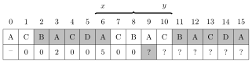

# String algorithms

This chapter deals with efficient algorithms for string processing. Many string problems can be easily solved in $O(n^2)$ time, but the challenge is to find algorithms that work in $O(n)$ or $O(n \log n)$ time.

For example, a fundamental string processing problem is the **pattern matching** problem: given a string of length $n$ and a pattern of length $m$, our task is to find the occurrences of the pattern in the string. For example, the pattern `ABC` occurs two times in the string `ABABCBABC`.

The pattern matching problem can be easily solved in $O(nm)$ time by a brute force algorithm that tests all positions where the pattern may occur in the string. However, in this chapter, we will see that there are more efficient algorithms that require only $O(n+m)$ time.

## String terminology

Throughout the chapter, we assume that zero-based indexing is used in strings. Thus, a string `s` of length $n$ consists of characters $\texttt{s}[0],\texttt{s}[1],\ldots,\texttt{s}[n-1]$. The set of characters that may appear in strings is called an **alphabet**. For example, the alphabet $\{\texttt{A},\texttt{B},\ldots,\texttt{Z}\}$ consists of the capital letters of English.

A **substring** is a sequence of consecutive characters in a string. We use the notation $\texttt{s}[a \ldots b]$ to refer to a substring of `s` that begins at position $a$ and ends at position $b$. A string of length $n$ has $n(n+1)/2$ substrings. For example, the substrings of `ABCD` are `A`, `B`, `C`, `D`, `AB`, `BC`, `CD`, `ABC`, `BCD` and `ABCD`.

A **subsequence** is a sequence of (not necessarily consecutive) characters in a string in their original order. A string of length $n$ has $2^n-1$ subsequences. For example, the subsequences of `ABCD` are `A`, `B`, `C`, `D`, `AB`, `AC`, `AD`, `BC`, `BD`, `CD`, `ABC`, `ABD`, `ACD`, `BCD` and `ABCD`.

A **prefix** is a substring that starts at the beginning of a string, and a **suffix** is a substring that ends at the end of a string. For example, the prefixes of `ABCD` are `A`, `AB`, `ABC` and `ABCD`, and the suffixes of `ABCD` are `D`, `CD`, `BCD` and `ABCD`.

A **rotation** can be generated by moving the characters of a string one by one from the beginning to the end (or vice versa). For example, the rotations of `ABCD` are `ABCD`, `BCDA`, `CDAB` and `DABC`.

A **period** is a prefix of a string such that the string can be constructed by repeating the period. The last repetition may be partial and contain only a prefix of the period. For example, the shortest period of `ABCABCA` is `ABC`.

A **border** is a string that is both a prefix and a suffix of a string. For example, the borders of `ABACABA` are `A`, `ABA` and `ABACABA`.

Strings are compared using the **lexicographical order** (which corresponds to the alphabetical order). It means that $x<y$ if either $x \neq y$ and $x$ is a prefix of $y$, or there is a position $k$ such that $x[i]=y[i]$ when $i<k$ and $x[k]<y[k]$.

## Trie structure

A **trie** is a rooted tree that maintains a set of strings. Each string in the set is stored as a chain of characters that starts at the root. If two strings have a common prefix, they also have a common chain in the tree.

For example, consider the following trie:


This trie corresponds to the set $\{\texttt{CANAL},\texttt{CANDY},\texttt{THE},\texttt{THERE}\}$. The character \* in a node means that a string in the set ends at the node. Such a character is needed, because a string may be a prefix of another string. For example, in the above trie, `THE` is a prefix of `THERE`.

We can check in $O(n)$ time whether a trie contains a string of length $n$, because we can follow the chain that starts at the root node. We can also add a string of length $n$ to the trie in $O(n)$ time by first following the chain and then adding new nodes to the trie if necessary.

Using a trie, we can find the longest prefix of a given string such that the prefix belongs to the set. Moreover, by storing additional information in each node, we can calculate the number of strings that belong to the set and have a given string as a prefix.

A trie can be stored in an array

```cpp
int trie[N][A];
```

where $N$ is the maximum number of nodes (the maximum total length of the strings in the set) and $A$ is the size of the alphabet. The nodes of a trie are numbered $0,1,2,\ldots$ so that the number of the root is 0, and $\texttt{trie}[s][c]$ is the next node in the chain when we move from node $s$ using character $c$.

## String hashing

**String hashing** is a technique that allows us to efficiently check whether two strings are equal[^1]. The idea in string hashing is to compare hash values of strings instead of their individual characters.

#### Calculating hash values

A **hash value** of a string is a number that is calculated from the characters of the string. If two strings are the same, their hash values are also the same, which makes it possible to compare strings based on their hash values.

A usual way to implement string hashing is **polynomial hashing**, which means that the hash value of a string `s` of length $n$ is $$(\texttt{s}[0] A^{n-1} + \texttt{s}[1] A^{n-2} + \cdots + \texttt{s}[n-1] A^0) \bmod B  ,$$ where $s[0],s[1],\ldots,s[n-1]$ are interpreted as the codes of the characters of `s`, and $A$ and $B$ are pre-chosen constants.

For example, the codes of the characters of `ALLEY` are:


Thus, if $A=3$ and $B=97$, the hash value of `ALLEY` is $$(65 \cdot 3^4 + 76 \cdot 3^3 + 76 \cdot 3^2 + 69 \cdot 3^1 + 89 \cdot 3^0) \bmod 97 = 52.$$

#### Preprocessing

Using polynomial hashing, we can calculate the hash value of any substring of a string `s` in $O(1)$ time after an $O(n)$ time preprocessing. The idea is to construct an array `h` such that $\texttt{h}[k]$ contains the hash value of the prefix $\texttt{s}[0 \ldots k]$. The array values can be recursively calculated as follows: $$\begin{array}{lcl}
\texttt{h}[0] & = & \texttt{s}[0] \\
\texttt{h}[k] & = & (\texttt{h}[k-1] A + \texttt{s}[k]) \bmod B \\
\end{array}$$ In addition, we construct an array $\texttt{p}$ where $\texttt{p}[k]=A^k \bmod B$: $$\begin{array}{lcl}
\texttt{p}[0] & = & 1 \\
\texttt{p}[k] & = & (\texttt{p}[k-1] A) \bmod B. \\
\end{array}$$ Constructing these arrays takes $O(n)$ time. After this, the hash value of any substring $\texttt{s}[a \ldots b]$ can be calculated in $O(1)$ time using the formula $$(\texttt{h}[b]-\texttt{h}[a-1] \texttt{p}[b-a+1]) \bmod B$$ assuming that $a>0$. If $a=0$, the hash value is simply $\texttt{h}[b]$.

#### Using hash values

We can efficiently compare strings using hash values. Instead of comparing the individual characters of the strings, the idea is to compare their hash values. If the hash values are equal, the strings are *probably* equal, and if the hash values are different, the strings are *certainly* different.

Using hashing, we can often make a brute force algorithm efficient. As an example, consider the pattern matching problem: given a string $s$ and a pattern $p$, find the positions where $p$ occurs in $s$. A brute force algorithm goes through all positions where $p$ may occur and compares the strings character by character. The time complexity of such an algorithm is $O(n^2)$.

We can make the brute force algorithm more efficient by using hashing, because the algorithm compares substrings of strings. Using hashing, each comparison only takes $O(1)$ time, because only hash values of substrings are compared. This results in an algorithm with time complexity $O(n)$, which is the best possible time complexity for this problem.

By combining hashing and *binary search*, it is also possible to find out the lexicographic order of two strings in logarithmic time. This can be done by calculating the length of the common prefix of the strings using binary search. Once we know the length of the common prefix, we can just check the next character after the prefix, because this determines the order of the strings.

#### Collisions and parameters

An evident risk when comparing hash values is a **collision**, which means that two strings have different contents but equal hash values. In this case, an algorithm that relies on the hash values concludes that the strings are equal, but in reality they are not, and the algorithm may give incorrect results.

Collisions are always possible, because the number of different strings is larger than the number of different hash values. However, the probability of a collision is small if the constants $A$ and $B$ are carefully chosen. A usual way is to choose random constants near $10^9$, for example as follows: $$\begin{array}{lcl}
A & = & 911382323 \\
B & = & 972663749 \\
\end{array}$$

Using such constants, the `long long` type can be used when calculating hash values, because the products $AB$ and $BB$ will fit in `long long`. But is it enough to have about $10^9$ different hash values?

Let us consider three scenarios where hashing can be used:

*Scenario 1:* Strings $x$ and $y$ are compared with each other. The probability of a collision is $1/B$ assuming that all hash values are equally probable.

*Scenario 2:* A string $x$ is compared with strings $y_1,y_2,\ldots,y_n$. The probability of one or more collisions is

$$1-(1-\frac{1}{B})^n.$$

*Scenario 3:* All pairs of strings $x_1,x_2,\ldots,x_n$ are compared with each other. The probability of one or more collisions is $$1 - \frac{B \cdot (B-1) \cdot (B-2) \cdots (B-n+1)}{B^n}.$$

The following table shows the collision probabilities when $n=10^6$ and the value of $B$ varies:

| constant $B$ | scenario 1 | scenario 2 | scenario 3 |
|-------------:|-----------:|-----------:|-----------:|
|       $10^3$ | $0.001000$ | $1.000000$ | $1.000000$ |
|       $10^6$ | $0.000001$ | $0.632121$ | $1.000000$ |
|       $10^9$ | $0.000000$ | $0.001000$ | $1.000000$ |
|    $10^{12}$ | $0.000000$ | $0.000000$ | $0.393469$ |
|    $10^{15}$ | $0.000000$ | $0.000000$ | $0.000500$ |
|    $10^{18}$ | $0.000000$ | $0.000000$ | $0.000001$ |

The table shows that in scenario 1, the probability of a collision is negligible when $B \approx 10^9$. In scenario 2, a collision is possible but the probability is still quite small. However, in scenario 3 the situation is very different: a collision will almost always happen when $B \approx 10^9$.

The phenomenon in scenario 3 is known as the **birthday paradox**: if there are $n$ people in a room, the probability that *some* two people have the same birthday is large even if $n$ is quite small. In hashing, correspondingly, when all hash values are compared with each other, the probability that some two hash values are equal is large.

We can make the probability of a collision smaller by calculating *multiple* hash values using different parameters. It is unlikely that a collision would occur in all hash values at the same time. For example, two hash values with parameter $B \approx 10^9$ correspond to one hash value with parameter $B \approx 10^{18}$, which makes the probability of a collision very small.

Some people use constants $B=2^{32}$ and $B=2^{64}$, which is convenient, because operations with 32 and 64 bit integers are calculated modulo $2^{32}$ and $2^{64}$. However, this is *not* a good choice, because it is possible to construct inputs that always generate collisions when constants of the form $2^x$ are used [57].

## Z-algorithm

The **Z-array** `z` of a string `s` of length $n$ contains for each $k=0,1,\ldots,n-1$ the length of the longest substring of `s` that begins at position $k$ and is a prefix of `s`. Thus, $\texttt{z}[k]=p$ tells us that $\texttt{s}[0 \ldots p-1]$ equals $\texttt{s}[k \ldots k+p-1]$. Many string processing problems can be efficiently solved using the Z-array.

For example, the Z-array of `ACBACDACBACBACDA` is as follows:


In this case, for example, $\texttt{z}[6]=5$, because the substring `ACBAC` of length 5 is a prefix of `s`, but the substring `ACBACB` of length 6 is not a prefix of `s`.

#### Algorithm description

Next we describe an algorithm, called the **Z-algorithm**[^2], that efficiently constructs the Z-array in $O(n)$ time. The algorithm calculates the Z-array values from left to right by both using information already stored in the Z-array and comparing substrings character by character.

To efficiently calculate the Z-array values, the algorithm maintains a range $[x,y]$ such that $\texttt{s}[x \ldots y]$ is a prefix of `s` and $y$ is as large as possible. Since we know that $\texttt{s}[0 \ldots y-x]$ and $\texttt{s}[x \ldots y]$ are equal, we can use this information when calculating Z-values for positions $x+1,x+2,\ldots,y$.

At each position $k$, we first check the value of $\texttt{z}[k-x]$. If $k+\texttt{z}[k-x]<y$, we know that $\texttt{z}[k]=\texttt{z}[k-x]$. However, if $k+\texttt{z}[k-x] \ge y$, $\texttt{s}[0 \ldots y-k]$ equals $\texttt{s}[k \ldots y]$, and to determine the value of $\texttt{z}[k]$ we need to compare the substrings character by character. Still, the algorithm works in $O(n)$ time, because we start comparing at positions $y-k+1$ and $y+1$.

For example, let us construct the following Z-array:


After calculating the value $\texttt{z}[6]=5$, the current $[x,y]$ range is $[6,10]$:


Now we can calculate subsequent Z-array values efficiently, because we know that $\texttt{s}[0 \ldots 4]$ and $\texttt{s}[6 \ldots 10]$ are equal. First, since $\texttt{z}[1] = \texttt{z}[2] = 0$, we immediately know that also $\texttt{z}[7] = \texttt{z}[8] = 0$:


Then, since $\texttt{z}[3]=2$, we know that $\texttt{z}[9] \ge 2$:


However, we have no information about the string after position 10, so we need to compare the substrings character by character:



It turns out that $\texttt{z}[9]=7$, so the new $[x,y]$ range is $[9,15]$:


After this, all the remaining Z-array values can be determined by using the information already stored in the Z-array:


#### Using the Z-array

It is often a matter of taste whether to use string hashing or the Z-algorithm. Unlike hashing, the Z-algorithm always works and there is no risk for collisions. On the other hand, the Z-algorithm is more difficult to implement and some problems can only be solved using hashing.

As an example, consider again the pattern matching problem, where our task is to find the occurrences of a pattern $p$ in a string $s$. We already solved this problem efficiently using string hashing, but the Z-algorithm provides another way to solve the problem.

A usual idea in string processing is to construct a string that consists of multiple strings separated by special characters. In this problem, we can construct a string $p$`#`$s$, where $p$ and $s$ are separated by a special character `#` that does not occur in the strings. The Z-array of $p$`#`$s$ tells us the positions where $p$ occurs in $s$, because such positions contain the length of $p$.

For example, if $s=$`HATTIVATTI` and $p=$`ATT`, the Z-array is as follows:


The positions 5 and 10 contain the value 3, which means that the pattern `ATT` occurs in the corresponding positions of `HATTIVATTI`.

The time complexity of the resulting algorithm is linear, because it suffices to construct the Z-array and go through its values.

#### Implementation

Here is a short implementation of the Z-algorithm that returns a vector that corresponds to the Z-array.

```cpp
vector<int> z(string s) {
    int n = s.size();
    vector<int> z(n);
    int x = 0, y = 0;
    for (int i = 1; i < n; i++) {
        z[i] = max(0,min(z[i-x],y-i+1));
        while (i+z[i] < n && s[z[i]] == s[i+z[i]]) {
            x = i; y = i+z[i]; z[i]++;
        }
    }
    return z;
}
```

[^1]: The technique was popularized by the Karp--Rabin pattern matching algorithm [46].

[^2]: The Z-algorithm was presented in [35] as the simplest known method for linear-time pattern matching, and the original idea was attributed to [55].
