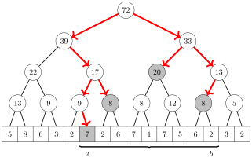
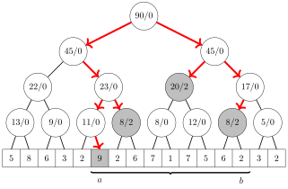
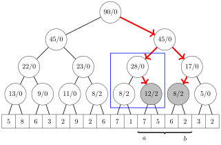

# 再探线段树

线段树是一种用途广泛的数据结构，可以用来解决大量的算法问题。然而，与线段树相关的许多主题我们尚未涉及。现在是时候讨论一些更高级的线段树变体了。

到目前为止，我们都是通过在线段树中*自底向上*地行走来实现线段树的各项操作。例如，我们曾用如下方式计算区间和（第 9.3 节）：

```cpp
int sum(int a, int b) {
    a += n; b += n;
    int s = 0;
    while (a <= b) {
        if (a%2 == 1) s += tree[a++];
        if (b%2 == 0) s += tree[b--];
        a /= 2; b /= 2;
    }
    return s;
}
```

然而，在更高级的线段树中，常常需要用另一种方式来实现这些操作，即*自顶向下*地行走。采用这种思路，该函数变为如下形式：

```cpp
int sum(int a, int b, int k, int x, int y) {
    if (b < x || a > y) return 0;
    if (a <= x && y <= b) return tree[k];
    int d = (x+y)/2;
    return sum(a,b,2*k,x,d) + sum(a,b,2*k+1,d+1,y);
}
```

现在，我们可以用如下方式计算 $\texttt{sum}_q(a,b)$ 的任意取值（即数组中区间 $[a,b]$ 上元素之和）：

```cpp
int s = sum(a, b, 1, 0, n-1);
```

参数 $k$ 表示在 `tree` 中的当前位置。起初 $k$ 等于 1，因为我们从树的根开始。区间 $[x,y]$ 与 $k$ 相对应，初始时为 $[0,n-1]$。计算和时，如果 $[x,y]$ 在 $[a,b]$ 之外，则和为 0；如果 $[x,y]$ 完全包含在 $[a,b]$ 之内，则可以在 `tree` 中找到该和。如果 $[x,y]$ 部分落在 $[a,b]$ 之内，则继续递归搜索 $[x,y]$ 的左半部分和右半部分。左半部分是 $[x,d]$，右半部分是 $[d+1,y]$，其中 $d=\lfloor \frac{x+y}{2} \rfloor$。

下图展示了计算 $\texttt{sum}_q(a,b)$ 的值时搜索过程如何进行。灰色结点表示递归停止、可以在 `tree` 中找到该和的结点。



在这个实现中，操作的用时同样是 $O(\log n)$，因为访问到的结点总数为 $O(\log n)$。

## 懒传播

利用**懒传播**（lazy propagation），我们可以构建一棵线段树，使其在 $O(\log n)$ 时间内*同时*支持区间更新与区间查询。其思路是自顶向下地执行更新和查询，并以*惰性*的方式执行更新，使得它们只有在必要时才被向下传播到树中。

在懒线段树中，结点包含两类信息。与普通线段树一样，每个结点包含对应子数组的和或与之相关的某个值。此外，结点还可能包含与懒更新相关的信息，这些信息尚未传播到其子结点。

区间更新有两类：对区间内每个数组值要么*增加*某个值，要么*赋值*为某个值。这两种操作可以用相似的思路实现，甚至可以构造一棵同时支持这两种操作的树。

#### 懒线段树

让我们考虑一个例子，目标是构造一棵线段树，支持两种操作：将 $[a,b]$ 中的每个值增加一个常数，以及计算 $[a,b]$ 中值之和。

我们将构造这样一棵树：每个结点有两个值 $s/z$。$s$ 表示该区间内值之和，$z$ 表示一个懒更新值，含义是该区间内所有值都应增加 $z$。在下面的树中，所有结点的 $z=0$，因此没有正在进行的懒更新。


当 $[a,b]$ 中的元素增加 $u$ 时，我们从根出发朝叶子行走，并按如下方式修改树的结点：如果某个结点的区间 $[x,y]$ 完全落在 $[a,b]$ 之内，就把该结点的 $z$ 值增加 $u$ 并停止。如果 $[x,y]$ 只是部分属于 $[a,b]$，就把该结点的 $s$ 值增加 $hu$，其中 $h$ 是 $[a,b]$ 与 $[x,y]$ 交集的大小，并继续在树中递归行走。

例如，下图展示了把 $[a,b]$ 中的元素增加 2 之后树的样子：



我们也通过自顶向下地在树中行走来计算区间 $[a,b]$ 内元素之和。如果某个结点的区间 $[x,y]$ 完全属于 $[a,b]$，就把该结点的 $s$ 值加入和。否则，继续在树中递归向下搜索。

无论是更新还是查询，懒更新的值总是在处理该结点之前先传播到其子结点。其思路是：更新只在必要时才向下传播，这保证了这些操作始终是高效的。

下图展示了计算 $\texttt{sum}_a(a,b)$ 的值时树如何变化。矩形标出的结点其值发生改变，因为懒更新被向下传播。



注意，有时需要合并懒更新。当已经带有一个懒更新的结点又被赋予另一个懒更新时，就会发生这种情况。在计算和时，合并懒更新很容易，因为更新 $z_1$ 与 $z_2$ 的组合对应于更新 $z_1+z_2$。

#### 多项式更新

懒更新可以被推广，从而可以用如下形式的多项式来更新区间：$$p(u) = t_k u^k + t_{k-1} u^{k-1} + \cdots + t_0.$$

此时，对 $[a,b]$ 中位置 $i$ 处的值的更新为 $p(i-a)$。例如，把多项式 $p(u)=u+1$ 加到 $[a,b]$ 上，意味着位置 $a$ 处的值增加 1，位置 $a+1$ 处的值增加 2，依此类推。

为支持多项式更新，每个结点被赋予 $k+2$ 个值，其中 $k$ 等于多项式的次数。值 $s$ 是区间内元素之和，而值 $z_0,z_1,\ldots,z_k$ 是对应于一个懒更新的多项式系数。

现在，区间 $[x,y]$ 内值之和等于 $$s+\sum_{u=0}^{y-x} z_k u^k + z_{k-1} u^{k-1} + \cdots + z_0.$$

这样的和可以利用求和公式高效地计算出来。例如，项 $z_0$ 对应和 $(y-x+1)z_0$，项 $z_1 u$ 对应和 $$z_1(0+1+\cdots+y-x) = z_1 \frac{(y-x)(y-x+1)}{2} .$$

在树中传播更新时，$p(u)$ 的下标会发生变化，因为在每个区间 $[x,y]$ 中，值都是针对 $u=0,1,\ldots,y-x$ 计算的。不过这不是问题，因为 $p'(u)=p(u+h)$ 是一个与 $p(u)$ 次数相同的多项式。例如，若 $p(u)=t_2 u^2+t_1 u-t_0$，则 $$p'(u)=t_2(u+h)^2+t_1(u+h)-t_0=t_2 u^2 + (2ht_2+t_1)u+t_2h^2+t_1h-t_0.$$

## 动态树

普通线段树是静态的，这意味着每个结点在数组中都有固定的位置，并且树需要固定数量的内存。在**动态线段树**中，只为算法过程中实际访问到的结点分配内存，这可以节省大量内存。

动态树的结点可以用结构体表示：

```cpp
struct node {
    int value;
    int x, y;
    node *left, *right;
    node(int v, int x, int y) : value(v), x(x), y(y) {}
};
```

这里 `value` 是结点的值，$[\texttt{x},\texttt{y}]$ 是对应的区间，而 `left` 和 `right` 分别指向左子树和右子树。

此后，可以按如下方式创建结点：

```cpp
// create new node
node *x = new node(0, 0, 15);
// change value
x->value = 5;
```

#### 稀疏线段树

当底层数组是*稀疏*的，即允许的下标范围 $[0,n-1]$ 很大、但大多数数组值都为零时，动态线段树就很有用。普通线段树使用 $O(n)$ 的内存，而动态线段树只使用 $O(k \log n)$ 的内存，其中 $k$ 是执行的操作次数。

**稀疏线段树**最初只有一个值为零的结点 $[0,n-1]$，这表示每个数组值都为零。经过若干更新之后，新结点被动态地加入树中。例如，若 $n=16$，且位置 3 和位置 10 处的元素已被修改，则树中包含如下结点：


从根结点到叶子的任意一条路径都包含 $O(\log n)$ 个结点，因此每次操作最多向树中加入 $O(\log n)$ 个新结点。于是，经过 $k$ 次操作后，树中至多包含 $O(k \log n)$ 个结点。

注意，如果我们在算法开始时就知道所有将要被更新的元素，那么动态线段树并非必需，因为我们可以使用带下标压缩的普通线段树（第 9.4 节）。然而，当下标是在算法过程中生成的时，这就无法做到了。

#### 可持久化线段树

利用动态实现，还可以创建**可持久化线段树**，它存储树的*修改历史*。在这样的实现中，我们可以高效地访问算法过程中曾经存在过的树的所有版本。

当修改历史可用时，我们可以像在普通线段树中那样在任意一棵先前的树中执行查询，因为每棵树的完整结构都被保存了下来。我们还可以基于先前的树创建新的树，并独立地修改它们。

考虑下面这一系列更新，其中红色结点发生改变，其他结点保持不变：


每次更新之后，树中的大部分结点都保持不变，因此存储修改历史的一种高效方式是：把历史中的每棵树表示为新结点与先前树的子树的组合。在这个例子中，修改历史可以按如下方式存储：


从相应的根结点出发沿着指针行进，就可以重建先前每棵树的结构。由于每次操作只向树中加入 $O(\log n)$ 个新结点，因此可以存储树的完整修改历史。

## 用数据结构作结点

线段树中的结点除了可以包含单个值之外，还可以包含用于维护对应区间信息的*数据结构*。在这样的树中，操作需要 $O(f(n) \log n)$ 时间，其中 $f(n)$ 是操作过程中处理单个结点所需的时间。

作为一个例子，考虑一棵线段树，它支持形如“元素 $x$ 在区间 $[a,b]$ 中出现了多少次”的查询。例如，元素 1 在下面的区间中出现了三次：


为支持这样的查询，我们构建一棵线段树，为每个结点赋予一个数据结构，可以用它查询任意元素 $x$ 在对应区间中出现了多少次。利用这棵树，可以通过合并属于该区间的各结点的结果来计算出一次查询的答案。

例如，下面的线段树对应于上面的数组：


我们可以构建这棵树，使每个结点包含一个 `map` 结构。此时，处理每个结点所需的时间是 $O(\log n)$，所以一次查询的总时间复杂度是 $O(\log^2 n)$。这棵树使用 $O(n \log n)$ 的内存，因为有 $O(\log n)$ 层，而每层包含 $O(n)$ 个元素。

## 二维

**二维线段树**支持与二维数组的矩形子数组相关的查询。这样的树可以实现为嵌套的线段树：一棵大树对应于数组的行，而每个结点包含一棵对应于列的小树。

例如，在数组


中，任意子数组的和都可以从下面的线段树计算出来：


二维线段树的操作需要 $O(\log^2 n)$ 时间，因为大树和每棵小树都包含 $O(\log n)$ 层。这棵树需要 $O(n^2)$ 的内存，因为每棵小树都包含 $O(n)$ 个值。
