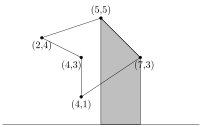
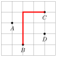
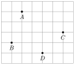
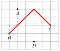

# Geometry

In geometric problems, it is often challenging to find a way to approach the problem so that the solution to the problem can be conveniently implemented and the number of special cases is small.

As an example, consider a problem where we are given the vertices of a quadrilateral (a polygon that has four vertices), and our task is to calculate its area. For example, a possible input for the problem is as follows:


One way to approach the problem is to divide the quadrilateral into two triangles by a straight line between two opposite vertices:


After this, it suffices to sum the areas of the triangles. The area of a triangle can be calculated, for example, using **Heron's formula** $$\sqrt{s (s-a) (s-b) (s-c)},$$ where $a$, $b$ and $c$ are the lengths of the triangle's sides and $s=(a+b+c)/2$.

This is a possible way to solve the problem, but there is one pitfall: how to divide the quadrilateral into triangles? It turns out that sometimes we cannot just pick two arbitrary opposite vertices. For example, in the following situation, the division line is *outside* the quadrilateral:


However, another way to draw the line works:


It is clear for a human which of the lines is the correct choice, but the situation is difficult for a computer.

However, it turns out that we can solve the problem using another method that is more convenient to a programmer. Namely, there is a general formula $$x_1y_2-x_2y_1+x_2y_3-x_3y_2+x_3y_4-x_4y_3+x_4y_1-x_1y_4,$$ that calculates the area of a quadrilateral whose vertices are $(x_1,y_1)$, $(x_2,y_2)$, $(x_3,y_3)$ and $(x_4,y_4)$. This formula is easy to implement, there are no special cases, and we can even generalize the formula to *all* polygons.

## Complex numbers

A **complex number** is a number of the form $x+y i$, where $i = \sqrt{-1}$ is the **imaginary unit**. A geometric interpretation of a complex number is that it represents a two-dimensional point $(x,y)$ or a vector from the origin to a point $(x,y)$.

For example, $4+2i$ corresponds to the following point and vector:


The C++ complex number class `complex` is useful when solving geometric problems. Using the class we can represent points and vectors as complex numbers, and the class contains tools that are useful in geometry.

In the following code, `C` is the type of a coordinate and `P` is the type of a point or a vector. In addition, the code defines macros `X` and `Y` that can be used to refer to x and y coordinates.

```cpp
typedef long long C;
typedef complex<C> P;
#define X real()
#define Y imag()
```

For example, the following code defines a point $p=(4,2)$ and prints its x and y coordinates:

```cpp
P p = {4,2};
cout << p.X << " " << p.Y << "\n"; // 4 2
```

The following code defines vectors $v=(3,1)$ and $u=(2,2)$, and after that calculates the sum $s=v+u$.

```cpp
P v = {3,1};
P u = {2,2};
P s = v+u;
cout << s.X << " " << s.Y << "\n"; // 5 3
```

In practice, an appropriate coordinate type is usually `long long` (integer) or `long double` (real number). It is a good idea to use integer whenever possible, because calculations with integers are exact. If real numbers are needed, precision errors should be taken into account when comparing numbers. A safe way to check if real numbers $a$ and $b$ are equal is to compare them using $|a-b|<\epsilon$, where $\epsilon$ is a small number (for example, $\epsilon=10^{-9}$).

#### Functions

In the following examples, the coordinate type is `long double`.

The function $\texttt{abs}(v)$ calculates the length $|v|$ of a vector $v=(x,y)$ using the formula $\sqrt{x^2+y^2}$. The function can also be used for calculating the distance between points $(x_1,y_1)$ and $(x_2,y_2)$, because that distance equals the length of the vector $(x_2-x_1,y_2-y_1)$.

The following code calculates the distance between points $(4,2)$ and $(3,-1)$:

```cpp
P a = {4,2};
P b = {3,-1};
cout << abs(b-a) << "\n"; // 3.16228
```

The function $\texttt{arg}(v)$ calculates the angle of a vector $v=(x,y)$ with respect to the x axis. The function gives the angle in radians, where $r$ radians equals $180 r/\pi$ degrees. The angle of a vector that points to the right is 0, and angles decrease clockwise and increase counterclockwise.

The function $\texttt{polar}(s,a)$ constructs a vector whose length is $s$ and that points to an angle $a$. A vector can be rotated by an angle $a$ by multiplying it by a vector with length 1 and angle $a$.

The following code calculates the angle of the vector $(4,2)$, rotates it $1/2$ radians counterclockwise, and then calculates the angle again:

```cpp
P v = {4,2};
cout << arg(v) << "\n"; // 0.463648
v *= polar(1.0,0.5);
cout << arg(v) << "\n"; // 0.963648
```

## Points and lines

The **cross product** $a \times b$ of vectors $a=(x_1,y_1)$ and $b=(x_2,y_2)$ is calculated using the formula $x_1 y_2 - x_2 y_1$. The cross product tells us whether $b$ turns left (positive value), does not turn (zero) or turns right (negative value) when it is placed directly after $a$.

The following picture illustrates the above cases:


For example, in the first case $a=(4,2)$ and $b=(1,2)$. The following code calculates the cross product using the class `complex`:

```cpp
P a = {4,2};
P b = {1,2};
C p = (conj(a)*b).Y; // 6
```

The above code works, because the function `conj` negates the y coordinate of a vector, and when the vectors $(x_1,-y_1)$ and $(x_2,y_2)$ are multiplied together, the y coordinate of the result is $x_1 y_2 - x_2 y_1$.

#### Point location

Cross products can be used to test whether a point is located on the left or right side of a line. Assume that the line goes through points $s_1$ and $s_2$, we are looking from $s_1$ to $s_2$ and the point is $p$.

For example, in the following picture, $p$ is on the left side of the line:


The cross product $(p-s_1) \times (p-s_2)$ tells us the location of the point $p$. If the cross product is positive, $p$ is located on the left side, and if the cross product is negative, $p$ is located on the right side. Finally, if the cross product is zero, points $s_1$, $s_2$ and $p$ are on the same line.

#### Line segment intersection

Next we consider the problem of testing whether two line segments $ab$ and $cd$ intersect. The possible cases are:

*Case 1:* The line segments are on the same line and they overlap each other. In this case, there is an infinite number of intersection points. For example, in the following picture, all points between $c$ and $b$ are intersection points:


In this case, we can use cross products to check if all points are on the same line. After this, we can sort the points and check whether the line segments overlap each other.

*Case 2:* The line segments have a common vertex that is the only intersection point. For example, in the following picture the intersection point is $b=c$:


This case is easy to check, because there are only four possibilities for the intersection point: $a=c$, $a=d$, $b=c$ and $b=d$.

*Case 3:* There is exactly one intersection point that is not a vertex of any line segment. In the following picture, the point $p$ is the intersection point:


In this case, the line segments intersect exactly when both points $c$ and $d$ are on different sides of a line through $a$ and $b$, and points $a$ and $b$ are on different sides of a line through $c$ and $d$. We can use cross products to check this.

#### Point distance from a line

Another feature of cross products is that the area of a triangle can be calculated using the formula $$\frac{| (a-c) \times (b-c) |}{2},$$ where $a$, $b$ and $c$ are the vertices of the triangle. Using this fact, we can derive a formula for calculating the shortest distance between a point and a line. For example, in the following picture $d$ is the shortest distance between the point $p$ and the line that is defined by the points $s_1$ and $s_2$:


The area of the triangle whose vertices are $s_1$, $s_2$ and $p$ can be calculated in two ways: it is both $\frac{1}{2} |s_2-s_1| d$ and $\frac{1}{2} ((s_1-p) \times (s_2-p))$. Thus, the shortest distance is $$d = \frac{(s_1-p) \times (s_2-p)}{|s_2-s_1|} .$$

#### Point inside a polygon

Let us now consider the problem of testing whether a point is located inside or outside a polygon. For example, in the following picture point $a$ is inside the polygon and point $b$ is outside the polygon.


A convenient way to solve the problem is to send a *ray* from the point to an arbitrary direction and calculate the number of times it touches the boundary of the polygon. If the number is odd, the point is inside the polygon, and if the number is even, the point is outside the polygon.

For example, we could send the following rays:


The rays from $a$ touch 1 and 3 times the boundary of the polygon, so $a$ is inside the polygon. Correspondingly, the rays from $b$ touch 0 and 2 times the boundary of the polygon, so $b$ is outside the polygon.

## Polygon area

A general formula for calculating the area of a polygon, sometimes called the **shoelace formula**, is as follows: $$\frac{1}{2} |\sum_{i=1}^{n-1} (p_i \times p_{i+1})| =
\frac{1}{2} |\sum_{i=1}^{n-1} (x_i y_{i+1} - x_{i+1} y_i)|,$$ Here the vertices are $p_1=(x_1,y_1)$, $p_2=(x_2,y_2)$, $\ldots$, $p_n=(x_n,y_n)$ in such an order that $p_i$ and $p_{i+1}$ are adjacent vertices on the boundary of the polygon, and the first and last vertex is the same, i.e., $p_1=p_n$.

For example, the area of the polygon


is $$\frac{|(2\cdot5-5\cdot4)+(5\cdot3-7\cdot5)+(7\cdot1-4\cdot3)+(4\cdot3-4\cdot1)+(4\cdot4-2\cdot3)|}{2} = 17/2.$$

The idea of the formula is to go through trapezoids whose one side is a side of the polygon, and another side lies on the horizontal line $y=0$. For example:



The area of such a trapezoid is $$(x_{i+1}-x_{i}) \frac{y_i+y_{i+1}}{2},$$ where the vertices of the polygon are $p_i$ and $p_{i+1}$. If $x_{i+1}>x_{i}$, the area is positive, and if $x_{i+1}<x_{i}$, the area is negative.

The area of the polygon is the sum of areas of all such trapezoids, which yields the formula $$|\sum_{i=1}^{n-1} (x_{i+1}-x_{i}) \frac{y_i+y_{i+1}}{2}| =
\frac{1}{2} |\sum_{i=1}^{n-1} (x_i y_{i+1} - x_{i+1} y_i)|.$$

Note that the absolute value of the sum is taken, because the value of the sum may be positive or negative, depending on whether we walk clockwise or counterclockwise along the boundary of the polygon.

#### Pick's theorem

**Pick's theorem** provides another way to calculate the area of a polygon provided that all vertices of the polygon have integer coordinates. According to Pick's theorem, the area of the polygon is $$a + b/2 -1,$$ where $a$ is the number of integer points inside the polygon and $b$ is the number of integer points on the boundary of the polygon.

For example, the area of the polygon


is $6+7/2-1=17/2$.

## Distance functions

A **distance function** defines the distance between two points. The usual distance function is the **Euclidean distance** where the distance between points $(x_1,y_1)$ and $(x_2,y_2)$ is $$\sqrt{(x_2-x_1)^2+(y_2-y_1)^2}.$$ An alternative distance function is the **Manhattan distance** where the distance between points $(x_1,y_1)$ and $(x_2,y_2)$ is $$|x_1-x_2|+|y_1-y_2|.$$

For example, consider the following picture:


The Euclidean distance between the points is $$\sqrt{(5-2)^2+(2-1)^2}=\sqrt{10}$$ and the Manhattan distance is $$|5-2|+|2-1|=4.$$ The following picture shows regions that are within a distance of 1 from the center point, using the Euclidean and Manhattan distances:


#### Rotating coordinates

Some problems are easier to solve if Manhattan distances are used instead of Euclidean distances. As an example, consider a problem where we are given $n$ points in the two-dimensional plane and our task is to calculate the maximum Manhattan distance between any two points.

For example, consider the following set of points:


The maximum Manhattan distance is 5 between points $B$ and $C$:



A useful technique related to Manhattan distances is to rotate all coordinates 45 degrees so that a point $(x,y)$ becomes $(x+y,y-x)$. For example, after rotating the above points, the result is:



And the maximum distance is as follows:



Consider two points $p_1=(x_1,y_1)$ and $p_2=(x_2,y_2)$ whose rotated coordinates are $p'_1=(x'_1,y'_1)$ and $p'_2=(x'_2,y'_2)$. Now there are two ways to express the Manhattan distance between $p_1$ and $p_2$: $$|x_1-x_2|+|y_1-y_2| = \max(|x'_1-x'_2|,|y'_1-y'_2|)$$

For example, if $p_1=(1,0)$ and $p_2=(3,3)$, the rotated coordinates are $p'_1=(1,-1)$ and $p'_2=(6,0)$ and the Manhattan distance is $$|1-3|+|0-3| = \max(|1-6|,|-1-0|) = 5.$$

The rotated coordinates provide a simple way to operate with Manhattan distances, because we can consider x and y coordinates separately. To maximize the Manhattan distance between two points, we should find two points whose rotated coordinates maximize the value of $$\max(|x'_1-x'_2|,|y'_1-y'_2|).$$ This is easy, because either the horizontal or vertical difference of the rotated coordinates has to be maximum.
